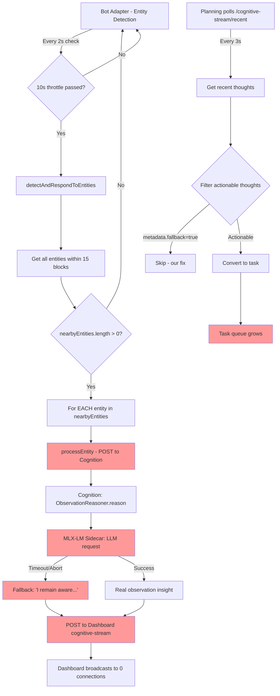

# Observation Spam Root Cause Analysis

## Problem Summary

The system is sending **hundreds of observation requests per minute**, overwhelming:
1. The MLX-LM Sidecar (local LLM)
2. The Cognition service
3. The Dashboard
4. The Planning service

This causes:
- LLM requests to abort ("This operation was aborted")
- Generic fallback thoughts to spam the logs
- Task queue to fill with unprocessable tasks
- System to miss critical events (bot death, respawn needed)

## Flow Diagram



## Root Cause: Unthrottled Per-Entity Processing

### Current Behavior (Line 888-890 in bot-adapter.ts)

```typescript
for (const entity of nearbyEntities) {
  await this.processEntity(entity);  // ← BLOCKS on each entity
}
```

**Problem**: If there are 9 entities nearby (as shown in logs), this sends **9 sequential HTTP requests** to Cognition, each waiting for:
1. Cognition to process
2. MLX-LM to generate (or timeout)
3. Response to return

### Timeline from Logs

```
23:28:39 - Detected 9 nearby entities
23:28:39 - Entity thought: "husk 13.8 blocks"  → POST to Cognition
23:28:39 - Entity thought: "husk 11.7 blocks"  → POST to Cognition
23:28:39 - Entity thought: "husk 10.9 blocks"  → POST to Cognition
... (6 more entities)
23:28:41 - LLM failed (aborted) x9
23:28:41 - Detected 9 nearby entities (AGAIN - next scan)
... repeat
```

**Result**: 9 entities × every 10 seconds = **54 requests/minute** minimum, but because the LLM is slow/aborting, the loop backs up and scans trigger faster.

## Bottlenecks Identified

### 1. MLX-LM Sidecar Overload
- **Capacity**: ~1-2 requests/second (local LLM)
- **Incoming**: 9 requests every 10s = 0.9 req/s baseline, but bursts to 4-5 req/s when backed up
- **Result**: Requests timeout → "This operation was aborted"

### 2. No Request Deduplication
- Same entity (e.g., "husk at 13.8 blocks") gets processed **every scan** even if:
  - Distance barely changed
  - Already sent observation 10s ago
  - LLM is still processing previous request

### 3. No Backpressure/Circuit Breaker
- When MLX-LM is overloaded, system keeps sending more requests
- No "wait for previous batch to complete" logic
- No "skip this scan if last one is still processing"

### 4. Fallback Spam (Now Fixed)
- ✅ **FIXED**: Generic fallbacks no longer posted to cognitive stream
- ✅ **FIXED**: Planning skips `metadata.fallback=true` thoughts
- But the **root cause** (too many requests) remains

## Proposed Solutions

### Solution 1: Per-Entity Observation Throttle (Recommended)

**Track last observation time per entity ID**:

```typescript
private entityLastObserved = new Map<number, number>();
private readonly ENTITY_OBSERVATION_COOLDOWN = 30000; // 30 seconds

private async processEntity(entity: any): Promise<void> {
  const now = Date.now();
  const lastObserved = this.entityLastObserved.get(entity.id) || 0;
  
  // Skip if we observed this entity recently
  if (now - lastObserved < this.ENTITY_OBSERVATION_COOLDOWN) {
    return;
  }
  
  this.entityLastObserved.set(entity.id, now);
  
  // ... existing processEntity logic
}
```

**Impact**: Reduces from 9 requests/scan to ~1-2 requests/scan (only new/moved entities).

### Solution 2: Batch Entity Observations

**Send all entities in one request**:

```typescript
private async detectAndRespondToEntities(): Promise<void> {
  // ... get nearbyEntities
  
  if (nearbyEntities.length === 0) return;
  
  // Build single observation payload with all entities
  const observation = {
    type: 'environmental_awareness',
    content: `Detected ${nearbyEntities.length} nearby entities`,
    metadata: {
      entities: nearbyEntities.map(e => ({
        type: e.name,
        id: e.id,
        distance: e.position.distanceTo(this.bot.entity.position),
        position: e.position
      })),
      botPosition: this.bot.entity.position,
      timestamp: Date.now()
    }
  };
  
  // Single POST instead of N POSTs
  await fetch(`${cognitionUrl}/process`, { ... });
}
```

**Impact**: Reduces from 9 requests/scan to 1 request/scan.

### Solution 3: Circuit Breaker for MLX-LM

**Stop sending when overloaded**:

```typescript
private mlxCircuitBreaker = {
  failureCount: 0,
  lastFailure: 0,
  state: 'closed' as 'closed' | 'open' | 'half-open'
};

private async processEntity(entity: any): Promise<void> {
  // Check circuit breaker
  if (this.mlxCircuitBreaker.state === 'open') {
    const timeSinceFailure = Date.now() - this.mlxCircuitBreaker.lastFailure;
    if (timeSinceFailure < 60000) { // 1 minute cooldown
      console.log('⚠️ Circuit breaker OPEN - skipping entity observation');
      return;
    }
    this.mlxCircuitBreaker.state = 'half-open';
  }
  
  try {
    const response = await fetch(...);
    // Reset on success
    this.mlxCircuitBreaker.failureCount = 0;
    this.mlxCircuitBreaker.state = 'closed';
  } catch (error) {
    this.mlxCircuitBreaker.failureCount++;
    this.mlxCircuitBreaker.lastFailure = Date.now();
    if (this.mlxCircuitBreaker.failureCount >= 3) {
      this.mlxCircuitBreaker.state = 'open';
      console.warn('🚨 Circuit breaker OPENED - too many MLX failures');
    }
  }
}
```

**Impact**: Prevents cascade failures when MLX-LM is overloaded.

### Solution 4: Priority Queue for Observations

**Process high-priority entities first**:

```typescript
private async detectAndRespondToEntities(): Promise<void> {
  // ... get nearbyEntities
  
  // Sort by priority (hostile > neutral > passive)
  const prioritized = nearbyEntities.sort((a, b) => {
    const aPriority = this.getEntityPriority(a);
    const bPriority = this.getEntityPriority(b);
    return bPriority - aPriority;
  });
  
  // Process only top 3 highest priority
  const toProcess = prioritized.slice(0, 3);
  
  for (const entity of toProcess) {
    await this.processEntity(entity);
  }
}

private getEntityPriority(entity: any): number {
  if (['zombie', 'skeleton', 'creeper', 'spider'].includes(entity.name)) {
    return 10; // Hostile
  }
  if (['player'].includes(entity.name)) {
    return 8; // Players
  }
  return 1; // Passive
}
```

**Impact**: Reduces from 9 requests/scan to 3 requests/scan, focusing on threats.

## Recommended Implementation Order

1. **Immediate (Today)**:
   - ✅ **DONE**: Skip posting generic fallbacks to cognitive stream
   - ✅ **DONE**: Planning filters `metadata.fallback=true`
   - **TODO**: Add per-entity observation throttle (Solution 1)

2. **Short-term (This Week)**:
   - Add circuit breaker for MLX-LM (Solution 3)
   - Add priority queue for entity processing (Solution 4)

3. **Medium-term (Next Week)**:
   - Refactor to batch entity observations (Solution 2)
   - Add backpressure: skip scan if previous scan still processing

4. **Long-term (Future)**:
   - Move to event-driven entity observations (only on spawn/move)
   - Implement distributed rate limiting across services
   - Add observability: metrics for observation queue depth, LLM latency

## Metrics to Monitor

After implementing fixes, track:
- **Observation requests/minute**: Should drop from ~54 to ~6-12
- **MLX-LM queue depth**: Should stay < 3
- **Cognition response time P95**: Should drop from 2000ms to < 500ms
- **Fallback rate**: Should drop from 90% to < 10%
- **Task queue growth rate**: Should stabilize

## Testing Plan

1. **Baseline**: Run for 5 minutes, count observation requests
2. **Apply Solution 1**: Run for 5 minutes, verify reduction
3. **Apply Solution 3**: Trigger overload, verify circuit breaker opens
4. **Apply Solution 4**: Spawn 20 entities, verify only top 3 processed
5. **Load test**: Spawn 50 entities, verify system remains stable

---

## Architectural Solution

See [Rig I-ext: Entity belief tracking and saliency](docs/planning/sterling-minecraft-domains.md#rig-i-ext-entity-belief-tracking-and-saliency-epistemic--invariant-coupling) for the formal specification that addresses these concerns at an architectural level.

The key insight is the **"no raw detections → cognition" invariant** (certification gate: Separation). This invariant ensures that:

1. Raw entity detections are processed by a **TRACK_UPDATE** operator (batched evidence ingestion)
2. Only **SALIENCY_DIFF** outputs (meaningful deltas with hysteresis) cross into cognition/planning
3. Stable scenes emit ~0 events after warmup (certification gate: Event sparsity)
4. Active sensing queries (**ACTIVE_SENSE_REQUEST**) replace blind polling

This transforms the problem from "throttle the spam" to "architecturally prevent spam by design."
