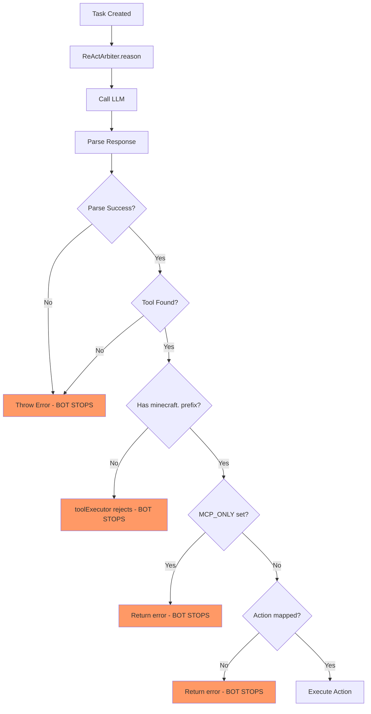

# Tool Selection & Execution Analysis

**Date**: 2025-10-02  
**Author**: @darianrosebrook  
**Issue**: Bot unable to select/execute tools, sits idle without taking actions

## Executive Summary

The bot's tool selection and execution pipeline has **multiple critical failures** that prevent proper operation. The issues span from LLM response parsing to tool namespace mismatches and lack of fallback mechanisms.

## Critical Issues Identified

### 1. Tool Namespace Mismatch (CRITICAL)

**Location**: `packages/cognition/src/react-arbiter/ReActArbiter.ts` vs `packages/planning/src/modular-server.ts`

**Problem**:
- ReActArbiter registers tools **without** `minecraft.` prefix: `find_blocks`, `pathfind`, `dig`, `craft`, etc. (lines 403-426)
- toolExecutor **requires** all tools to start with `minecraft.` (line 250)
- When LLM selects a tool like `dig`, it gets rejected immediately

```typescript:403:426:packages/cognition/src/react-arbiter/ReActArbiter.ts
private initializeToolRegistry(): void {
  const tools = [
    { name: 'find_blocks', description: '...' },
    { name: 'pathfind', description: '...' },
    { name: 'dig', description: '...' },
    // ... all without minecraft. prefix
  ];
}
```

```typescript:248:261:packages/planning/src/modular-server.ts
const toolExecutor = {
  async execute(tool: string, args: Record<string, any>, signal?: AbortSignal) {
    if (!tool.startsWith('minecraft.')) {
      return {
        ok: false,
        error: 'Unsupported tool namespace',
        // ... rejection
      };
    }
  }
}
```

**Impact**: **100% of tool selections fail immediately**

### 2. Brittle LLM Response Parsing (CRITICAL)

**Location**: `packages/cognition/src/react-arbiter/ReActArbiter.ts:314-348`

**Problem**:
- Uses simplistic string matching for keywords like `"Tool:"`, `"Action:"`, `"Args:"`
- No structured output format (JSON schema, etc.)
- LLM must format response **exactly** as expected or parsing fails
- No handling of variations in LLM responses

```typescript:314:348:packages/cognition/src/react-arbiter/ReActArbiter.ts
private parseReActResponse(responseText: string): ReActStep {
  const lines = responseText.split('\n');
  let thoughts = '';
  let selectedTool = '';
  let args: Record<string, any> = {};

  for (const line of lines) {
    const trimmed = line.trim();
    if (
      trimmed.toLowerCase().includes('tool:') ||
      trimmed.toLowerCase().includes('action:')
    ) {
      selectedTool = trimmed.split(':')[1]?.trim() || '';
    } else if (
      trimmed.toLowerCase().includes('args:') ||
      trimmed.toLowerCase().includes('parameters:')
    ) {
      try {
        const argsText = trimmed.split(':')[1]?.trim() || '{}';
        args = JSON.parse(argsText);
      } catch (e) {
        console.warn('Failed to parse args:', e);
      }
    }
  }

  return { thoughts: thoughts.trim(), selectedTool, args };
}
```

**Impact**: Parsing fails frequently, causing bot to throw errors and stop

### 3. No Fallback or Recovery Mechanism (CRITICAL)

**Location**: `packages/cognition/src/react-arbiter/ReActArbiter.ts:157-183`

**Problem**:
- When parsing fails or tool not found, error is thrown immediately
- No retry with different prompt
- No fallback to safe default action
- Bot just stops executing

```typescript:157:183:packages/cognition/src/react-arbiter/ReActArbiter.ts
async reason(context: ReActContext): Promise<ReActStep> {
  const prompt = this.buildReActPrompt(context);

  try {
    const response = await this.callLLM(prompt, {
      temperature: 0.3,
      maxTokens: 500,
    });

    const step = this.parseReActResponse(response.text);

    // Validate that we have at most one tool call
    if (!step.selectedTool) {
      throw new Error('ReAct step must select exactly one tool');  // NO FALLBACK
    }

    // Validate tool exists in registry
    if (!this.toolRegistry.has(step.selectedTool)) {
      throw new Error(`Unknown tool: ${step.selectedTool}`);  // NO FALLBACK
    }

    return step;
  } catch (error) {
    console.error('ReAct reasoning failed:', error);
    throw error;  // JUST THROWS, NO RECOVERY
  }
}
```

**Impact**: Any failure stops the entire execution loop

### 4. MCP_ONLY Environment Variable Blocking Execution

**Location**: `packages/planning/src/modular-server.ts:283-297`

**Problem**:
- If `MCP_ONLY=true`, all direct action execution is disabled
- Returns error instead of executing tools
- No clear documentation of when this should be set

```typescript:283:297:packages/planning/src/modular-server.ts
if (MCP_ONLY) {
  console.log(
    'MCP_ONLY=true; toolExecutor will not use direct /action fallback'
  );
  return {
    ok: false,
    data: null,
    environmentDeltas: {},
    error: 'Direct action disabled (MCP_ONLY) — use MCP option execution',
    confidence: 0,
    cost: 1,
    duration: Date.now() - startTime,
    metadata: { reason: 'mcp_only_disabled' },
  };
}
```

**Impact**: If env var is set, bot cannot execute any tools

### 5. Tool Discovery Relevance Threshold

**Location**: `packages/planning/src/modules/mcp-integration.ts:835`

**Problem**:
- Requires relevance score > 0.3 to match tools
- Simple keyword matching may miss relevant tools
- No semantic understanding of tool capabilities

```typescript:835:850:packages/planning/src/modules/mcp-integration.ts
if (relevance > 0.3) {  // Hard threshold
  matches.push({
    tool,
    relevance,
    confidence,
    reasoning: this.generateMatchingReasoning(tool, goalDescription, relevance),
    estimatedDuration: tool.metadata.timeoutMs || this.config.toolTimeoutMs || 30000,
  });
}
```

**Impact**: Some relevant tools may not be discovered

## Execution Flow Analysis



## Recommendations

### Immediate Fixes (Priority 1)

1. **Fix Tool Namespace Mismatch**:
   - Option A: Add `minecraft.` prefix to ReActArbiter tool registry
   - Option B: Update toolExecutor to accept tools without prefix and add it automatically
   - **Recommended**: Option B for flexibility

2. **Improve LLM Response Parsing**:
   - Use JSON schema for structured output
   - Add multiple parsing strategies with fallbacks
   - Implement fuzzy matching for tool names

3. **Add Fallback Mechanisms**:
   - Default safe action when parsing fails (e.g., `chat` to report issue)
   - Retry with simplified prompt on failure
   - Log failures for debugging but continue execution

4. **Review MCP_ONLY Usage**:
   - Document when this should be enabled
   - Add warning logs when blocking execution
   - Consider hybrid mode that tries MCP first, then falls back

### Medium-term Improvements (Priority 2)

5. **Enhance Tool Discovery**:
   - Lower relevance threshold or make it configurable
   - Add semantic similarity matching using embeddings
   - Include usage history in relevance scoring

6. **Better Error Context**:
   - Include LLM prompt and response in error logs
   - Track which tools were available when selection failed
   - Add metrics for tool selection success rate

7. **Prompt Engineering**:
   - Provide clearer tool selection format to LLM
   - Include examples of correct tool selection
   - Add validation instructions in system prompt

## Testing Checklist

- [ ] Verify tool registry includes all necessary tools
- [ ] Test LLM response parsing with various formats
- [ ] Confirm toolExecutor accepts tools with/without prefix
- [ ] Check MCP_ONLY environment variable state
- [ ] Validate tool discovery finds relevant tools
- [ ] Test fallback mechanisms when parsing fails
- [ ] Measure tool selection success rate
- [ ] Verify error logs provide actionable information

## Related Files

- `packages/cognition/src/react-arbiter/ReActArbiter.ts` - Tool selection and LLM interaction
- `packages/planning/src/modular-server.ts` - Tool execution and validation
- `packages/planning/src/modules/mcp-integration.ts` - Tool discovery
- `packages/planning/src/modules/action-mapping.ts` - Action to Minecraft mapping
- `packages/planning/src/behavior-trees/BehaviorTreeRunner.ts` - BT action execution

## Next Steps

1. Implement immediate fixes for namespace mismatch
2. Add structured JSON parsing for LLM responses
3. Implement fallback chain for failed tool selection
4. Add comprehensive logging for debugging
5. Test with real bot scenarios
6. Monitor success rate and iterate

