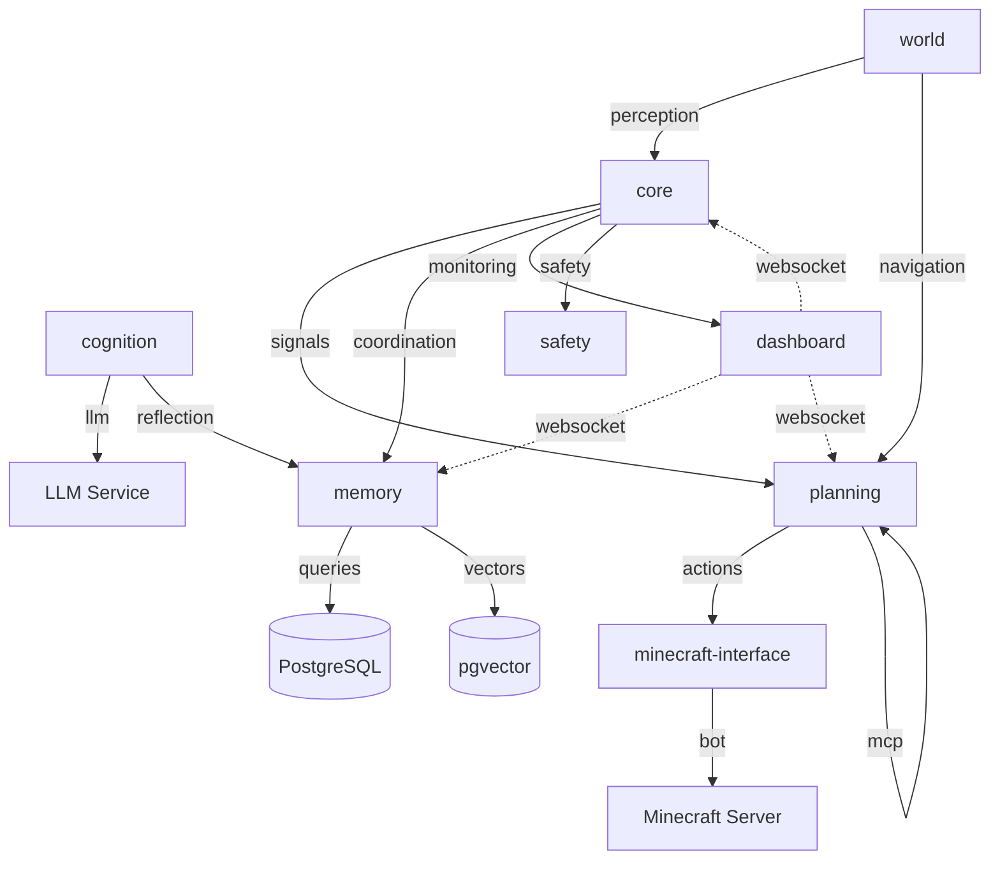

# Integration Audit Report

**Generated:** 2025-09-22T01:00:55.797Z
**Total Integration Points:** 48
**Critical Data Flows:** 2
**Risk Distribution:** T1: 11, T2: 26, T3: 11

## Integration Points by Risk Tier

### Tier 1 (Critical)
- core → planning (api): Package dependency: core -> @conscious-bot/planning
- memory → world (api): Package dependency: memory -> @conscious-bot/world
- core → external-clients (api): HTTP API endpoint: /signal
- core → external-clients (api): HTTP API endpoint: /arbiter
- core → external-clients (api): HTTP API endpoint: /performance
- memory → external-clients (api): HTTP API endpoint: /memory
- memory → external-clients (api): HTTP API endpoint: /search
- memory → external-clients (api): HTTP API endpoint: /identity
- memory → postgresql (database): PostgreSQL connection for memory storage
- memory → pgvector (database): Vector database for semantic search
- cognition → memory (event): Cognitive stream processing

### Tier 2 (Important)
- cognition → core (api): Package dependency: cognition -> @conscious-bot/core
- cognition → memory (api): Package dependency: cognition -> @conscious-bot/memory
- cognition → planning (api): Package dependency: cognition -> @conscious-bot/planning
- minecraft-interface → core (api): Package dependency: minecraft-interface -> @conscious-bot/core
- minecraft-interface → planning (api): Package dependency: minecraft-interface -> @conscious-bot/planning
- minecraft-interface → world (api): Package dependency: minecraft-interface -> @conscious-bot/world
- planning → mcp-server (api): Package dependency: planning -> @conscious-bot/mcp-server
- planning → memory (api): Package dependency: planning -> @conscious-bot/memory
- planning → world (api): Package dependency: planning -> @conscious-bot/world
- planning → external-clients (api): HTTP API endpoint: /plan
- planning → external-clients (api): HTTP API endpoint: /task
- planning → external-clients (api): HTTP API endpoint: /mcp
- cognition → external-clients (api): HTTP API endpoint: /cognition
- cognition → external-clients (api): HTTP API endpoint: /llm
- cognition → external-clients (api): HTTP API endpoint: /reflection
- world → external-clients (api): HTTP API endpoint: /world
- world → external-clients (api): HTTP API endpoint: /navigation
- world → external-clients (api): HTTP API endpoint: /perception
- minecraft-interface → external-clients (api): HTTP API endpoint: /minecraft
- minecraft-interface → external-clients (api): HTTP API endpoint: /bot
- minecraft-interface → external-clients (api): HTTP API endpoint: /game
- core → filesystem (filesystem): Configuration file reading
- cognition → llm-service (network): External LLM API calls
- minecraft-interface → minecraft-server (network): Minecraft server connection
- planning → mcp-server (network): MCP server for task execution
- core → dashboard (event): Real-time event streaming to dashboard

### Tier 3 (Supporting)
- dashboard → evaluation (api): Package dependency: dashboard -> @conscious-bot/evaluation
- evaluation → cognition (api): Package dependency: evaluation -> @conscious-bot/cognition
- evaluation → core (api): Package dependency: evaluation -> @conscious-bot/core
- evaluation → memory (api): Package dependency: evaluation -> @conscious-bot/memory
- evaluation → planning (api): Package dependency: evaluation -> @conscious-bot/planning
- evaluation → safety (api): Package dependency: evaluation -> @conscious-bot/safety
- evaluation → world (api): Package dependency: evaluation -> @conscious-bot/world
- dashboard → external-clients (api): HTTP API endpoint: /dashboard
- dashboard → external-clients (api): HTTP API endpoint: /metrics
- dashboard → external-clients (api): HTTP API endpoint: /status
- all-packages → filesystem (filesystem): Log file writing

## Critical Data Flows

### Signal Processing Pipeline
**Expected Latency:** 1200ms
**Steps:**
- world: Perceive world state (100ms)
- core: Process signals through arbiter (50ms)
- planning: Generate and execute plans (1000ms)
- minecraft-interface: Execute actions in game (50ms)
**Failure Modes:** Network latency, Service unavailability, Resource constraints

### Memory Retrieval Flow
**Expected Latency:** 300ms
**Steps:**
- memory: Vector search query processing (200ms)
- memory: Emotional memory integration (100ms)
**Failure Modes:** Database unavailability, Vector index corruption

## Service Dependencies

### core
- **Dependencies:** memory, planning, cognition, world, safety
- **Communication:** sync
- **Risk Tier:** 1

### planning
- **Dependencies:** core, memory, world, minecraft-interface
- **Communication:** async
- **Risk Tier:** 2

### memory
- **Dependencies:** postgresql, pgvector
- **Communication:** sync
- **Risk Tier:** 1

### dashboard
- **Dependencies:** core, memory, planning, cognition, world
- **Communication:** event-driven
- **Risk Tier:** 3

## System Architecture

## Recommendations

- Critical: Monitor 11 Tier 1 integration points closely
- Performance: Optimize 2 slow data flows
- Architecture: Simplify dependencies for 3 services
- Reliability: Add redundancy for 2 failure-prone flows

---

*Report generated by Integration Mapping System*
