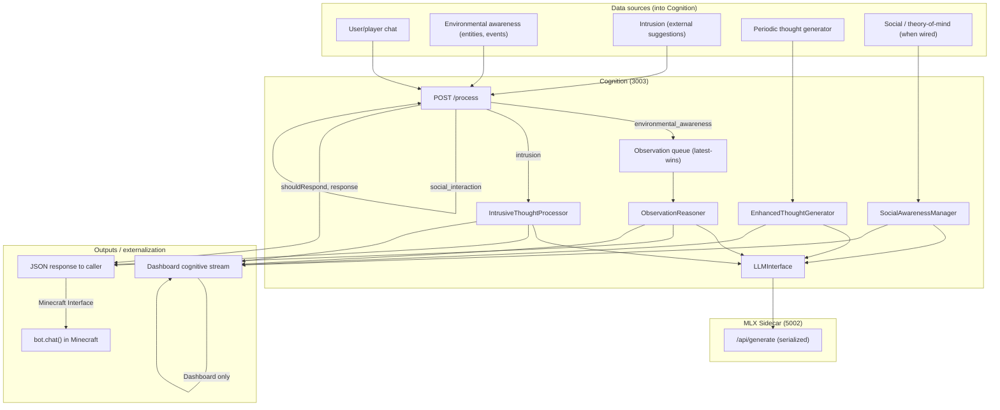
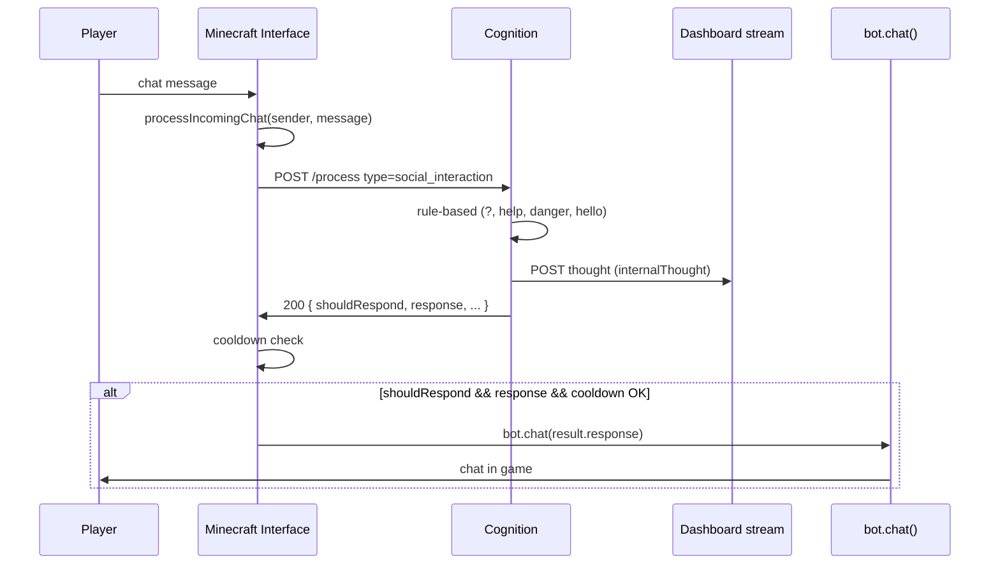
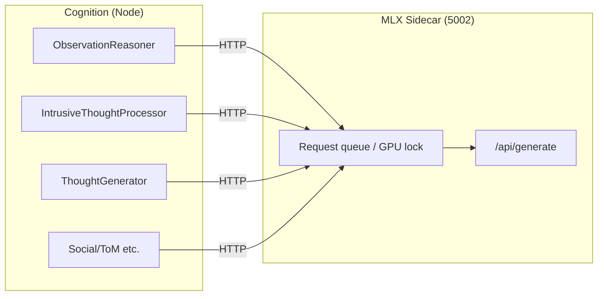

# MLX Sidecar Dataflow and Scheduler Design

Dataflow for how inputs reach the MLX sidecar, how they are prioritized and routed, and how chat/thought externalization works. Complements the reactive danger path (which does not use the LLM) and the observation queue design.

**Author:** @darianrosebrook

---

## 1. Service and Port Reference

| Service             | Port | Role |
|---------------------|------|------|
| Dashboard           | 3000 | Cognitive stream (POST/WS), UI |
| Planning            | 3002 | Sterling solvers, task/plan API |
| Cognition           | 3003 | /process, thought generators, LLMInterface |
| Minecraft Interface | 3005 | Bot, chat, entity/event detection |
| MLX-LM Sidecar      | 5002 | Single-process LLM (generate/embed); one request at a time |

All Cognition-originated LLM calls use `LLMInterface` (or subclasses), which by default target `LLM_SIDECAR_URL` (canonical), falling back to `OLLAMA_HOST`, then `COGNITION_LLM_HOST` + `COGNITION_LLM_PORT` (e.g. localhost:5002). The sidecar exposes `/api/generate` (and optionally `/api/embed`); it holds a single GPU lock so requests are serialized at the backend.

---

## 2. High-Level Dataflow

---

## 3. Reactive vs LLM-Based Decisions

| Path | Uses MLX? | Description |
|------|------------|--------------|
| **Reactive danger** | No | Immediate safety (e.g. flee, block placement) decided in Minecraft Interface or plan executor; no call to Cognition LLM. |
| **Environmental awareness** | Yes | ObservationReasoner; queue with latest-wins; one LLM call per drain; stale observations get fallback. |
| **Intrusion** | Yes | IntrusiveThoughtProcessor; no queue; direct LLM. |
| **Social interaction** | No (today) | POST /process type `social_interaction` is rule-based (keywords: ?, help, danger, hello); no LLM. Can be extended to use SocialAwarenessManager/LLM later. |
| **Environmental event** | No (today) | POST /process type `environmental_event` is rule-based; no LLM. |
| **Periodic thought** | Yes | EnhancedThoughtGenerator (e.g. 60s interval); uses `generateInternalThought` -> LLM. |
| **Chat consideration** | Yes (when triggered) | SocialAwarenessManager can use LLM for chat consideration; results go to cognitive stream. |

So: **only some reasoning paths hit MLX**. Reactive danger and current social/environmental-event responses do not; observation, intrusion, periodic thought, and (when used) social/ToM do.

---

## 4. How Data Gets to the MLX Sidecar

All paths that use the LLM go through Cognition’s `LLMInterface` (or a subclass). The interface calls the sidecar at `http://<host>:<port>/api/generate` (Ollama-compatible API). No shared Node-side scheduler exists: multiple call sites can invoke `generateResponse` / `generateInternalThought` / `callOllama` concurrently from Node’s perspective; the **sidecar** serializes them (one request at a time).

| Call site | Entry in Cognition | Uses LLM? | Node-side queue? |
|-----------|--------------------|-----------|-------------------|
| Observation (environmental_awareness) | POST /process -> enqueueObservation -> drain -> ObservationReasoner.reason() | Yes | Yes (observation queue; latest-wins) |
| Intrusion | POST /process type intrusion -> IntrusiveThoughtProcessor | Yes | No |
| Social interaction | POST /process type social_interaction | No (rule-based) | N/A |
| Environmental event | POST /process type environmental_event | No (rule-based) | N/A |
| Periodic thought | EnhancedThoughtGenerator (timer) | Yes | No |
| Intrusive thought (internal) | IntrusiveThoughtProcessor events | Yes | No |
| Chat consideration | SocialAwarenessManager (on chat) | Yes (if used) | No |
| ReAct / conversation / reflection / etc. | Various modules | Yes (when invoked) | No |

So: **only observations** are prioritized and deduplicated in Node (latest-wins + stale fallback). All other LLM traffic is “best effort” and serialized only at the sidecar.

---

## 5. Prioritization and Routing Today

- **Observation lane (Cognition):**  
  - Pending observations are stored; when the worker drains, it runs **only the newest** through the LLM and resolves all others with a stale fallback (no LLM).  
  - Effect: under load, observation LLM work is reduced to one call per batch; clients still get a 200 and a fallback insight for stale items.

- **All other LLM call sites:**  
  - No Node-side queue or priority. They call `LLMInterface` (or equivalent) when triggered; requests stack at the sidecar and are served one by one.  
  - If many triggers happen at once (e.g. observation + intrusion + periodic thought), they all wait on the same MLX process; client timeouts (e.g. 25s for /process) can occur.

- **Routing back to caller:**  
  - **POST /process** returns JSON: `processed`, `type`, `thought`, `actions`, `shouldRespond`, `response`, `shouldCreateTask`, `taskSuggestion`, etc.  
  - Minecraft Interface reads `shouldRespond` and `response`; if true and cooldown allows, it calls `bot.chat(result.response)`.  
  - Thoughts are also sent to the Dashboard cognitive stream (POST to `/api/ws/cognitive-stream`) for display; that path does **not** by itself cause the bot to say anything in-game.

---

## 6. User Chat: Inbound and Bot Reply

- **Inbound:** Player chat is received by the bot; `processIncomingChat` sends it to Cognition as `social_interaction`.  
- **Cognition:** Current implementation uses **rules only** (no LLM): e.g. questions get a generic “processing your question” style reply; “help”/“assist” get a help message; short “hello”/“hi” get a 40% chance reply.  
- **Outbound:** Cognition returns `shouldRespond` and `response`. Minecraft Interface throttles with `chatCooldown`; if allowed, it calls `bot.chat(result.response)` so the bot speaks to the server (observed by all players in range).

There is also a **ChatProcessor** path that posts to the Dashboard cognitive stream as `external_chat_in` for display; it does **not** call Cognition `/process` and does **not** by itself produce a bot reply.

---

## 7. Observation and Entity/Event Responses (Bot Speaking)

When the type is `environmental_awareness` or `environmental_event`:

- **Environmental awareness:**  
  - Minecraft Interface sends entity/observation payload to POST /process.  
  - Cognition runs the **observation queue** (latest-wins), then ObservationReasoner (LLM).  
  - Response includes `shouldRespond`, `response`, `shouldCreateTask`, `taskSuggestion`.  
  - If `shouldRespond && response` and cooldown OK, Minecraft Interface calls `bot.chat(result.response)` (e.g. reacting to a nearby entity).

- **Environmental event:**  
  - Same POST /process with type `environmental_event`.  
  - Cognition uses **rule-based** logic (e.g. health_loss, block_break); no LLM.  
  - Same response shape; Minecraft Interface again uses `shouldRespond` and `response` to call `bot.chat(result.response)` when appropriate.

So: **bot speech to players** from these flows is always driven by Cognition’s JSON response and Minecraft Interface’s cooldown, not by the cognitive stream alone.

---

## 8. Thought Externalization (When Does the Bot “Say” Something?)

The bot externalizes (says something in Minecraft) in these ways:

| Mechanism | Source | How it becomes chat |
|-----------|--------|----------------------|
| **/process response** | Cognition POST /process (social_interaction, environmental_awareness, environmental_event) | Minecraft Interface reads `shouldRespond` and `response` and calls `bot.chat(result.response)` if cooldown allows. |
| **Plan step chat action** | Planning + execution | Plan executor or action translator executes a “chat” action (e.g. `executeChat` with `message`); that calls `bot.chat(message)`. So a thought that becomes a task and then a plan step with a chat action is externalized via execution, not via the cognitive stream. |
| **Cognitive stream (Dashboard)** | All thought types | Thoughts are sent to the Dashboard for display only. There is **no** automatic path from “cognitive stream event” to `bot.chat()`. To externalize a stream thought as chat, something must later turn it into a task/plan step that produces a chat action, or a dedicated “externalize thought” flow would need to be added. |

So: **today, externalization to chat** is either (1) Cognition returning `shouldRespond`/`response` and Minecraft Interface calling `bot.chat()`, or (2) a planned chat action executed by the plan executor/action translator.

---

## 9. MLX Sidecar: Single Serialization Point

- The sidecar serves one generate request at a time.  
- Multiple concurrent HTTP requests from Node are accepted and processed in an unspecified order (effectively FIFO at the server).  
- No priority or lanes exist at the sidecar; prioritization is only in Cognition’s observation queue (latest-wins for observations).

---

## 10. Token and Latency Configuration

Cognition’s `llm-token-config.ts` defines per-source `maxTokens` and `temperature` (e.g. observation: 128 tokens; internal_thought: 512). ObservationReasoner uses the `observation` source config to keep latency low. Other call sites may use default or their own options when calling `LLMInterface`. See `docs/integration/observation-queue-and-llm-scheduling.md` and `docs/integration/mlx-sidecar-health-and-setup.md` for queue behavior and benchmarking.

---

## 11. Summary Table

| Topic | Summary |
|-------|---------|
| **Reactive danger** | Handled without LLM; not in this dataflow. |
| **Data into MLX** | Observation (queued), intrusion, periodic thought, intrusive thought, and optionally social/ToM; all via LLMInterface -> sidecar. |
| **Prioritization** | Only observation has a queue (latest-wins + stale fallback). Everything else serialized at sidecar only. |
| **Routing back** | JSON response to Minecraft Interface; cognitive stream to Dashboard. |
| **User chat in** | Player -> Minecraft Interface -> POST /process social_interaction -> Cognition (rule-based) -> JSON. |
| **Bot chat out** | Minecraft Interface calls `bot.chat(result.response)` when Cognition returns `shouldRespond` and `response` and cooldown allows; or plan executor runs a chat action. |
| **Thought externalization** | Either (1) /process `response` -> bot.chat(), or (2) plan step chat action -> bot.chat(). Cognitive stream is display-only unless a separate flow turns a thought into a task/plan chat action. |

---

## 12. Gaps and Missed Opportunities (Planning / Focus)

Review of how goal planning and task execution connect to cognition shows several disconnects and opportunities.

### 12.1 Observation is not plan-aware

**Gap:** `ObservationReasoner.reason(payload)` receives only the observation payload. The prompt in `buildPrompt(sanitised)` has no "current tasks" or "current focus." The LLM decides `shouldCreateTask` and `tasks` without knowing what the bot is already doing.

**Effect:** The bot can get task suggestions that distract from the current plan (e.g. "investigate entity" while it is mid-build), or miss that an observation is directly relevant to the active goal.

**Opportunity:** When handling POST /process `environmental_awareness`, Cognition could fetch Planning GET /state (or receive current focus in the request), then pass `currentTasks` / `currentGoals` into the reasoner. Extend `ObservationReasoner` (e.g. optional `planningContext` or `currentFocus`) and add a line in the prompt such as: "Current focus: &lt;task titles&gt;. Decide if this observation supports, conflicts with, or is unrelated to that focus."

### 12.2 Planning state is only used in the thought generator

**Current:** Cognition fetches Planning GET /state only in the **periodic thought generator** (every 60s). It passes `currentTasks` into `generateThought()`, so periodic thoughts are task-aware.

**Gap:** The **observation path** (POST /process environmental_awareness) does not fetch Planning state and does not pass current tasks into ObservationReasoner. So observation reasoning never sees current focus.

**Opportunity:** Use the same Planning /state (or a shared "focus" snapshot) in the observation handler: fetch when draining the observation queue (or accept focus from the client) and pass into `reason()` so observation insights are focus-aware.

### 12.3 Minecraft Interface /state does not expose current plan focus

**Current:** Minecraft Interface GET /state returns bot/world state (position, health, inventory, etc.). The minimal/fallback response includes `planningContext: { currentGoals: [], activeTasks: [] }` but those are empty. When the bot is connected, the full response does not merge in Planning's current goals/tasks from Planning GET /state.

**Gap:** There is no single endpoint that returns "bot state + current plan focus." Cognition could call Minecraft Interface /state for bot state and Planning /state for focus, but that is two calls and not currently done in the observation path.

**Opportunity:** Either (a) have Minecraft Interface merge Planning /state into its /state response (e.g. `planningContext.currentGoals`, `planningContext.activeTasks` from Planning), or (b) keep them separate but document and use both in Cognition (e.g. observation handler fetches Planning /state when building context for the reasoner).

### 12.4 No feedback from observation to planning focus

**Current:** Cognition returns `shouldCreateTask` and `taskSuggestion`; Minecraft Interface POSTs those to Planning /goal. So Cognition can **add** goals. There is no flow where observation insights **reprioritize**, **pause**, or **replace** the current plan (e.g. "threat detected, consider fleeing" as a focus change rather than only a new goal).

**Gap:** Planning cycle runs every 15s and decides what to do next from its own state. Observation insights are not used to adjust "what we're focusing on right now" (e.g. interrupt, priority boost, or defer current goal).

**Opportunity:** Define a contract for "focus change" or "plan interrupt" (e.g. Planning endpoint or event that accepts high-priority suggestions from Cognition). Use observation categories (e.g. "threat") to trigger that path so urgent observations can shift focus, not only enqueue a new goal.

### 12.5 Polling cadence and who drives "what to focus on"

**Current:** Planning cycle: 15s. Thought generator (and its Planning /state poll): 60s. Observation: on-demand (when Minecraft Interface sends an observation). There is no shared "focus" signal that observation and thought generation both use at the same granularity.

**Gap:** "What to focus on" is owned by Planning and the plan executor (current plan, current step). Cognition does not poll Planning on every observation; it only polls in the thought generator. So observation and periodic thought can have different pictures of focus (or observation has none).

**Opportunity:** Align on a single source of truth for "current focus" (e.g. Planning /state) and have every Cognition path that benefits from it (observation handler, thought generator, and optionally social/response) read it when needed (per request for observation; on interval for thought generator). Optionally, Planning could push "focus updated" events to Cognition so reasoning always has a fresh focus without polling.

### 12.6 Summary table

| Gap | Where | Opportunity |
|-----|--------|-------------|
| Observation blind to current tasks | ObservationReasoner.buildPrompt() | Pass currentTasks/currentGoals into reasoner; add "Current focus" to prompt. |
| Planning state only in thought gen | server.ts observation path | Fetch Planning /state in observation handler (or from request); pass focus into ObservationReasoner. |
| Minecraft /state has no plan focus | server.ts GET /state (Minecraft Interface) | Merge Planning /state into Minecraft /state, or document dual fetch and use in Cognition. |
| Observation doesn't change focus | Cognition -> Planning only via /goal | Add "focus change" or "interrupt" path from Cognition to Planning for high-priority observations. |
| Focus freshness vs polling | 15s planning cycle, 60s thought poll | Use Planning /state in observation path; optionally Planning pushes focus updates to Cognition. |

---

## 13. Related Docs

- `observation-queue-and-llm-scheduling.md` – Observation queue, latest-wins, stale fallback, and option for global/lanes.
- `observation-thought-action-flow.md` – Observation to thought to action pipeline and investigation notes.
- `mlx-sidecar-health-and-setup.md` – Sidecar startup, /health, and benchmarking.
- `docs/planning/RIG_DOCUMENTATION_INDEX.md` – Planning rigs and goal/task formulation.
