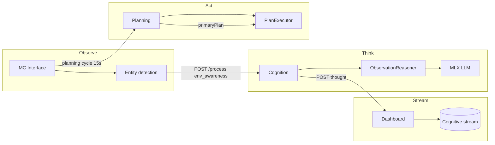
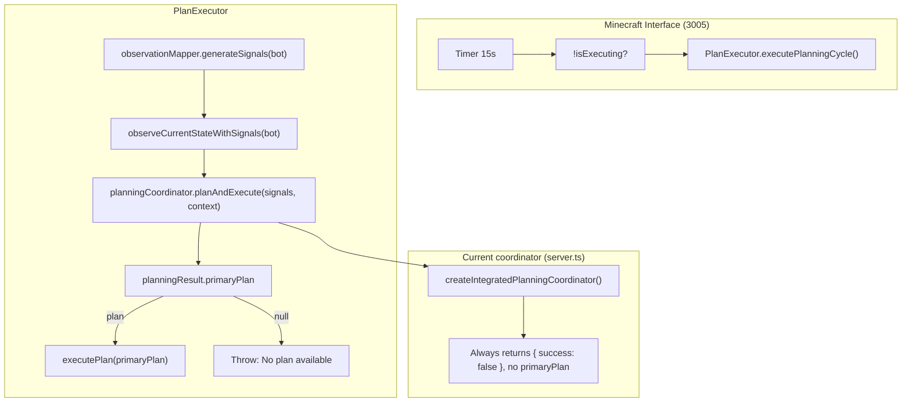

# Observation to Thought to Action Flow

Flow diagram and investigation notes for the pipeline: observations (Minecraft Interface, Cognition) -> thoughts (LLM/MLX, cognitive stream) -> actions (Planning, execution). Derived from bot run logs and codebase review.

**Author:** @darianrosebrook

---

## Service Ports (Reference)

| Service            | Port | Role |
|--------------------|------|------|
| Dashboard          | 3000 | Cognitive stream, WS, UI |
| Memory             | 3001 | Memory registry |
| Planning           | 3002 | Sterling solvers, task/plan API |
| Cognition          | 3003 | /process, ObservationReasoner, thoughts |
| World              | 3004 | World state |
| Minecraft Interface| 3005 | Bot, entity detection, planning cycle |
| Core               | 3007 | Shared utilities |
| MLX-LM Sidecar     | 5002 | LLM generate (Cognition -> MLX) |

---

## Intended Flow (High Level)



---

## Detailed Flow: Observation -> Thought

```mermaid
flowchart TB
  subgraph MC["Minecraft Interface (3005)"]
    Detect["Detect entities (interval)"]
    Describe["describeEntity() -> short thought string"]
    Req["resilientFetch(Cognition /process)"]
    Detect --> Describe
    Describe --> Req
  end

  subgraph Cog["Cognition (3003)"]
    Route["POST /process"]
    BuildObs["buildObservationPayload()"]
    Reason["ObservationReasoner.reason()"]
    Route --> BuildObs
    BuildObs --> Reason
  end

  subgraph ObsReason["ObservationReasoner"]
    Avail["LLM available?"]
    Prompt["buildPrompt(), sanitiseObservation()"]
    CallLLM["LLMInterface.generateResponse()"]
    Sanitize["sanitizeLLMOutput()"]
    Abort["AbortController 35s timeout"]
    Parse["parseLLMResponse()"]
    Fallback["createFallback()"]
    Avail -->|no| Fallback
    Avail -->|yes| Prompt
    Prompt --> CallLLM
    CallLLM --> Sanitize
    Sanitize --> Abort
    Abort -->|ok| Parse
    Abort -->|timeout/abort| Fallback
  end

  subgraph MLX["MLX-LM Sidecar (5002)"]
    Gen["POST /api/generate"]
    Gen --> Resp["200 + text"]
  end

  subgraph Dash["Dashboard (3000)"]
    Stream["POST /api/ws/cognitive-stream"]
    History["Thought history"]
    Stream --> History
  end

  Req --> Route
  Reason --> CallLLM
  CallLLM --> Gen
  Resp --> Parse
  Parse --> Stream
  Fallback --> Stream
  Cog -->|res.json(processed, shouldCreateTask, taskSuggestion)| Req
```

- **Minecraft Interface** sends one POST per entity observation to Cognition `/process` with `type: 'environmental_awareness'`.
- **Cognition** turns the body into an observation, runs **ObservationReasoner**, which optionally calls **MLX** (with 35s timeout). Result is parsed or replaced by a fallback; the **internal thought** is sent to the Dashboard cognitive stream; the HTTP response includes `processed`, `shouldCreateTask`, `taskSuggestion`.
- **resilientFetch** in Minecraft Interface uses default **10s timeout per attempt** and **6 attempts**. If Cognition takes longer than 10s (e.g. MLX slow), the client aborts and never receives `shouldCreateTask` / `taskSuggestion`.

---

## Detailed Flow: Thought -> Action (Planning Cycle)



- The **planning cycle** runs every 15s. It builds **signals** from the bot and **context**, then calls **planningCoordinator.planAndExecute(signals, context)**.
- In the current **Minecraft Interface server**, the coordinator is a **stub** that always returns failure and **no primaryPlan**. So "No plan available for execution" is expected until the real Planning service (3002) is wired as the coordinator.

---

## LLM Output Sanitization

All LLM responses are sanitized at the `generateResponse()` return boundary in `LLMInterface` before any consumer sees them. This ensures clean text reaches the cognitive stream, planning signal extraction, intrusive thought parsing, and the dashboard.

**Module:** `packages/cognition/src/llm-output-sanitizer.ts`

**Pipeline (applied in order):**
1. **Strip code fences** — Removes `` ``` `` / `` ```lang `` wrappers the LLM sometimes emits
2. **Strip system prompt leaks** — Removes regurgitated prompt fragments ("You are my private inner thought...")
3. **Extract goal tag** — Parses `[GOAL: action target amount]` into structured `GoalTag`; removes tag from text
4. **Truncate degeneration** — Detects trigram repetition (3+) and consecutive identical words (4+); truncates
5. **Strip trailing garbage** — Removes trailing standalone numbers and incomplete sentence fragments
6. **Normalize whitespace** — Collapses runs, trims

**Metadata propagation:**
- `LLMResponse.metadata.extractedGoal` — Structured goal if a `[GOAL:]` tag was found
- `LLMResponse.metadata.sanitizationFlags` — What was cleaned (code fences, leaks, degeneration, garbage, lengths)
- `CognitiveThought.metadata.extractedGoal` — Plumbed through all 4 thought generation methods

The dashboard's `cleanMarkdownArtifacts()` remains as defense-in-depth but is effectively a no-op on pre-cleaned text.

---

## MLX Integration (Cognition -> LLM)

- **Cognition** uses `LLMInterface` (default host localhost, port **5002**, timeout 45s).
- **ObservationReasoner** calls `this.llm.generateResponse(prompt, ..., { signal: abortController.signal })` with its own **35s** AbortController.
- MLX-LM Sidecar serves **POST /api/generate**; logs show `200` responses, but many Cognition-side calls end in "This operation was aborted" and fallback. So either:
  - ObservationReasoner’s 35s timeout fires before MLX responds, or
  - Many concurrent observation requests cause queueing and timeouts.

---

## What the Logs Show (bot-activities.log / terminal)

1. **Entity observations**  
   "Detected 3 nearby entities", "Entity thought: I notice a trader_llama 12.2 blocks away" — Minecraft Interface is detecting and sending to Cognition.

2. **Cognition /process**  
   "Processing environmental_awareness", "ObservationReasoner Calling LLM with prompt", then often "LLM failed (This operation was aborted), using fallback" and "cognition.observation.fallback".

3. **resilientFetch**  
   "[Minecraft Interface] [resilient-fetch] http://localhost:3003/process unavailable after 6 attempts: This operation was aborted" — client gives up before Cognition responds.

4. **Thoughts still reach Dashboard**  
   "Dashboard POST /api/ws/cognitive-stream received", "New thought added to history" — Cognition completes (often with fallback) and posts to the cognitive stream; the HTTP response to Minecraft Interface is the one that never arrives.

5. **Planning cycle**  
   "Starting autonomous planning cycle...", "Planning cycle error: Error: No plan available for execution", "Planning cycle ended: No plan available for execution (0/0 steps)" — stub coordinator, no plan.

6. **MLX**  
   "MLX-LM Sidecar ... POST /api/generate HTTP/1.1 200" — some requests succeed; others are aborted on the Cognition side (timeout or contention).

---

## Areas to Investigate

### 1. Client timeout vs Cognition/MLX latency

- **Issue:** Minecraft Interface uses default `resilientFetch` (10s per attempt). Cognition’s ObservationReasoner can take up to 35s (LLM). So the client often aborts before the response.
- **Effect:** Minecraft Interface never sees `shouldCreateTask` or `taskSuggestion`; task-from-thought is effectively broken for environmental_awareness.
- **Investigate:**  
  - Use a longer `timeoutMs` for POST to Cognition `/process` (e.g. 40s+) when type is environmental_awareness, or  
  - Have Cognition respond quickly (e.g. 202 + thought pushed to stream) and avoid blocking the client on LLM.

### 2. ObservationReasoner LLM timeouts and contention

- **Issue:** Many "LLM failed (This operation was aborted), using fallback" and "cognition.observation.fallback" with reason "This operation was aborted".
- **Investigate:**  
  - Confirm whether the 35s AbortController in ObservationReasoner is firing (log when abort fires vs when MLX returns).  
  - Check if multiple concurrent observations overload MLX (single process, serial requests). Consider queuing or throttling per-bot observation reasoning.

### 3. Planning coordinator is a stub

- **Issue:** `createIntegratedPlanningCoordinator()` in minecraft-interface `server.ts` always returns no plan. Comment: "Legacy planning retired — use Sterling solvers."
- **Effect:** Observations and thoughts never turn into executed plans; "No plan available for execution" is expected.
- **Investigate:**  
  - Wire PlanExecutor to the real Planning service (3002): implement a coordinator that calls Planning’s plan/execute API and maps the result to `primaryPlan` (and steps) for PlanExecutor.

### 4. Thought -> task path when client does get a response

- **Issue:** Even when Cognition returns, Minecraft Interface only uses `shouldCreateTask` and `taskSuggestion` from the `/process` response (e.g. `createTaskFromEntity`). The 15s planning cycle does not pull from the cognitive stream; it uses `observationMapper.generateSignals(bot)` and the coordinator.
- **Investigate:**  
  - Define how task suggestions from Cognition (or from the cognitive stream) should feed into the Planning service or into signals so that "thoughts" can influence "actions" in the same pipeline.

### 5. Observation throttling and volume

- **Issue:** Logs show many entities (e.g. 3–4) and repeated observations (trader_llama, wandering_trader) every few seconds, each triggering POST /process and possibly LLM calls.
- **Investigate:**  
  - Throttle or deduplicate entity observations (e.g. same entity type + distance bucket) before calling Cognition.  
  - Optionally batch observations in one /process request to reduce load and timeouts.

### 6. ResilientFetch options for Cognition

- **Issue:** Default `timeoutMs: 10000` and `maxRetries: 5` are tuned for quick health/availability, not for LLM-backed /process.
- **Investigate:**  
  - For Cognition `/process`, pass `timeoutMs: 40000` (or higher) and possibly fewer retries to avoid long repeated aborts.  
  - Optionally use a different timeout for environmental_awareness than for chat/intrusion.

---

## Summary: What Works vs What’s Broken

| Segment | Status | Notes |
|--------|--------|--------|
| Entity detection -> POST Cognition /process | Works | Requests are sent; often timeout on client side |
| Cognition /process -> ObservationReasoner | Works | Observations parsed and reasoned |
| ObservationReasoner -> MLX | Partial | Some 200s; many aborted, fallback used |
| LLM output sanitization | Works | Deterministic regex pipeline at generateResponse() boundary; strips fences, leaks, degeneration, garbage; extracts goal tags |
| Cognition -> Dashboard cognitive stream | Works | Thoughts (including fallback) reach Dashboard |
| Cognition response -> Minecraft Interface | Broken | Client aborts before response; no task suggestion received |
| Planning cycle -> planAndExecute | Broken | Stub coordinator; no plan ever returned |
| Plan -> executePlan | N/A | Never reached while coordinator is stub |

End-to-end **observation -> thought -> action** is broken at: (1) client timeout so task suggestions are lost, and (2) planning coordinator stub so no plan is ever produced for execution.

---

## Benchmark and token tuning

### MLX benchmark script

To measure why responses are slow and to tune token lengths per source:

```bash
# Start MLX-LM sidecar first (e.g. pnpm start, or run sidecar alone on port 5002)
pnpm run benchmark:mlx
```

Scenarios: observation-like prompts at 400/800 chars with max_tokens 128, 256, 512; short prompts at 64/128 tokens. Output: client latency (ms), server duration, prompt/completion token counts. Use results to adjust `packages/cognition/src/config/llm-token-config.ts`.

### Token config per source

`packages/cognition/src/config/llm-token-config.ts` defines recommended **maxTokens** and **temperature** per call source:

| Source            | maxTokens | Temperature | Notes                          |
|-------------------|-----------|-------------|--------------------------------|
| observation       | 256       | 0.35        | Short JSON thought + actions   |
| internal_thought  | 512       | 0.8         | One–two sentences              |
| social_response   | 256       | 0.8         | Single reply                   |
| ethical_reasoning | 1024      | 0.6         | Longer analysis                |
| react_operational | 500       | 0.3         | Low temp for decisions         |
| default           | 512       | 0.7         | Fallback                       |

ObservationReasoner uses `getLLMConfig('observation')` (256 tokens) to reduce latency vs the previous 512. After running the benchmark, adjust these values and re-run to compare latency.

### Runtime benchmark logging

To log every LLM call’s latency and token usage from Cognition:

```bash
COGNITION_LLM_BENCHMARK=1 pnpm run dev:cognition
```

Log line format: `[LLM benchmark] latency_ms=... prompt_len=... max_tokens=... prompt_tokens=... completion_tokens=...`
