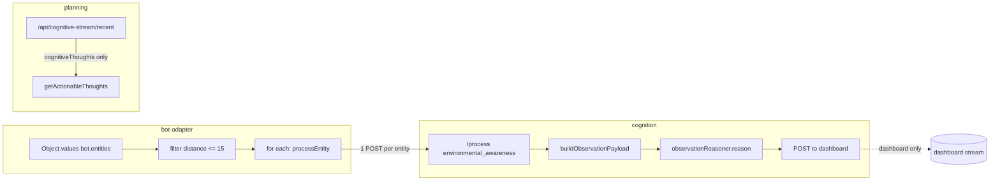

# Primitive 21 / Rig I-ext Implementation Plan

**Implementation**: Partial — evidence capsule types and reference fixtures exist in `planning/sterling/primitives/p21/`

This document outlines how to tackle the P21 (Entity belief maintenance and saliency under partial observability) and Rig I-ext (Entity belief tracking and saliency) work: what to investigate, what to implement or change, where, and why.

---

## 1. Target Invariant (Why)

**Critical boundary (from spec):** Raw detections must not flow directly into cognition/planning. Only **belief-layer outputs** may cross into cognition: (a) **SaliencyDeltas** (bounded, typed deltas with hysteresis; normal path), and (b) **Snapshot** (compact TrackSet summary; resync/recovery path).

- **Current:** `bot-adapter` gets nearby entities → for each entity → `processEntity()` → POST to Cognition (`/process`). Every detection becomes an observation request; cognition (and LLM) see raw, per-entity traffic. Result: observation spam, LLM overload, fallback spam.
- **Target:** Perception → **Belief Bus** (TrackSet; TRACK_UPDATE, DECAY, SALIENCY_DIFF) → **only deltas + snapshots** are sent to cognition. Stable scenes emit ~0 deltas after warmup; meaningful deltas (new high-threat track, lost track, reclassification) drive cognition; periodic snapshots allow resync after drops/restarts.

So the work is: introduce a belief layer between "raw entity detections" and "cognition/planning," enforce boundedness and determinism, and gate cognition on saliency deltas only.

---

## 1b. Ownership rule and Belief Bus

**Single source of truth:** TrackSet is the canonical belief model. No competing world views.

- **Raw detections never become decisions.** `bot.entities` is a perception feed only; it feeds the belief layer, never cognition or planning directly.
- **ThreatPerceptionManager** is not a second source of truth. Choose one:
  - **(A) Sensor provider:** It produces evidence/LOS confirmations that feed into EvidenceBatch and thus the belief layer; it does not maintain its own persistent threat map.
  - **(B) Consumer of TrackSet:** It reads from TrackSet (and optionally hazard summary) and no longer owns `knownThreats`; it derives threat views from the single belief model.
- **Rule:** Any component that needs "what entities/threats exist" gets it from TrackSet (or its outputs). Eliminate duplicate state so debugging is not a blame game ("threat manager thinks X; tracker thinks Y").

**Belief Bus (single boundary component):**

A small, explicit component with three responsibilities only:

1. **Ingest** `EvidenceBatch(tick_id)` — accept evidence keyed by monotonic tick; no real-time ms inside the core.
2. **Maintain** TrackSet — bounded, deterministic; apply TRACK_UPDATE, DECAY, eviction; emit no raw state to consumers.
3. **Emit** (a) **SaliencyDeltas** (normal path) and (b) **periodic Snapshot** checkpoints (resync path).

**Consumer routing (no bypasses):**

- **Reflex layer** (safety): Consumes TrackSet / hazard summary **directly**. Must not depend on cognition; immediate evasion/defense from belief state. Reflex is the place to enforce "threat nearby → act now."
- **Cognition:** Consumes **deltas + snapshots** only; never raw detections. Interpretation and longer-horizon choices.
- **Planning:** Consumes **hazard summary** (and optionally a compact TrackSet subset); never raw detections.

This keeps the system legible and gives one place to enforce "no bypasses."

---

## 2. What to Investigate

### 2.1 Current data flow (entity → cognition → planning)

| Step | Location | Verified (2025-01-31) |
|------|----------|------------------------|
| Entity enumeration | `packages/minecraft-interface/src/bot-adapter.ts` 865-889 | `_detectAndRespondToEntitiesImpl()` uses `Object.values(bot.entities)`; no TrackSet; no association across ticks. |
| Per-entity POST | Same file 894-942 | `processEntity(entity)` throttles 30s, builds thought, POSTs to Cognition `/process` with `type: 'environmental_awareness'`. One request per entity. |
| Cognition entrypoint | `packages/cognition/src/server.ts` 1528, 1590 | `/process` routes `environmental_awareness` to `buildObservationPayload` → `observationReasoner.reason()`. No batching; no delta semantics. |
| Contract | `contracts/cognition-observation.yaml` | Request is per-observation; no EvidenceBatch, TrackSet, or saliency delta. |
| Planning consumption | `packages/planning/src/modules/cognitive-stream-client.ts` 134-158 | `getActionableThoughts()` filters `metadata.fallback`; fetches from cognition `/api/cognitive-stream/recent`. Entity thoughts from `/process` do **not** reach planning (they go to dashboard only). |
| Thought pipeline | `packages/planning/src/cognitive-thought-processor.ts` | Uses type `observation`; no raw-detection path. |

**Investigation outcome (verified 2025-01-31):** The only path from "entity detected" to cognition is bot-adapter → Cognition `/process` with `type: 'environmental_awareness'`. Per-entity POSTs drive one LLM (or fallback) call each; throttling (30s per entity, 15s per environmental event) mitigates but does not eliminate spam. Entity-detection thoughts are POSTed to the dashboard cognitive-stream but are **not** stored in cognition's `cognitiveThoughts`; planning fetches from cognition's `/api/cognitive-stream/recent`, which returns `cognitiveThoughts` (populated by enhanced thought generator, intrusive processor, event-driven generator). Entity thoughts from `/process` thus flow to dashboard for display but do **not** reach planning's `getActionableThoughts()`. The boundary where the invariant must hold: "no raw detections past bot-adapter → cognition `/process`" (the per-entity POST loop).

### 2.1a Investigation findings (verified flow and call sites)

**Entity → Cognition path**

| Step | File | Line(s) | Verified behavior |
|------|------|---------|-------------------|
| Entity scan timer | `packages/minecraft-interface/src/bot-adapter.ts` | 815–832 | `setInterval(2000)`; calls `detectAndRespondToEntities()` when `now - lastEntityScan >= scanInterval` (10s). |
| Entity enumeration | Same | 865–889 | `_detectAndRespondToEntitiesImpl()`: `Object.values(bot.entities)` (unordered), filter `distance <= 15`, `entity.name !== 'item'`, `entity !== bot.entity`. |
| Per-entity POST | Same | 894–942 | `processEntity(entity)`: Throttle 30s (`ENTITY_PROCESS_THROTTLE_MS`). POST to `${cognitionUrl}/process` with `type: 'environmental_awareness'`, `content: thought`, `metadata: { entityType, entityId, distance, position, botPosition, timestamp }`. One request per entity. |
| Environmental events | Same | 1157–1202 | `processEnvironmentalEvent()`: Throttle 15s. POST to `/process` with `type: 'environmental_event'`. Separate from entity path. |
| Cognition entrypoint | `packages/cognition/src/server.ts` | 1528, 1590 | `app.post('/process')`; `type === 'environmental_awareness'` branch. |
| Observation build | Same | 370–456, 1600–1603 | `buildObservationPayload(raw, metadata)` maps bot-adapter flat metadata to `ObservationPayload`; `entityFromMetadata` when `raw.entity` absent. |
| LLM/fallback | `packages/cognition/src/environmental/observation-reasoner.ts` | `reason(payload)` | One LLM (or fallback) call per request. |
| Thought output | `packages/cognition/src/server.ts` | 1676–1692 | If not generic fallback, POST `internalThought` to `${dashboardUrl}/api/ws/cognitive-stream`. Does **not** push to `cognitiveThoughts`. |
| Planning fetch | `packages/planning/src/modules/cognitive-stream-client.ts` | 103, 134–158 | `getRecentThoughts()` fetches `${baseUrl}/api/cognitive-stream/recent` (baseUrl = COGNITION_ENDPOINT 3003). `getActionableThoughts()` filters `metadata.fallback`, processed, age. |
| Planning source | `packages/cognition/src/server.ts` | 3217–3231 | `/api/cognitive-stream/recent` returns `cognitiveThoughts` + `enhancedThoughtGenerator.getThoughtHistory()`. `cognitiveThoughts` is **not** populated by environmental_awareness path. |

**All call sites of Cognition `/process` with environmental awareness types**

| Caller | Type | Location |
|--------|------|----------|
| Bot-adapter `processEntity` | `environmental_awareness` | `bot-adapter.ts:919-923` |
| Bot-adapter `processEnvironmentalEvent` | `environmental_event` | `bot-adapter.ts:1184-1188` |
| Dashboard cognitive-stream `processExternalChat` | `external_chat` | `dashboard/.../cognitive-stream/route.ts:331` |
| Dashboard intrusive API | `intrusion` | `dashboard/api/intrusive/route.ts:32` |

**Contract**: `contracts/cognition-observation.yaml` defines `ObservationRequest` with `type: const: environmental_awareness`, `observation: ObservationPayload`. Bot-adapter sends `type`, `content`, `metadata` (flat); cognition's `buildObservationPayload` maps to `ObservationPayload` when `observation` is absent.

**Verified flow diagram:**



Entity thoughts from `/process` flow to dashboard only; planning receives thoughts from `cognitiveThoughts` (enhanced/intrusive/event-driven generators), not entity-detection.

### 2.2 Existing building blocks (reuse vs. extend)

| Component | Location | Relevance to P21/Rig I-ext |
|-----------|----------|----------------------------|
| ThreatPerceptionManager | `packages/minecraft-interface/src/threat-perception-manager.ts` | Tracks threats in `knownThreats` Map; has LOS, persistence, raycast. Not a full TrackSet (no class belief, decay, saliency diff), but shows persistence and LOS. |
| ConfidenceTracker | `packages/world/src/perception/confidence-tracker.ts` | Confidence decay over time; observation freshness. Aligns with "uncertainty honesty" and DECAY. |
| RaycastEngine / visible-sensing | `packages/world/src/sensing/` | FOV/LOS, occlusion; feeds into "EvidenceBatch" semantics (sensor metadata). |
| ObservationMapper | `packages/minecraft-interface/src/observation-mapper.ts` | Maps bot state to planning world state; not entity tracks. |
| World API | `contracts/world-api.yaml` | "Query visible observations"; could later align with EvidenceBatch-style queries. |

**Investigation outcome:** Decide where the TrackSet and saliency logic live: new module in `world` (perception-agnostic) vs. `minecraft-interface` (Minecraft-specific evidence and tracks). Recommendation: core types and TrackSet/saliency logic in `world` or a shared `entity-belief` package; Minecraft-specific evidence ingestion and "evidence → track update" in minecraft-interface.

### 2.3 Contracts and APIs

- **cognition-observation.yaml:** Today models a single observation (entity snapshot) per request. For Rig I-ext, cognition should accept **saliency deltas** (e.g. "new high-threat track," "track lost," "reclassification") or a small, bounded summary of "what changed in the belief state," not full entity lists.
- **world-api.yaml:** "Visible observations" could be formalized as EvidenceBatch (timestamped, FOV/LOS, occlusion, association features) for the belief layer input.
- **New contract (candidate):** `entity-belief-api.yaml` or an extension defining: TrackSet canonical form, EvidenceBatch, SALIENCY_DIFF payload (bounded events), and the rule that cognition receives only the latter.

**Investigation outcome (verified 2025-01-31):** Call sites listed in 2.1a. Bot-adapter sends `type: 'environmental_awareness'` with flat `metadata` (entityType, entityId, distance, position, botPosition, timestamp); cognition's `buildObservationPayload` (server.ts:370-456) maps this to `ObservationPayload` when `raw.observation` is absent. No `request_version`; no delta or snapshot schema. Design a minimal delta API that planning/cognition can consume without per-entity traffic.

---

## 2b. Architecture drift accelerants and pivots

These constraints prevent the plan from quietly creating contradictory state, non-determinism, or migration traps. Address them before or as you wire the system.

| # | Risk | Pivot |
|---|------|--------|
| **1. Competing world models** | Three views (bot.entities, ThreatPerceptionManager.knownThreats, TrackSet) lead to contradictory behavior and blame-game debugging. | Declare **TrackSet as truth**. ThreatPerceptionManager is either (A) sensor provider (feeds evidence) or (B) consumer of TrackSet (no separate map). See 1b. |
| **2. Determinism lost to async/time** | Node timers, async POSTs, fluctuating tick duration, unordered `Object.values(bot.entities)` make "same stream → same hash" aspirational only. | **Monotonic tick source:** belief layer accepts `(tick_id, EvidenceBatch)` explicitly. **Canonicalize evidence:** sort by a stable key before association; never iterate bot.entities without a defined order. **Bucket time at boundary:** no real-time milliseconds inside the belief core. |
| **3. Association overbuild / stall** | Anti-ID reliance is right as a goal, but implementing a "perfect" tracker first stalls proving the real capability (saliency gating + boundary). | **Stage the capability.** Stage 1 (ship fast): engine ID as **soft hint** only; kinematic gating + feature checks; enforce track caps and eviction; prove event sparsity + separation boundary. Stage 2 (rig discrimination): add ID-noise harness in tests (occlusion + reappearance) to prove anti-ID reliance. |
| **4. Resync / phantom world model** | Cognition only receiving deltas leads to drift on dropped requests, restarts, schema mismatch, or eviction (e.g. "cognition thinks track 7 exists; tracker evicted it"). | **Baseline snapshot path.** On connect (and optionally every N seconds), send a **compact TrackSet summary** (state-of-the-world snapshot) with the same canonical structure as deltas. Deltas = normal path; snapshots = recovery. Same pattern as event-sourced checkpoints. |
| **5. Hazard summary as state explosion** | Feeding hazard summary into "world-state or cost map" can fracture search if continuous/jittery values get hashed into canonical planning state. | **Hazard summary = derived, ephemeral control input.** Use only for navigation and reactive safety. If it ever enters planning state: **bucketed regions**, **stable thresholds**, **bounded count**, **deterministic sort**. Never raw floats in canonical state hash. |
| **6. Event sparsity without warmup/stable meaning** | Hysteresis + cooldown alone can still allow threshold jitter or "moved significantly" from measurement noise to spam events. | **Warmup rule:** events allowed for first K ticks after track creation, then must drop to near-zero unless thresholds are crossed. **Per-event hysteresis bands:** trigger threshold vs reset threshold. **Significant movement:** use **distance-bucket changes**, not raw distance deltas. |
| **7. Safety depending on cognition** | If threat reaction is still routed through cognition/LLM, spam is reduced but the bot can die waiting for cognition on reflexive cases. | **Reflexive safety consumer:** Add (or formalize) a path where **TrackSet / hazard summary** drives **immediate** evasion/defense actions. Cognition is for interpretation and longer-horizon choices; reflex is for "husk 3 blocks away → act now." |
| **8. Execution-grounded updates as scope creep** | Implementing the full "preventability guard" and learning updates in the first integration slows delivery and creates attribution disputes. | **First pass:** log preventability signals as **telemetry** (track existed? confidence? hazard warning? LOS? time since last seen?). **Later milestone:** turn telemetry into learning updates. Keep boundary-enforcement milestone separate from learning-loop correctness. |
| **9. Contract mutation without versioning** | Same `/process` endpoint accepting multiple shapes without strong version tags causes ambiguous behavior and hard-to-debug migration failures. | **Versioned request type or separate endpoint.** e.g. `request_version: 'saliency_delta' | 'legacy_observation'` or distinct path for deltas. Bot-adapter **chooses explicitly**; no inference from payload shape. |

---

## 3. What to Implement / Change

### 3.1 Belief layer (TrackSet + operators) — the Belief Bus core

**Where:** New module(s). Options:
- `packages/world/src/entity-belief/` (if we want perception-agnostic core), or
- `packages/minecraft-interface/src/entity-belief/` (if Minecraft-only for now).

**What:**

1. **Types (aligned to Rig I-ext spec)**  
   - **TrackSet:** Bounded set of track hypotheses. Each track: track_id, class belief distribution (incl. unknown), kinematic belief with uncertainty, last_seen **bucket**, visibility enum (visible/inferred/lost), threat/opportunity scores.  
   - **EvidenceBatch:** Keyed by **tick_id** (monotonic); evidence items with sensor metadata (FOV/LOS, distance bucket, occlusion, association features). No real-time ms inside the core; time is bucketed at the boundary.  
   - **AttentionBudget:** Optional; explicit compute/sensing budget (state, not hidden).

2. **Tick clock and determinism (pivot 2)**  
   - Belief layer API: **ingest `(tick_id, EvidenceBatch)`** only. Caller supplies monotonic tick; evidence is **canonically ordered** (e.g. sort by stable key: position bucket, then type, then a deterministic tie-break) before association. Never pass through unordered `Object.values(bot.entities)`; always sort by a defined key.  
   - Unit tests: same `(tick_id, EvidenceBatch)` sequence → same TrackSet hash and same SALIENCY_DIFF list.

3. **Operators (deterministic, bounded)**  
   - **TRACK_UPDATE:** Associate evidence to tracks; fuse; create new track only when no association (bounded creation).  
   - **DECAY:** When a track is not updated this tick, grow uncertainty; drift class confidence toward unknown; bounded growth.  
   - **SALIENCY_DIFF:** Typed deltas (e.g. new_threat, track_lost, reclassified) with **hysteresis bands** (trigger vs reset threshold) and **cooldown**. **Warmup rule (pivot 6):** events allowed for first K ticks after track creation, then must drop to near-zero unless thresholds are crossed. **Significant movement** = distance-**bucket** change, not raw distance delta. Output is a bounded list of saliency events.  
   - **ACTIVE_SENSE_REQUEST:** Optional; emit reacquire/turn/scan when high-threat track goes inferred/lost.  
   - **Eviction:** When TrackSet size exceeds TRACK_CAP, evict by deterministic policy (e.g. lowest threat×recency×relevance).

4. **Staged association (pivot 3)**  
   - **Stage 1 (ship fast):** Engine ID is a **soft hint** only; association uses kinematic gating + feature checks; never ID alone. Enforce track caps and eviction; prove event sparsity + separation boundary first.  
   - **Stage 2 (rig discrimination):** Add ID-noise harness in tests (occlusion + reappearance, perturbed/absent IDs); prove association accuracy above baseline without relying on ID.  
   - Design association key to use position/velocity/type cues; ID can break ties or hint, but must not be sole criterion.

5. **Invariants to enforce**  
   - TrackSet size ≤ TRACK_CAP.  
   - Provenance/audit data (e.g. evidence ring buffer) not included in **canonical state hash** (avoid state space blow-up; see spec footguns).  
   - Same `(tick_id, EvidenceBatch)` stream (canonical ordering + tick bucketing) → same TrackSet hash and same emitted SALIENCY_DIFF events (determinism).

6. **Emissions**  
   - **Normal path:** SaliencyDeltas (bounded list per tick).  
   - **Resync path (pivot 4):** Periodic **Snapshot** — compact TrackSet summary, same canonical structure as used in deltas (e.g. track list with bucketed fields). Emitted on connect and optionally every N seconds so cognition can recover from drops/restarts/eviction.

**Why:** This is the core of P21 and the Belief Bus. Without a bounded, deterministic belief layer keyed by tick and with warmup/hysteresis, we cannot gate cognition on deltas or meet certification gates.

### 3.2 Minecraft-side: evidence ingestion and belief updates

**Where:** `packages/minecraft-interface/` (bot-adapter and a new or extended component).

**What:**

1. **Ownership (pivot 1): ThreatPerceptionManager is not a second source of truth**  
   - **Option A — Sensor provider:** ThreatPerceptionManager produces evidence/LOS confirmations only; these feed into EvidenceBatch. It does **not** maintain `knownThreats` as a persistent map; the belief layer owns tracks.  
   - **Option B — Consumer of TrackSet:** ThreatPerceptionManager reads from TrackSet (and hazard summary); it no longer owns `knownThreats`; it derives threat views from the single belief model.  
   - Choose one and refactor so there is exactly one canonical threat/entity state (TrackSet).

2. **Stop per-entity POSTs; feed Belief Bus with tick**  
   - In `bot-adapter.ts`, remove the `for (const entity of nearbyEntities) { await this.processEntity(entity); }` pattern. Replace with: (a) obtain **monotonic tick_id** (e.g. from game tick or bucketed time); (b) build **EvidenceBatch** from current tick with **canonical ordering** (sort entities by stable key, not `Object.values` order); (c) call belief layer **ingest(tick_id, EvidenceBatch)** → TRACK_UPDATE, DECAY, SALIENCY_DIFF; (d) consume **SaliencyDeltas** and **Snapshot** (on connect + periodic) from the Belief Bus.

3. **Send only deltas + snapshots to cognition (pivot 4)**  
   - **Normal path:** Send **SaliencyDeltas** (batched) to Cognition with **versioned request type** (pivot 9): e.g. `request_version: 'saliency_delta'`.  
   - **Resync path:** On connect (and optionally every N seconds), send a **Snapshot** (compact TrackSet summary) so cognition can reconcile after drops/restarts/eviction. Same canonical structure as deltas; no raw detections.

4. **Hazard summary = derived, ephemeral (pivot 5)**  
   - From TrackSet, produce a **hazard summary**: e.g. list of (center **bucket**, radius **bucket**, threat_level) with **bounded count** and **deterministic sort**.  
   - **Use only as derived, ephemeral control input** for navigation and reactive safety. Do **not** put raw hazard values into canonical planning state hash. If hazard ever enters planning state: bucketed regions, stable thresholds, bounded, sorted.  
   - **Reflex layer (pivot 7):** A **reflexive safety consumer** reads TrackSet / hazard summary **directly** and triggers **immediate** evasion/defense (e.g. "threat in range → strafe/block"). Safety must **not** depend on cognition; the bot must not wait for LLM on reflexive threats. Cognition is for interpretation and longer-horizon choices.

**Why:** This is where the "no raw detections → cognition" invariant is enforced and where ownership (single TrackSet), resync (snapshots), hazard treatment (derived only), and reflex (safety not via cognition) are implemented.

### 3.3 Cognition and planning

**Where:** `packages/cognition/` (server, observation-reasoner), `packages/planning/` (task-integration, types).

**What:**

1. **Cognition API — versioned (pivot 9)**  
   - Accept **saliency deltas** and **snapshots** via a **versioned request type** or separate path: e.g. `request_version: 'saliency_delta' | 'legacy_observation'` or distinct route for deltas/snapshots. Bot-adapter **chooses explicitly**; no inference from payload shape.  
   - ObservationReasoner (or SaliencyReasoner) interprets deltas and snapshots and produces thoughts/actions. Legacy single-observation remains behind version/flag until deprecated.

2. **Thought metadata**  
   - Tag thoughts from saliency deltas/snapshots so task-integration and analytics can distinguish "delta-driven" vs "legacy." Fallback-skip logic remains.

3. **Planning and hazard (pivot 5)**  
   - Task-integration already skips `metadata.fallback`. New saliency-driven thoughts get the same treatment (task creation only when delta suggests a task).  
   - **Hazard summary** is a **derived, ephemeral** input: feed into navigation/cost for reactive avoidance only. If any hazard data enters planning state, use **bucketed regions, stable thresholds, bounded count, deterministic sort**; never raw floats in canonical state hash.

4. **Reflex vs cognition (pivot 7)**  
   - Reflex layer (safety) consumes TrackSet/hazard **directly** and acts immediately; cognition never blocks reflexive threat response. Planning and task-integration consume hazard/deltas for longer-horizon behavior only.

**Why:** Pipeline respects "only deltas + snapshots cross into cognition"; versioning avoids migration traps; hazard stays out of canonical state; safety does not depend on cognition.

### 3.4 Contracts and types (pivot 9)

**Where:** `contracts/`, shared types in `packages/world` or `packages/minecraft-interface`.

**What:**

1. **cognition-observation.yaml — versioned**  
   - **Do not mutate `/process` in place without versioning.** Add a **versioned request type** (or separate endpoint) for saliency deltas vs legacy observation: e.g. `request_version: 'saliency_delta' | 'legacy_observation'` in schema; or distinct path for delta/snapshot. Bot-adapter **chooses explicitly**; no inference from payload shape.  
   - Saliency-delta schema: list of events (event_type, track_id, threat_level, distance_bucket, ...) and optional **Snapshot** (compact TrackSet summary). Document deltas + snapshots as the preferred path; legacy remains for migration only.

2. **New or extended contract**  
   - Document EvidenceBatch (keyed by tick_id), TrackSet (canonical form, bucketed fields), SALIENCY_DIFF output, and Snapshot shape so minecraft-interface and future consumers (e.g. robotics rig) share the same contract.

3. **World / perception**  
   - If EvidenceBatch or FOV/LOS types live in `world`, add them to world types and expose via world-api if needed (e.g. "get visible observations" returning EvidenceBatch-shaped data).

**Why:** Versioning avoids ambiguous behavior and migration traps; contract-first keeps cognition and planning decoupled and enables transfer tests.

### 3.5 Testing and certification

**Where:** Unit tests next to belief layer; integration tests in minecraft-interface and cognition; optional e2e for "stable scene → ~0 events."

**What:**

1. **Unit (belief layer)**  
   - **Determinism (pivot 2):** same `(tick_id, EvidenceBatch)` sequence (canonical ordering) → same TrackSet hash and same SALIENCY_DIFF list.  
   - **Boundedness:** after N updates, TrackSet size ≤ TRACK_CAP; eviction policy applied.  
   - **Decay:** unupdated track’s uncertainty increases, class drifts toward unknown.  
   - **Saliency (pivot 6):** hysteresis bands + cooldown + warmup; repeated identical evidence does not emit duplicate deltas after warmup; significant movement = bucket change only.  
   - **Anti-ID (pivot 3 — Stage 2):** association tests with perturbed/absent IDs (ID-noise harness); prove association accuracy above baseline without relying on ID. Stage 1 ships without this; Stage 2 adds the harness.

2. **Integration**  
   - Minecraft-interface: feed synthetic `(tick_id, EvidenceBatch)`; assert no direct POST per entity; assert only **versioned** delta/snapshot payloads sent to Cognition.  
   - Cognition: accept delta + snapshot payloads by version; return thought; no regression on legacy path during migration.

3. **Certification gates (from Rig I-ext)**  
   - Event sparsity: after warmup, events/tick ≤ MAX_EVENTS_PER_TICK in stable scenes.  
   - Separation: raw detections never create tasks; only SALIENCY_DIFF (and Snapshot for resync) cross into cognition/planning.

4. **Execution-grounded (pivot 8)**  
   - **First pass:** log preventability signals as **telemetry** only (track existed? confidence? hazard warning? LOS? time since last seen?). Do **not** implement full learning updates in the boundary-enforcement milestone.  
   - **Later milestone:** turn telemetry into learning updates and credit assignment. Keep boundary-enforcement and learning-loop correctness as separate milestones.

**Why:** Rig I-ext is "Planned"; these tests are the evidence that the rig is implemented and the invariant holds, without conflating first proving run with learning-loop correctness.

---

## 4. Where (summary)

| Area | Location | Change |
|------|----------|--------|
| **Belief Bus** (single boundary) | New: `packages/world/src/entity-belief/` or `packages/minecraft-interface/src/entity-belief/` | Ingest `(tick_id, EvidenceBatch)`; maintain TrackSet (bounded + deterministic); emit SaliencyDeltas + periodic Snapshot. |
| Entity → cognition path | `packages/minecraft-interface/src/bot-adapter.ts` | Replace per-entity loop with tick + EvidenceBatch (canonical order) → Belief Bus → send **versioned** deltas + snapshots only. |
| Threat / hazard (ownership) | `packages/minecraft-interface/src/threat-perception-manager.ts` | Either (A) sensor provider for EvidenceBatch, or (B) consumer of TrackSet; no second source of truth. Hazard summary = derived, ephemeral; reflex consumes it directly. |
| **Reflex layer** (safety) | New or existing safety path in minecraft-interface | Consume TrackSet / hazard summary **directly**; immediate evasion/defense. Must **not** depend on cognition. |
| Cognition API | `packages/cognition/src/server.ts`, `observation-reasoner.ts` | Accept **versioned** saliency-delta + snapshot payloads; reason over deltas/snapshots; legacy path behind version/flag. |
| Planning / tasks | `packages/planning/src/task-integration.ts`, world-state or cost | Consume hazard summary as **derived input only** (bucketed, bounded); keep fallback skip. |
| Contracts | `contracts/cognition-observation.yaml`, new or extended contract | **Versioned** request type or path for deltas vs legacy; EvidenceBatch (tick_id), TrackSet, SALIENCY_DIFF, Snapshot. |
| Tests | Same packages, `__tests__` | Unit: belief layer (determinism with tick, boundedness, warmup/hysteresis). Stage 2: anti-ID harness. Integration: versioned delta/snapshot only. Execution-grounded: telemetry first, learning later. |

---

## 4b. Implement in conscious-bot vs Sterling

Rig I-ext is **proved in the rig** (conscious-bot, Minecraft). Sterling is an external Python service (graph search + learned edge ordering); the **bot remains the source of Minecraft knowledge at solve time** (see sterling-minecraft-domains.md).

**conscious-bot (the rig) must implement:** Belief Bus, TrackSet, EvidenceBatch, TRACK_UPDATE, DECAY, SALIENCY_DIFF, eviction, hazard summary, reflex layer, cognition delta/snapshot path, ThreatPerceptionManager refactor, versioned contracts, and all proving tasks + certification tests. No part of the belief layer or entity tracking is implemented in Sterling.

**Sterling:** No changes required for the boundary milestone. Sterling does not implement TrackSet, EvidenceBatch, saliency, or entity belief. Optional/future: if a Sterling domain is added that reasons about spatial risk or movement (e.g. navigation with hazard avoidance), then Sterling would accept a compact hazard summary in the state payload and use it in operator costs/preconditions; conscious-bot would include hazard_regions in state for that domain. Current domains (crafting, tool progression, building) do not use hazard state.

See `docs/planning/P21_RIG_I_EXT_COMPANION_APPROACH.md` section 2b for the full split (what must be implemented where).

---

## 5. Order of work (suggested)

1. **Investigate and document** the exact current flow (bot-adapter → cognition → planning) and all call sites of `/process` with `environmental_awareness`.  
2. **Define types and contract** for TrackSet, EvidenceBatch (tick_id), SALIENCY_DIFF, Snapshot, and **versioned** request (deltas vs legacy); get review.  
3. **Implement Belief Bus** in a new module: ingest `(tick_id, EvidenceBatch)`; maintain TrackSet; emit SaliencyDeltas + periodic Snapshot. Unit tests: determinism (tick + canonical order), boundedness, decay, saliency warmup/hysteresis. Stage 1 association (ID as soft hint).  
4. **Wire Minecraft evidence** in bot-adapter: monotonic tick; build EvidenceBatch with **canonical ordering**; call Belief Bus; consume deltas + snapshots.  
5. **Change bot-adapter** to send only **versioned** deltas + snapshots to Cognition; remove per-entity POST loop.  
6. **Reflex layer:** Add or formalize reflexive safety consumer of TrackSet/hazard summary; immediate evasion/defense; no cognition dependency.  
7. **Extend Cognition** to accept **versioned** saliency-delta + snapshot payloads; keep legacy path behind version/flag.  
8. **Hazard summary** from TrackSet (bucketed, bounded, derived only); feed to reflex + navigation; never raw in canonical planning state.  
9. **ThreatPerceptionManager:** Refactor to (A) sensor provider or (B) consumer of TrackSet; eliminate second source of truth.  
10. **Update contracts** and add integration + certification tests (event sparsity, separation, versioning). Execution-grounded: telemetry first; learning updates = later milestone.  
11. **Deprecate** legacy single-observation path once delta + snapshot path is stable.

---

## 6. Dependencies and risks

- **Rig I and Rig J:** Rig I-ext is "conceptually placed after Rig I, but depends on Rig J's invariant semantics." If Rig J (invariant maintenance) is not yet implemented, we can still implement the belief layer and delta path; we may defer "invariant-aware" hazard semantics (e.g. maintenance goals that react to hazard summary) until Rig J exists.
- **World vs. minecraft-interface:** Putting the belief layer in `world` makes it reusable for non-Minecraft rigs (e.g. robotics, security) but requires world to depend only on abstract evidence format. Putting it in minecraft-interface is faster to ship but couples P21 to Minecraft. Recommendation: implement in minecraft-interface first with clear types; extract to world (or shared package) when we add a second rig.
- **MLX/LLM load:** Reducing per-entity requests by sending only deltas directly reduces load; no separate "single start script" or MLX change required for this invariant, but it helps with the spam that motivated P21/Rig I-ext.

This plan aligns implementation with the documented Primitive 21 and Rig I-ext specification and keeps the critical invariant ("no raw detections → cognition") at the center of the design.

---

## 7. What not to change (plan strengths)

- **Critical boundary framing** — "Raw detections never become decisions" and "only belief-layer outputs cross into cognition" remain the primary acceptance test. Correct.
- **Determinism, boundedness, event sparsity in the belief layer** — Keeping these in the belief layer (not in cognition) is correct; the pivots above make determinism and sparsity testable (tick clock, canonical order, warmup/hysteresis).
- **Staged extraction (Minecraft-first, then world/shared)** — Pragmatic; keep types and contracts clean so extraction is mechanical later. No change.

---

## 8. Priority tuning

If you need to re-order steps for a specific goal:

- **Fastest spam elimination:** Ship Belief Bus + tick-keyed EvidenceBatch + deltas-only to Cognition first; add Snapshot and reflex layer next; defer Stage 2 anti-ID harness and full execution-grounded learning.
- **Strongest replay determinism:** Lock tick source and canonical evidence ordering first; unit tests that same `(tick_id, EvidenceBatch)` sequence yields same hash and deltas; then wire Minecraft evidence with strict ordering; defer hazard/reflex polish.
- **Transfer readiness:** Define EvidenceBatch, TrackSet, SALIENCY_DIFF, Snapshot in a contract/types package that has no Minecraft dependency; implement Belief Bus against those types; Minecraft becomes one evidence provider; add second rig (e.g. robotics) without changing the bus.

---

## 9. Implementation construction constraints (8 pivots)

The companion document (`P21_RIG_I_EXT_COMPANION_APPROACH.md`, section 6.2) details **8 implementation-construction pivots** that prevent "conceptually correct but broken in practice" outcomes. Each pivot has an **acceptance check** that proves correctness.

| # | Pivot | Key constraint | Acceptance check |
|---|-------|----------------|------------------|
| 1 | **Tick cadence** | High-frequency ingest (200ms) separate from cognition emission (1Hz). | Belief Bus reacts to closing hostile in <250ms; reflex reads every tick. |
| 2 | **Integer buckets** | Canonicalize with integer buckets only; no `toFixed()` or float strings. | Same positions with ±0.02 noise map to same evidence key, no deltas. |
| 3 | **Deterministic track IDs** | Content-derived or sequential from canonicalized stream. | Replay same EvidenceBatch stream produces identical delta bytes. |
| 4 | **Stream contract** | Single POST with `stream_id`, `seq`, `tick_id`; snapshot before deltas. | Out-of-order network delivery does not regress or hallucinate. |
| 5 | **Bypass enforcement** | CI tripwire fails if per-entity `/process` call without version. | Any reintroduction of per-entity POST fails CI immediately. |
| 6 | **Reflex arbitration** | Reflex override for N ticks; planner paused during override. | Sustained threat results in coherent behavior (one controller at a time). |
| 7 | **Stage separation** | ACTIVE_SENSE_REQUEST and preventability are telemetry-only in Stage 1. | Stage 1 produces stable sparse deltas without active sensing or learning. |
| 8 | **Hazard exclusion** | Hazard is runtime input; never in canonical planning state hash. | Hazard avoidance does not increase state cardinality beyond bounded factor. |

**Stream contract** (Pivot 4) is the single change that prevents most resync and race-condition failures. Implement `stream_id`, `seq`, `tick_id`, and "apply snapshot then deltas" rule from the start.

See the companion document for full implementation details, code snippets, and DO/DO NOT rules aligned with these pivots.

---

## 10. Cross-references

- **Companion approach**: `P21_RIG_I_EXT_COMPANION_APPROACH.md` (implementation details, signatures, DO/DO NOT)
- **Capability primitives**: `capability-primitives.md` (P21 formal definition)
- **Rig definitions**: `sterling-minecraft-domains.md` (Rig I-ext section)

### Related rigs (dependency chain)

| Rig | Relationship | Documentation |
|-----|--------------|---------------|
| **Rig A** (Certification) | Foundation: deterministic operators, credit semantics | `RIG_A_CERTIFICATION_PLAN.md`, `RIG_A_CERTIFICATION_APPROACH.md` |
| **Rig I** (Epistemic) | Foundation: belief-state semantics, probe operators | `RIG_I_EPISTEMIC_PLANNING_PLAN.md`, `RIG_I_EPISTEMIC_PLANNING_APPROACH.md` |
| **Rig J** (Invariant) | Coupled: hazard summary → invariant metrics | `RIG_J_INVARIANT_MAINTENANCE_PLAN.md`, `RIG_J_INVARIANT_MAINTENANCE_APPROACH.md` |
| **Rig I-ext** (This rig) | Proves P21: entity belief + saliency | This document, `P21_RIG_I_EXT_COMPANION_APPROACH.md` |

### Dependency graph

```
Rig A (Certification)
    │
    ├── Rig I (Epistemic)
    │       │
    │       └── Rig I-ext (Entity Belief) ◄── you are here
    │               │
    └── Rig J (Invariant) ◄─────────────────┘
            hazard summary
```
