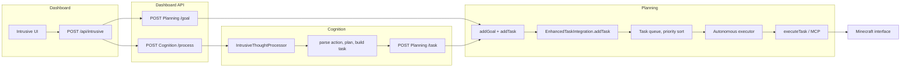

# Task Flow Trace: Intrusive Thought and Endpoint to Execution

How tasks entered via the intrusive thought UI or the planning endpoint flow through the system, and how to verify they are managed, prioritized, decomposed, and executed.

---

## Entry points

1. **Intrusive thought (dashboard)**  
   User types a thought in the dashboard; it is sent to:
   - `POST /api/intrusive` (dashboard) with `{ text, tags?, strength? }`.

2. **Planning goal endpoint (direct)**  
   Caller sends:
   - `POST http://localhost:3002/goal` with `{ name?, description, priority?, urgency?, tasks?[] }`.

---

## Flow overview



- **Dashboard `/api/intrusive`**: Always calls Cognition `/process` (type `intrusion`, content = text). If the text contains goal-related keywords (goal, task, craft, mine, build, explore, gather, farm), it also calls Planning `POST /goal` with one autonomous task whose description is the thought text.
- **Cognition**: For intrusion content, `IntrusiveThoughtProcessor.processIntrusiveThought()` parses an action, chooses a plan (option vs sequence), builds a task, then calls **Planning `POST /task`** with that task (title, description, type, priority as string, source `intrusive-thought`, steps, metadata).
- **Planning**:  
  - `POST /goal` creates a goal and optionally adds tasks via `goalFormulation.addTask` (source `goal`).  
  - `POST /task` calls `goalFormulation.addTask(taskData)` (used by Cognition and any direct caller).  
  - `EnhancedTaskIntegration.addTask()` normalizes priority/urgency (string low/medium/high to 0..1), resolves requirements, generates or accepts steps, stores the task, and emits `taskAdded`.  
  - The autonomous executor loop periodically gets active tasks (sorted by priority), filters by backoff/blocked, and executes the highest-priority eligible task via MCP options or `executeTask()`.

---

## Log lines to follow (development)

With `NODE_ENV=development`, you can trace a task using these prefixes and messages:

| Step | Where | Log pattern |
|------|--------|-------------|
| Intrusive submitted | Dashboard | `[Dashboard] Creating goal from intrusive thought:` (if goal keywords) |
| Goal created | Planning | `[Planning] Goal created: id=... description="..." tasks=...` |
| Task from Cognition | Planning | `[Planning] Task added: id=... title="..." source=intrusive-thought priority=...` |
| Task from /goal | Planning | `[Planning] Task added: id=... title="..." source=goal priority=...` |
| Execution | Planning (modular-server) | `[AUTONOMOUS EXECUTOR] Executing task: ...` / `Executing task: ...` / `Task executed successfully` / `Task execution failed` |
| Cognition | Cognition server | `Task created in planning system:` (response includes `taskId` when Planning returns it) |

Run the stack with `pnpm start` (or equivalent) and watch the planning and cognition logs while submitting an intrusive thought or calling `POST /goal` or `POST /task`.

---

## Priority and normalization

- **Intrusive thought processor** sends `priority` as `'low' | 'medium' | 'high'`.
- **Planning `addTask`** normalizes string priority to numeric: low -> 0.3, medium -> 0.5, high -> 0.8. Urgency is normalized the same way.
- Tasks are ordered by **priority (desc)** then creation time; the autonomous executor picks the highest-priority eligible task.

---

## Checking that actions are used

1. **Task added**: Look for `[Planning] Task added` with the expected `title` and `source` (e.g. `intrusive-thought` or `goal`).
2. **Task executed**: Look for `[AUTONOMOUS EXECUTOR] Executing task:` or `Executing task:` with the same logical task (title/type).
3. **Steps and blocks**: If a task has no executable steps, it gets `blockedReason: 'no-executable-plan'`. Steps are either synthesized by Sterling (e.g. crafting/gathering) or come from the intrusive processor (sequence leaves). Execution uses MCP tools or the fallback `executeTask()` path (e.g. minecraft-interface actions).
4. **Minecraft behavior**: Confirm in-game or via minecraft-interface logs that the intended actions (e.g. dig, move, craft) are sent and that the bot state changes as expected (e.g. no longer defaulting to digging dirt when the goal was oak_log).

---

## POST /task response

Planning `POST /task` returns `{ success, taskId, message, timestamp }`. The Cognition intrusive processor can use `taskId` to correlate its “Task created in planning system” log with the planning-assigned task id.

---

## Action dispatch boundary (minecraft-interface)

When a task reaches the Minecraft interface for execution, the action type must pass through the `/action` endpoint's dispatch logic. This section documents the dispatch architecture.

### Dispatch flow

```
mapBTActionToMinecraft(leafName, args)     mapTaskTypeToMinecraftAction(task)
         │                                            │
         └─────────── { type, parameters } ───────────┘
                              │
                    POST /action endpoint
                              │
                   actionTranslator.executeAction()
                              │
                  ┌───────────┴───────────┐
                  │  LeafFactory-first     │
                  │  (ACTION_TYPE_TO_LEAF  │
                  │   normalization)       │
                  └───────────┬───────────┘
                              │
                   ┌──── leaf found? ────┐
                   │ yes (non-placeholder)│ no / placeholder
                   │                      │
              leaf.run()           hardcoded switch
                                  (navigate, wait,
                                   scan_environment, ...)
```

### ACTION_TYPE_TO_LEAF normalization

The `ACTION_TYPE_TO_LEAF` map resolves aliases before LeafFactory lookup:

| Action type (from planner) | Leaf name (in LeafFactory) |
|---|---|
| `craft` | `craft_recipe` |
| `craft_item` | `craft_recipe` |
| `smelt` | `smelt` |
| `smelt_item` | `smelt` |
| `prepare_site` | `prepare_site` |
| `build_module` | `build_module` |
| `place_feature` | `place_feature` |

Types not in this map use their action type as the leaf name directly.

### Known boundary gaps

These BT leaf mappings emit action types that `executeAction` does not handle. They are cognitive-reflection mappings (not solver outputs) and do not block runtime execution of planned tasks.

| BT leaf | Maps to action type | Status |
|---|---|---|
| `move_and_gather` | `gather_resources` | Not in executeAction; tracked for future cleanup |
| `explore_area` | `move_random` | Not in executeAction; tracked for future cleanup |

### Conformance tests

- `packages/planning/src/__tests__/planner-action-boundary.test.ts` — Asserts every planner-emitted action type is accepted by `executeAction` (51 tests)
- `packages/minecraft-interface/src/__tests__/action-dispatch-contract.test.ts` — Verifies dispatch mechanics: craft alias, smelt handler, building leaves, LeafFactory-first priority, placeholder fallthrough (24 tests)

---

## Terminal log failures and mitigations

| Log message | Cause | Mitigation |
|-------------|--------|------------|
| **"I have undefined other tasks to consider"** in task title/thought | `task_completed` lifecycle event was sent to cognition without `activeTasksCount`; event-driven thought generator interpolated undefined. | Planning now includes `activeTasksCount` when posting `task_completed`. Cognition generator guards `activeTasksCount` (treats undefined as 0). |
| **[ObservationReasoner] LLM failed (This operation was aborted)** | ObservationReasoner calls the LLM with a timeout (default 35s). Abort fires when the LLM does not respond in time (e.g. MLX cold start, slow inference). | Fallback thought is used ("I remain aware of my surroundings..."). To reduce aborts: increase `ObservationReasoner` `timeoutMs` or `COGNITION_LLM_TIMEOUT_MS`; ensure MLX sidecar is warm. |
| **WorldStateManager poll failed (stale snapshot preserved): This operation was aborted** | Planning polls Minecraft interface `/state` with `POLL_TIMEOUT_MS` (8s). Request is aborted on timeout or cancel. | Stale snapshot is kept so consumers still have data. Increase `POLL_TIMEOUT_MS` in `packages/planning/src/modules/timeout-policy.ts` if the Minecraft interface is often slow. |
| **navigate gated: already navigating** | Minecraft action translator throttles duplicate navigate actions. | Expected when the bot is already pathfinding; avoids command spam. |
| **Found 0 potential actionable thoughts** | Planning fetches thoughts from cognition and filters by actionable keywords. Observation-style thoughts are explicitly excluded (see below). | Add more keywords only for goal-like content; status/observation thoughts are filtered out so they do not become tasks. |
| **Observation thoughts becoming tasks** | Thoughts like "Health: 56%, Hunger: 85%. Observing environment and deciding next action." were previously converted to tasks when they matched generic keywords. | Planning now excludes status/observation thoughts in `getActionableThoughts()` and `convertThoughtToTask()`: content starting with "Health:" / "Hunger:", or matching "Observing environment and deciding", or task-completion phrasing ("is complete. I have N other tasks") is not converted to tasks. |
| **Memory system found at: ... / not available at: ...** (repeated) | Planning discovers memory by trying several URLs (localhost, 127.0.0.1, Docker hostnames). When not in Docker, Docker hostnames fail. | Logging reduced to one line when endpoint is chosen or when none available (development only); see memory-integration.ts. |
| **Dashboard bot-state empty or stale** | Dashboard `/api/ws/bot-state` proxies to Minecraft (3005), Cognition (3003), World (3004) with 4s (JSON) or 3s (SSE) timeouts. Uses `localhost`; fails if dashboard runs in a container. | Returns degraded state (e.g. connected: false) on timeout. For Docker, configure service URLs via env (dashboard route currently hardcodes localhost). |

---

## Dashboard and task completion

- **Task completion in UI**: The dashboard events panel is populated by GET `/api/events`, which fetches from Memory `/telemetry`, Planning `/telemetry` and `/events`, and Minecraft `/telemetry`. **Planning does not currently expose GET `/telemetry` or GET `/events`**, so task_completed / task_failed from the executor do not appear in the dashboard events list. Completion is sent to Cognition (lifecycle) and appears in terminal logs only.
- **Bot state in UI**: HUD/inventory/position come from GET or SSE `/api/ws/bot-state`. The dashboard route calls `http://localhost:3005/state` (and 3003, 3004). If those time out or are unreachable, the UI gets a degraded payload (e.g. `connected: false`, empty vitals). Polling fallback on the page runs when the WebSocket has an error and polls `/api/ws/bot-state` every 10s.
