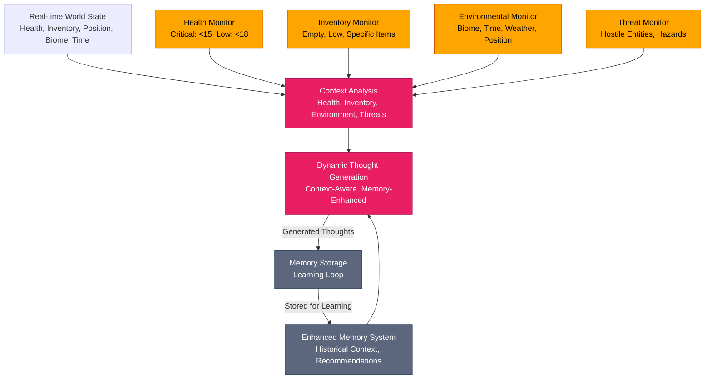
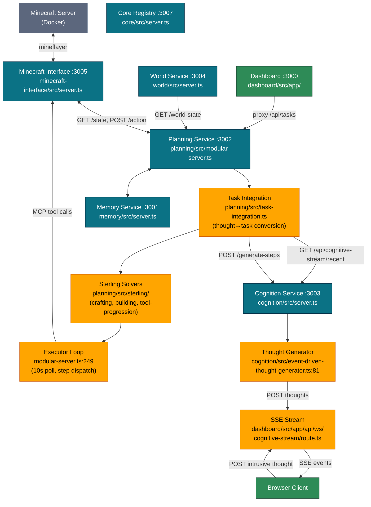
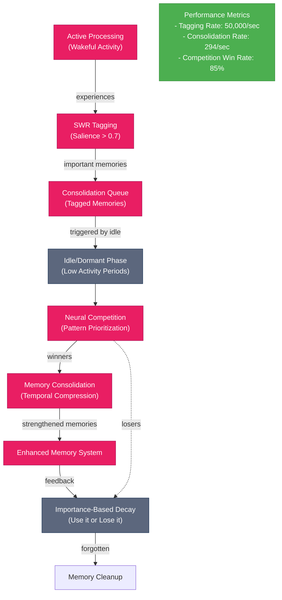
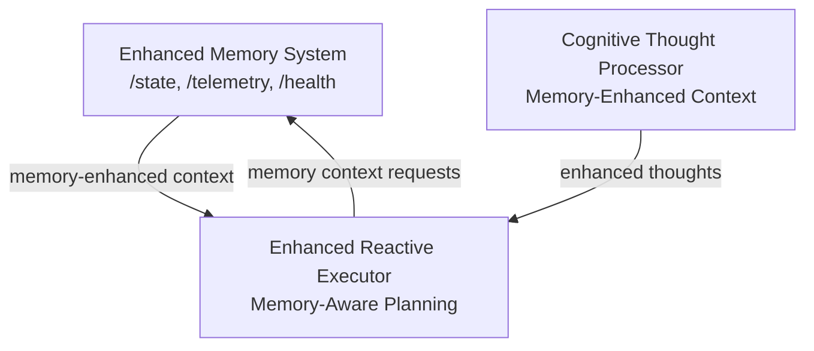
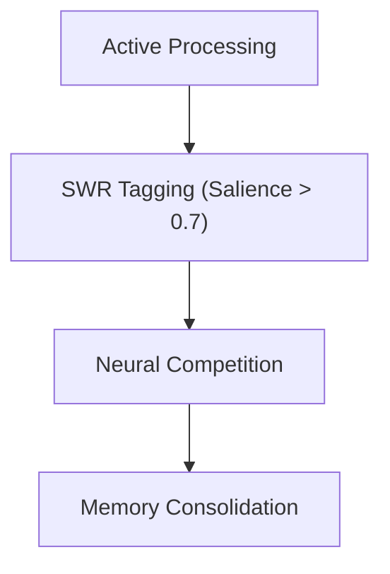
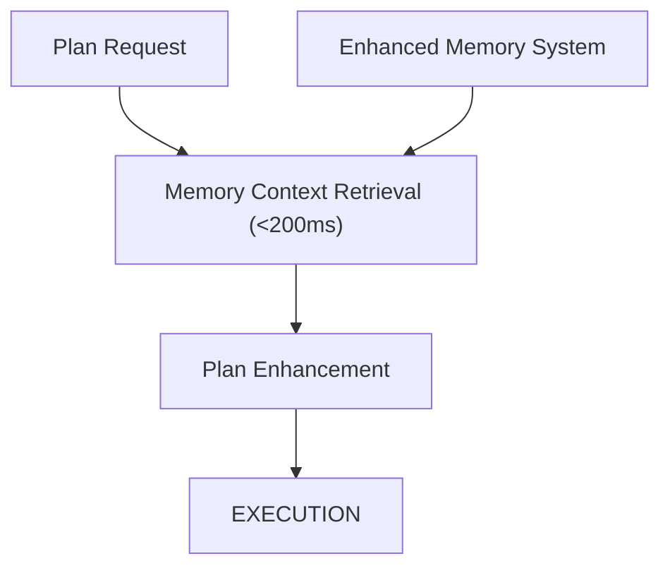
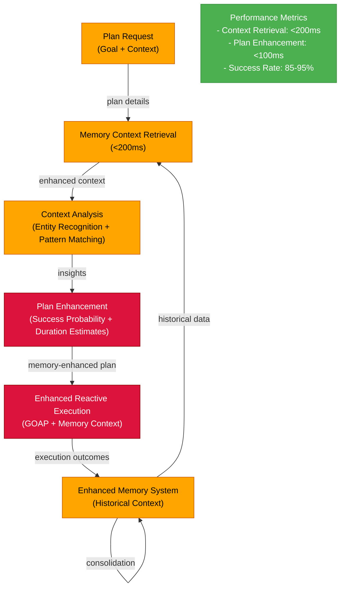

# Cognitive Architecture: Component Design & Rationale

This document explains the design decisions behind our autonomous bot's cognitive architecture. Each component serves a specific purpose in creating a robust, learning system that can operate independently in Minecraft while maintaining safety and accountability.

This section extends the "why" behind each architectural choice and makes the handoff from **brain → body** explicit, so plans reliably become actions. Where relevant, it borrows the **capability discipline** from MCP while keeping **behavior trees (BTs)** as our execution substrate.

> **Last updated:** January 2026. See "Known Bugs" section at the end for current executor inaction issue.

## Running Service Topology

| Service | Port | Entry Point | Role |
|---------|------|-------------|------|
| Dashboard | 3000 | `packages/dashboard/src/app/` (Next.js) | Web UI, SSE cognitive stream, API proxy |
| Memory | 3001 | `packages/memory/src/server.ts` | Episodic/semantic/working memory (PostgreSQL + pgvector) |
| Planning | 3002 | `packages/planning/src/modular-server.ts` | Task executor, Sterling solvers, world-state polling |
| Cognition | 3003 | `packages/cognition/src/server.ts` | Thought generation (event-driven + LLM), step generation |
| World | 3004 | `packages/world/src/server.ts` | World state aggregation |
| Minecraft Interface | 3005 | `packages/minecraft-interface/src/server.ts` | Mineflayer bot control, MCP tools |
| Viewer | 3006 | (served by minecraft-interface) | Prismarine 3D viewer |
| Core Registry | 3007 | `packages/core/src/server.ts` | Capability leaf/option registry |

## Architectural Thesis

* **Hybrid reasoning is not optional**: Minecraft is a mixed environment—structured subgoals (HTN/HRM), dynamic physics (GOAP-style repair), and ambiguous social/creative work (LLM). Each approach has known blind spots; the router's job is to keep us within the convex hull of their strengths.
* **Plans are only potential energy**: The only thing that matters is whether a plan reliably **activates** into world-changing actions. Our core job is to turn "intent" into a **serializable, testable, interruptible action stream**.
* **Safety is an end-to-end property**: Input filters, route constraints, execution guards, and post-hoc provenance together form our "defense-in-depth." No single layer carries the whole burden.

## Core Components & Their Roles

### Input Processing Layer
Components that gather and interpret environmental and cognitive inputs:

- **Intrusive Thought Processor**: Handles external suggestions from the dashboard UI. Users type a message in the dashboard → `POST /api/ws/cognitive-stream` → forwarded to Cognition service. Implemented in:
  - Dashboard POST handler: `packages/dashboard/src/app/api/ws/cognitive-stream/route.ts` (POST section)
  - Client hook: `packages/dashboard/src/hooks/use-cognitive-stream.ts:241` (`sendIntrusiveThought()`)

- **Environment Signals**: Raw sensory data from Minecraft via mineflayer (blocks, entities, weather, time). Polled by the Planning service's WorldStateManager.
  - World state polling: `packages/planning/src/world-state/world-state-manager.ts:63`
  - Minecraft Interface state endpoint: `packages/minecraft-interface/src/server.ts` (`GET /state`)

- **Sensorimotor Interface**: The bridge between raw environmental data and cognitive processing, via the Minecraft Interface service (:3005).
  - Server: `packages/minecraft-interface/src/server.ts`
  - MCP tool executor: `packages/planning/src/modular-server.ts:257`

- **Homeostasis Monitor**: Tracks the bot's internal state (health, hunger, inventory) and environmental threats. Drives thought generation in the Cognition service.
  - Event-driven thought generator: `packages/cognition/src/event-driven-thought-generator.ts:81`

### Memory & Learning Layer
Systems that store experiences and enable learning:

- **Memory Service** (:3001): Persistent storage and retrieval of episodic memories, plans, and learning data. PostgreSQL + pgvector for vector similarity search.
  - Server: `packages/memory/src/server.ts`

- **Provenance Recorder**: Maintains audit trails of decisions and actions.

- **HTN Memory Manager**: Tracks task effectiveness and method performance across executions.

### Planning & Reasoning Layer
The brain of the system — deciding what to do and how to do it:

- **Task Integration** (thought-to-task conversion): Polls cognition service every 30s for actionable thoughts, converts them to tasks, generates steps.
  - Main file: `packages/planning/src/task-integration.ts`
  - Thought polling: `task-integration.ts:349` (`startThoughtToTaskConversion()`)
  - Action word filter: `task-integration.ts:100`
  - Conversion: `task-integration.ts:414` (`convertThoughtToTask()`)
  - Step generation: `task-integration.ts:2206` (`generateDynamicSteps()`)

- **Sterling Symbolic Solvers**: WebSocket-based symbolic reasoning for structured Minecraft tasks.
  - Crafting solver: `packages/planning/src/sterling/minecraft-crafting-solver.ts`
  - Building solver: `packages/planning/src/sterling/minecraft-building-solver.ts`
  - Tool progression solver: `packages/planning/src/sterling/minecraft-tool-progression-solver.ts`
  - Sterling service: `packages/planning/src/sterling/sterling-reasoning-service.ts`

- **Cognitive/LLM Fallback**: When Sterling solvers cannot handle a thought, the system falls back to LLM-based step generation.
  - Cognitive step generation: `task-integration.ts:2560` (`generateStepsFromCognitive()`)
  - Intelligent fallback: `task-integration.ts:2607` (`generateIntelligentSteps()`)

### Execution Layer
Components that turn plans into actions:

- **Modular Server Executor**: The main autonomous loop that selects tasks, finds executable steps, and dispatches them to the Minecraft Interface.
  - Executor loop: `packages/planning/src/modular-server.ts:249` (10s poll interval)
  - Step-to-leaf mapping: `modular-server.ts:743` (`stepToLeafExecution()`)
  - Task selection with backoff/blocked filtering: `modular-server.ts:1665`
  - MCP tool execution: `modular-server.ts:257`

- **Enhanced Reactive Executor**: GOAP-based execution system for plan repair.
  - [EnhancedReactiveExecutor](../../packages/planning/src/reactive-executor/enhanced-reactive-executor.ts)
  - [EnhancedGOAPPlanner](../../packages/planning/src/reactive-executor/enhanced-goap-planner.ts)

- **Minecraft Interface** (:3005): Mineflayer bot control, action execution, Prismarine-Viewer for 3D visualization.
  - [Server](../../packages/minecraft-interface/src/server.ts)

- **PBI Executor Contracts**: Runtime enforcement of plan-body interface contracts.
  - [PBI Enforcer](../../packages/executor-contracts/src/pbi-enforcer.ts)
  - [Capability Registry](../../packages/executor-contracts/src/capability-registry.ts)

## Component Coupling and Contracts

### 1) Input Processing ↔ Planning: "Intent Objects"

**Why:** LLM output and external suggestions are probabilistic; we normalize them into structured **Intent** objects that are easy to route, reason about, and audit.

**Contract: `Intent`**

```ts
type Intent = {
  id: string;                      // traceability
  source: 'user'|'system'|'memory';
  goal: string;                    // e.g., "AcquireWood"
  context: Record<string, any>;    // env snapshot deltas, constraints
  urgency: number;                 // 0..1
  safety: { allowed: boolean; reason?: string };
  timeBudgetMs?: number;           // soft budget
  provenanceRef?: string;          // link to raw prompt/log
};
```

**Design Rationale**

* Normalization here lets **Cognitive Task Router** compare apples to apples across HRM/HTN/LLM options.
* Safety gating early ("allowed: boolean") reduces wasted planner cycles.

---

### 2) Planning & Reasoning ↔ Execution: "PlanStep → Action" Contract

**Why:** This is the crux of your failure-to-act loop: plan steps must be **executable atoms** with known preconditions/effects and a stable translation to Mineflayer behaviors.

**Contract: `PlanStep` and `Action`**

```ts
type PlanStep = {
  stepId: string;
  type: string;               // canonical verb: 'navigate', 'dig_block', 'craft_item', ...
  args: Record<string, any>;  // structured arguments
  // For repair/learning:
  preconds?: string[];        // declarative predicates (world/inventory)
  effects?: string[];         // expected post-conditions
  cost?: number;              // planner-estimated effort
  priority?: number;          // execution priority / deadline handling
  safetyLevel?: 'safe'|'caution'|'restricted';
  expectedDurationMs?: number;
  idempotencyKey?: string;    // to avoid double-execution
};

type ActionResult = {
  ok: boolean;
  error?: { code: string; detail?: string; retryable?: boolean };
  startedAt: number; endedAt: number;
  observables?: Record<string, any>; // facts for memory/provenance
};
```

**Design Rationale**

* **Canonical verbs** remove the impedance mismatch between planner outputs and the **ActionTranslator** switch—this was a root cause suspect in the inaction loop.
* **Preconditions/effects** give us a substrate for GOAP repair and post-execution verification.
* **Idempotency** protects against duplicate dispatch when retries or re-plans occur.

---

### 3) Behavior Trees (Execution Substrate) with MCP-Style Capability Discipline

**Why BTs:**

* Deterministic control flow, local guard conditions, and composability ("selectors" for fallbacks, "sequences" for recipes).
* Natural home for state machines like **crafting**, **gather-then-build**, etc.

**What MCP taught us to adopt (without the MCP server):**

* **Capability registry**: Every complex verb ('craft\_item', 'build\_structure', 'navigate\_to\_POI') is a registered capability with a name, input schema, and acceptance tests.
* **Single entrypoint per capability** (even if implemented as a BT/state machine inside).
* **Health & SLA for each capability**: success rate, mean duration, last failure reasons.

**Capability Manifest (per verb)**

```ts
type CapabilitySpec = {
  name: 'craft_item' | 'build_structure' | ...;
  version: '1.2.0';
  inputSchema: ZodSchema<any>;   // or JSON schema
  guard: (ctx) => boolean;       // cheap safety/feasibility gate
  runner: (ctx, args) => Promise<ActionResult>; // often BT/SM wrapper
  acceptance: (pre, post) => boolean; // effect verification
};
```

**Design Rationale**

* The registry is the **table of contents** between plan and body. If the planner emits a verb not in the registry, we **fail fast** with a clear error instead of silently doing nothing.
* Versioned capabilities let us improve behaviors without breaking planner assumptions.

---

### 4) Execution Orchestration: Enhanced Reactive Executor (ERE)

**Why:** Plans fail in the wild; the ERE converts **PlanStep**s into actions, monitors progress, and triggers **localized repair** without "boomeranging" back to full-replanning.

**Core invariants**

* **I1**: Exactly one PlanStep is **active** per executor per stream.
* **I2**: Every active step has a **deadline** and **timeout**.
* **I3**: On timeout, try local repair (e.g., re-pathfinding) up to `N` attempts; escalate to Router/Planner only after local options are exhausted.
* **I4**: Only **registry-known** verbs can be executed.

**Preemption/Interrupt Policy**

* **Safety > Goal**: Any "threat" signal (health drop, lava, hostile close) can preempt with a **Fast Path** capability ('flee', 'pillar\_up', 'eat\_food').
* **Urgent > Routine**: A high-urgency intent may pause low-priority steps if **I1–I3** won't be violated (we don't abandon mid-atomic actions).

---

### 5) Sensorimotor Interface (SMI) and Homeostasis

**Why:** Stable execution depends on tight feedback loops. SMI exposes world state as **derived signals** (e.g., "path blocked," "inventory near full," "hostile proximity").

**Design choices**

* **Signal taxonomy**: safety, navigation, inventory, time-of-day, weather, social.
* **Rate-limited updates**: avoid thrashing the router/executor.
* **Edge detection**: emit on **change** ("fell below 6 hearts"), not on every tick.

## Thought Type Taxonomy

Before diving into dynamic thought generation, it's important to understand the four categories of thought that flow through the system:

| Type | Attribution | Origin | Code Reference |
|------|------------|--------|----------------|
| **Reflection** | `self` | Cognition service LLM, triggered by bot lifecycle events (task completion, idle periods) | `packages/cognition/src/event-driven-thought-generator.ts:81` |
| **Environmental** | `self` | Cognition service observation pipeline. Falls back to generic "I remain aware..." text when LLM fails (`cognitiveSystem: 'environmental-fallback'`) | `packages/cognition/src/event-driven-thought-generator.ts` |
| **Internal** | `self` | Planning service internal reasoning during task creation, step generation, execution | `packages/planning/src/task-integration.ts:414` |
| **Intrusive** | `intrusive` | External human operator input via dashboard UI → `POST /api/ws/cognitive-stream` | `packages/dashboard/src/hooks/use-cognitive-stream.ts:241` |

**Lifecycle events that trigger thoughts** (`event-driven-thought-generator.ts:174`):
- `task_completed` → **reflection** type
- `task_failed` → **internal_dialogue** type
- `idle_period` → **planning** type
- `task_switch` → **observation** type
- `day_start` / `day_end` → environmental awareness

**Dashboard thought subtypes** (`packages/dashboard/src/types/index.ts:28`):
- `ThoughtType = 'self' | 'reflection' | 'intrusion' | 'intrusive'`

**Deduplication**: Environmental fallback observations are deduplicated at 30-second intervals on both server (`route.ts` POST handler) and client (`dashboard-store.ts:167`).

---

## Dynamic Thought Generation: Context-Aware Cognitive Processing

The cognitive architecture features **dynamic thought generation** that creates thoughts based on real-time context and memory integration, rather than relying on hard-coded or pre-loaded understanding.

### **Dynamic Thought Generation Architecture**



### **Context Analysis Methods**

#### **Health-Based Thought Generation**
```typescript
// Generated when health < 15
{
  type: 'planning',
  content: 'Health is critically low (12/20). Immediate priority: find food, avoid threats, seek shelter.',
  attribution: 'health-monitor',
  context: { health: 12, urgency: 'critical', biome: 'forest' },
  category: 'survival',
  priority: 'high'
}
```

#### **Inventory-Based Thought Generation**
```typescript
// Generated when inventory is empty
{
  type: 'planning',
  content: 'My inventory is empty. I should gather wood and basic materials for tools and shelter.',
  attribution: 'inventory-monitor',
  context: { inventoryCount: 0, biome: 'forest', time: 'day' },
  category: 'resource_gathering',
  priority: 'medium'
}
```

#### **Environmental Thought Generation**
```typescript
// Generated at night
{
  type: 'planning',
  content: 'Night time approaching. Should consider shelter and safety. Visibility will be reduced and hostile mobs will spawn.',
  attribution: 'time-monitor',
  context: { time: 'night', urgency: 'medium', biome: 'plains' },
  category: 'survival',
  priority: 'medium'
}
```

#### **Biome-Specific Thought Generation**
```typescript
// Generated in desert biome
{
  type: 'planning',
  content: 'Biome analysis: desert environment. Scarce water and food. Cacti provide green dye, and temples may contain valuable loot. However, Extreme heat and lack of water make survival challenging.',
  attribution: 'biome-monitor',
  context: { biome: 'desert', opportunities: true, risks: true },
  category: 'exploration',
  priority: 'medium'
}
```

### **Memory Integration in Thought Generation**

#### **Memory-Enhanced Context Processing**
```typescript
// Memory-based thought generation
const memoryContext = await this.memory.getMemoryEnhancedContext({
  query: 'Current situation analysis and potential actions',
  taskType: 'planning',
  entities: this.extractCurrentEntities(worldState),
  location: worldState.position,
  recentEvents: this.getRecentTaskHistory(5),
  maxMemories: 5,
});
```

#### **Memory-Based Thought Examples**
```typescript
// Memory insights become actionable thoughts
{
  type: 'reflection',
  content: 'Memory insight: Previous diamond mining had 70% success rate',
  attribution: 'memory-system',
  context: { source: 'memory-analysis', confidence: 0.85 },
  category: 'analysis',
  priority: 'high'
}

// Memory recommendations become planning thoughts
{
  type: 'planning',
  content: 'Memory-based recommendation: Bring torches for cave exploration',
  attribution: 'memory-system',
  context: { source: 'memory-recommendation', confidence: 0.85 },
  category: 'planning',
  priority: 'high'
}
```

### **Context Analysis Methods Implementation**

#### **getInventoryAdvice() - Context-Aware Inventory Recommendations**
```typescript
private getInventoryAdvice(worldState: any): string {
  const biome = worldState.biome || 'plains';
  const time = worldState.time || 'day';

  if (time === 'night') {
    return 'I should prioritize finding shelter and basic survival items before gathering resources.';
  }

  if (biome === 'forest') {
    return 'I should gather wood and basic materials for tools and shelter.';
  }

  if (biome === 'desert') {
    return 'I need to find water and shade while gathering basic materials.';
  }

  return 'I should gather basic materials like wood and stone to start crafting tools.';
}
```

#### **getBiomeOpportunities() - Biome-Specific Analysis**
```typescript
private getBiomeOpportunities(biome: string, worldState: any): CognitiveThought | null {
  const opportunities: Record<string, string> = {
    'forest': 'Abundant wood and food resources. Good for shelter construction and basic tools.',
    'desert': 'Scarce water and food. Cacti provide green dye, and temples may contain valuable loot.',
    'mountain': 'Rich in minerals (coal, iron, redstone). Watch for steep drops and limited resources.',
    'ocean': 'Fish provide food. Look for shipwrecks, ocean monuments, and underwater structures.',
    'jungle': 'Dense vegetation with unique resources. Watch for dangerous mobs and difficult navigation.',
    'swamp': 'Mushrooms, clay, and slime provide unique resources. Witch huts may contain valuable items.',
  };

  const risks: Record<string, string> = {
    'desert': 'Extreme heat and lack of water make survival challenging.',
    'mountain': 'Steep terrain and falls are major hazards.',
    'ocean': 'Drowning and ocean currents are significant risks.',
    'jungle': 'Dense vegetation makes navigation difficult and dangerous mobs spawn.',
    'swamp': 'Water hazards and poisonous witches pose threats.',
  };

  if (opportunities[biome]) {
    const content = opportunities[biome];
    const risk = risks[biome] ? ` However, ${risks[biome]}` : '';

    return {
      type: 'planning',
      content: `Biome analysis: ${biome} environment. ${content}${risk}`,
      // ... complete thought structure
    };
  }

  return null;
}
```

#### **analyzePosition() - Position-Based Strategic Thinking**
```typescript
private analyzePosition(worldState: any): CognitiveThought | null {
  if (!worldState.position) return null;

  const { x, y, z } = worldState.position;

  // Underground analysis
  if (y < 50) {
    const depth = 64 - y; // Distance below surface
    return {
      type: 'planning',
      content: `Currently at underground level (Y=${y}). Cave exploration opportunities. ${depth}m below surface - be cautious of dark areas and mobs.`,
      attribution: 'position-monitor',
      context: { position: worldState.position, depth, environment: 'underground' },
      category: 'exploration',
      priority: 'low'
    };
  }

  // Surface analysis
  if (y >= 50) {
    return {
      type: 'planning',
      content: `Currently on surface (Y=${y}). Good visibility for exploration and resource gathering.`,
      attribution: 'position-monitor',
      context: { position: worldState.position, environment: 'surface' },
      category: 'exploration',
      priority: 'low'
    };
  }

  return null;
}
```

### **Integration with Cognitive Architecture**

The dynamic thought generation system integrates seamlessly with the existing cognitive architecture:

1. **Real-Time Context Integration**: World state from Sensorimotor Interface feeds directly into thought generation
2. **Memory System Connection**: Enhanced Memory System provides historical context and recommendations
3. **Planning System Integration**: Generated thoughts are processed by the Cognitive Thought Processor and converted to tasks
4. **Learning Loop**: Generated thoughts are stored back to memory for future reference

### **Performance Characteristics**

- **Context Retrieval**: <200ms for memory context queries
- **Thought Generation**: <100ms for context analysis and thought creation
- **Memory Storage**: Real-time storage of generated thoughts
- **System Health**: Graceful degradation when memory system unavailable
- **Scalability**: Efficient processing of multiple context analysis methods

### **Benefits Over Previous Static Approach**

#### **Before (Static/Hard-Coded)**
- Thoughts generated from pre-defined lists
- Static responses that don't adapt to situation
- Limited contextual understanding
- No memory integration
- Fixed priority assignments

#### **After (Dynamic/Context-Aware)**
- **Context-Aware Generation**: Thoughts based on real-time health, inventory, position, biome, time
- **Memory Integration**: Historical context and recommendations influence thought generation
- **Dynamic Prioritization**: Priority based on current situation urgency
- **Adaptive Content**: Biome-specific, time-sensitive, and situation-appropriate thoughts
- **Learning Integration**: Generated thoughts stored in memory for future reference

### **Future Enhancements**

1. **Advanced Context Analysis**: Weather patterns, seasonal variations, social context
2. **Predictive Thinking**: Anticipatory thoughts based on trend analysis
3. **Goal-Oriented Thought Generation**: Thoughts aligned with current objectives
4. **Emotional Context Integration**: Emotional state influencing thought generation
5. **Social Context Awareness**: Group dynamics and social situation analysis


 

## Architecture Design Decisions

### Why This Layered Architecture?

Our design follows a **hierarchical cognitive architecture** inspired by research in autonomous systems and cognitive science. This structure provides several key benefits:

1. **Separation of Concerns**: Each layer has a distinct responsibility, making the system easier to understand, test, and maintain.

2. **Robustness Through Redundancy**: Multiple reasoning systems (HTN, HRM, LLM) ensure the bot can adapt when one approach fails.

3. **Learning Integration**: Memory systems are embedded throughout, enabling continuous improvement rather than static behavior.

4. **Safety by Design**: Input filtering, ethical validation, and emergency responses are built into the architecture from the ground up.

### Component Rationale & Trade-offs

**Intrusive Thought Processor**
- **Why chosen**: Enables external control and testing of the bot's reasoning capabilities
- **Alternative considered**: Direct LLM integration (rejected due to lack of safety filtering)
- **Key benefit**: Allows systematic testing of the bot's ability to handle both helpful and harmful suggestions

**Multi-Modal Planning (HTN + HRM + LLM)**
- **Why multiple systems**: No single planning approach works for all scenarios:
  - HTN excels at structured, hierarchical tasks with clear subtasks
  - HRM provides reliable logic for navigation and resource optimization
  - LLM handles creative, social, and ambiguous situations
- **Routing strategy**: Cognitive Task Router selects based on task characteristics and historical performance

**Enhanced Memory Integration Throughout**
- **Why distributed**: Avoids memory becoming a bottleneck while ensuring all components learn from experience
- **Specialization**: HTN Memory Manager focuses on method effectiveness, while Enhanced Memory System handles episodic, semantic, working, and neuroscience-inspired consolidation
- **Neuroscience Features**:
  - **Sharp Wave Ripple (SWR) Tagging**: Important memories are tagged during active processing for later consolidation
    - Tags memories with high salience (>0.7) during active processing
    - Creates "bookmarks" for later consolidation during idle periods
    - SWR strength calculation based on memory importance and recency
  - **Cognitive Map Tracking**: Internal model of environment and events evolves as the agent learns
    - Maintains spatial relationships and environmental structure
    - Tracks entity locations and interaction patterns over time
    - Provides context for navigation and exploration decisions
  - **Importance-Based Decay**: Memory "use it or lose it" principle favors recently tagged/consolidated memories
    - Memories with high SWR strength have slower decay rates
    - Recently consolidated memories are protected from decay
    - Gradual decay curve mimics human forgetting patterns
  - **Temporal Compression**: Memory replay during consolidation phases occurs at accelerated speeds
    - Consolidation processes run 10x faster than real-time
    - Efficient memory strengthening without interrupting active behavior
    - Batch processing during low-activity periods
  - **Neural Competition**: Memory patterns compete for expression, with stronger patterns winning consolidation
    - Similar memories compete for limited consolidation resources
    - Stronger, more salient patterns receive priority
    - Prevents memory interference and promotes pattern differentiation

### Neuroscience-Inspired Memory System Architecture

The enhanced memory system implements a biologically plausible memory consolidation process inspired by hippocampal research:


 

**Memory System Architecture Visualization**



**Neuroscience Memory Consolidation Flow**



**Memory-Aware Planning Process**


 
#### **SWR Tagging Implementation**
- **Tagging Criteria**: Memories with salience > 0.7 are automatically tagged
- **Tagging Rate**: Up to 50,000 memories/second during active processing
- **SWR Strength Calculation**: Combines memory importance, recency, and emotional salience
- **Queue Management**: Tagged memories queued for later consolidation during idle periods

#### **Cognitive Map Evolution**
- **Spatial Memory**: Tracks location relationships and environmental structure
- **Entity Tracking**: Maintains knowledge of NPCs, items, and environmental features
- **Pattern Learning**: Identifies interaction patterns and behavioral sequences
- **Context Provision**: Provides historical context for decision making

#### **Memory Consolidation Process**
- **Temporal Compression**: Consolidation runs 10x faster than real-time
- **Neural Competition**: Similar memories compete for limited consolidation resources
- **Pattern Differentiation**: Stronger patterns emerge, preventing memory interference
- **Efficiency Optimization**: Batch processing during low-activity periods

#### **Importance-Based Decay**
- **Decay Protection**: Recently consolidated memories are protected from decay
- **SWR Influence**: Memories with high SWR strength decay more slowly
- **Use-Dependent**: Frequently accessed memories have reduced decay rates
- **Gradual Forgetting**: Mimics human forgetting patterns with exponential decay

**Memory-Aware Planning and Execution**

The enhanced planning and execution systems now integrate memory context throughout the decision-making process, enabling the bot to learn from experience and adapt strategies based on historical performance.

#### **Memory-Enhanced Cognitive Processing**

**Cognitive Thought Processor Integration**
- **Context Enhancement**: Thoughts enriched with relevant historical context before processing
- **Entity Extraction**: Automatic identification of Minecraft entities (diamond, cave, mountain, etc.)
- **Priority Boosting**: Memory confidence increases thought priority for better decision making
- **Fallback Handling**: Graceful degradation when memory system unavailable

```typescript
// Memory-enhanced thought processing
const result = await thoughtProcessor.processThoughtWithMemory(thought);
// Returns: { task, memoryContext, enhancedThought, recommendations }
```

**Enhanced Reactive Executor Features**
- **Memory Context Integration**: Plans incorporate historical context for better decision making
- **Success Probability Calculation**: Plans adjusted based on past performance data
- **Entity Recognition**: Automatic identification of Minecraft items and locations in plans
- **Context-Aware Planning**: Memory influences plan duration and complexity estimates

#### **Memory-Aware Planning Process**



#### **Key Memory-Aware Planning Features**

**Context-Aware Plan Generation**
- **Historical Success Rates**: Plans adjusted based on past performance in similar contexts
- **Entity Context**: Automatic recognition of Minecraft items, locations, and biomes
- **Temporal Patterns**: Planning considers time of day, weather, and seasonal factors
- **Social Context**: Memory of past interactions influences planning decisions

**Memory-Enhanced Plan Execution**
- **Adaptive Duration Estimation**: Plan duration based on historical execution data
- **Success Probability Calculation**: Real-time assessment of plan likelihood based on memory
- **Pattern Recognition**: Identification of recurring situations and optimal responses
- **Risk Assessment**: Memory-based evaluation of potential hazards and failure modes

**Learning and Adaptation**
- **Method Effectiveness Tracking**: HTN Memory Manager records which approaches work best
- **Strategy Evolution**: Successful strategies reinforced, failed ones avoided
- **Contextual Memory**: Plans tagged with environmental context for future reference
- **Continuous Improvement**: System learns and adapts based on execution outcomes

#### **Memory-Aware Planning Implementation**

**Enhanced Reactive Executor Memory Integration**
```typescript
// Memory-enhanced execution context
const memoryContext = await this.getMemoryEnhancedExecutionContext(
  plan, worldState, goapPlan
);

// Memory-based plan analysis
const planMemory = {
  planType: plan.goal.type,
  planComplexity: plan.steps.length,
  estimatedDuration: this.estimatePlanDuration(plan),
  successProbability: this.calculatePlanSuccessProbability(plan, memoryContext),
  memoryEnhancedRecommendations: memoryContext.recommendations,
};
```

**Cognitive Thought Enhancement**
```typescript
// Memory-enhanced thought processing
const enhancedThought = {
  ...thought,
  content: `${thought.content}\n\nMemory Context:\n${memoryContext.insights.join('\n')}`,
  priority: this.calculateMemoryEnhancedPriority(thought, memoryContext),
  metadata: {
    ...thought.metadata,
    memoryConfidence: memoryContext.confidence,
    memoryInsights: memoryContext.insights,
  },
};
```

**Reactive Execution with Plan Repair**
- **Why GOAP**: Provides robust execution that can adapt to changing conditions without replanning from scratch
- **Alternative considered**: Pure HTN execution (rejected due to brittleness in dynamic environments)
- **Memory Integration**: Execution context includes historical performance data for repair decisions

## Routing Strategy (Cognitive Task Router)

**Goal:** Map **Intent** → **Reasoning Mode** with memory-aware priors.

**Routing matrix (sketch)**

| Feature / Task traits                    | HRM | HTN | LLM | Collaborative | Fast Path |
| ---------------------------------------- | :-: | :-: | :-: | :-----------: | :-------: |
| Deterministic navigation                 |  ✓  |  –  |  –  |       –       |     –     |
| Multi-step crafting/building             |  –  |  ✓  |  –  |       –       |     –     |
| Ambiguity / social / NL tasks            |  –  |  –  |  ✓  |       ✓       |     –     |
| Ethical constraints / trade-offs         |  –  |  –  |  –  |       ✓       |     –     |
| Time-critical safety                     |  –  |  –  |  –  |       –       |     ✓     |
| Known failure patterns (memory says "X") |  ✓  |  ✓  |  ✓  |       ✓       |     ✓     |

**Memory-conditioned priors**

* If **HTN Memory Manager** shows low success for method M in biome B at night, reduce its prior; prefer HRM/LLM or alternate HTN method bindings.

## How Components Work Together

### The Cognitive Flow: From Input to Action

```
External Suggestions → Intrusive Thought Processor → Task Bootstrapper → Need Generation → Task Routing → Planning → Execution → Memory → Learning
```

1. **Input Processing**: External suggestions are filtered through the Intrusive Thought Processor, while environmental signals flow through the Sensorimotor Interface to the Homeostasis Monitor.

2. **Task Generation**: TaskBootstrapper either recovers incomplete tasks from memory or generates new exploration goals. AdvancedNeedGenerator processes these through context gates considering environmental factors, time, and social context.

3. **Intelligent Routing**: CognitiveTaskRouter analyzes the task and selects the appropriate reasoning system:
   - **HTN Planner** for structured, hierarchical tasks
   - **HRM Planner** for navigation and resource optimization
   - **LLM Reasoning** for creative or social tasks
   - **Fast Path** for emergencies

4. **Plan Execution**: EnhancedReactiveExecutor converts plans into Minecraft actions, monitoring for unexpected changes and repairing plans as needed.

5. **Learning Loop**: All outcomes are recorded in memory systems, with HTNMemoryManager tracking method effectiveness for future planning decisions.

### Real-World Example: Resource Gathering

**Scenario**: Bot needs wood but is low on health and night is approaching.

1. **Input Processing**:
   - Homeostasis Monitor detects low health (high priority)
   - Environment Signals show night approaching (time pressure)
   - No external suggestions received

2. **Need Generation**:
   - Context gates prioritize health over resource gathering
   - Trend analysis suggests shelter is needed before nightfall
   - Memory integration recalls past successful shelter-building experiences

3. **Task Routing**:
   - Health crisis triggers Fast Path routing
   - CognitiveTaskRouter selects HRM Planner for reliable shelter construction

4. **Planning**:
   - HRM Planner creates sequence: find shelter → build basic protection → gather minimal wood
   - HTN Planner breaks this into subtasks with effectiveness tracking

5. **Execution**:
   - ReactiveExecutor monitors plan execution
   - If attacked during execution, plan is repaired to prioritize defense
   - Outcomes recorded for future learning

### Safety & Emergency Systems

The architecture includes multiple safety layers:

- **Proactive Safety**: Homeostasis Monitor continuously tracks health/threats
- **Input Safety**: Intrusive Thought Processor filters harmful suggestions
- **Planning Safety**: Constitutional filters in routing decisions
- **Execution Safety**: Emergency fast-path for life-threatening situations
- **Learning Safety**: Memory systems track both successful and dangerous outcomes

## Plan→Body Interface (PBI) Working Spec

**Acceptance for "step activation"**

* **A1**: For any `PlanStep` with a registry match, **Time-to-First-Action (TTFA)** ≤ **2s** from dispatch.
* **A2**: ≥ **95%** of steps either **complete** or **emit explicit failure** (no silent drops).
* **A3**: For retryable errors, **≤ 2** local retry attempts before escalation.
* **A4**: Stuckness detector trips if **no actuator command** has been issued for **> 3s**, producing a `stuck.loop` error.

**Quick-checks (verification)**

* **V1**: `step.type` ∈ `CapabilityRegistry`.
* **V2**: `inputSchema.parse(args)` passes.
* **V3**: `guard(ctx)` is true.
* **V4**: After run, `acceptance(pre, post)` is true or we emit a structured failure with `effects_unmet`.

**Minimal PBI pseudocode**

```ts
for (const step of plan.steps) {
  assert(registry.has(step.type), 'unknown_verb');

  const cap = registry.get(step.type);
  cap.inputSchema.parse(step.args);
  if (!cap.guard(ctx)) return fail('guard_failed');

  startTimer(step.expectedDurationMs ?? defaults);
  const pre = observeWorld(ctx);
  const res = await cap.runner(ctx, step.args); // BT/SM inside
  const post = observeWorld(ctx);

  if (!res.ok) return escalateOrRetry(res.error);
  if (!cap.acceptance(pre, post)) return escalate('effects_unmet');
}
```

## Key Architectural Patterns

### Event-Driven Architecture with State Management

Our system uses **event-driven architecture** for loose coupling between components:

- **Mineflayer Events**: Real-time world updates (health, inventory, block changes) flow through the Sensorimotor Interface
- **Internal Events**: Planning decisions, execution outcomes, and safety alerts are broadcast to interested components
- **Observer Pattern**: Components subscribe to relevant events without tight coupling

**Example**: When the bot takes damage:
1. Mineflayer emits `health` event → Sensorimotor Interface → Homeostasis Monitor
2. Homeostasis Monitor detects threat → broadcasts `safety_threat` event
3. CognitiveTaskRouter receives event → may trigger Fast Path routing
4. EnhancedReactiveExecutor receives event → may repair current plan

### Memory-First Planning with Continuous Learning

**Memory Integration Pattern**: All planning decisions are informed by past experiences:

- **Contextual Recall**: Before planning, systems query relevant memories for similar situations
- **Effectiveness Tracking**: HTN Memory Manager records which methods work in which contexts
- **Pattern Recognition**: Memory systems identify trends and predict likely outcomes
- **Experience Reuse**: Successful strategies are recalled and adapted for new situations

### Hierarchical Planning with Multiple Reasoning Modes

**Multi-Modal Reasoning**: The system selects planning approaches based on task characteristics:

| Task Type | Reasoning System | Why This Choice |
|-----------|-----------------|-----------------|
| **Structured tasks** (build shelter, gather resources) | HTN Planner | Reliable decomposition into proven subtasks |
| **Navigation/puzzles** | HRM Planner | Logic-based spatial reasoning with predictable outcomes |
| **Creative/social tasks** | LLM Reasoning | Natural language understanding and creative problem-solving |
| **Ethical dilemmas** | Collaborative | Combines structured logic with narrative understanding |
| **Emergencies** | Fast Path | Pre-defined responses for time-critical situations |

### Safety-First Design with Multiple Protection Layers

**Defense in Depth**: Safety is built into every layer:

1. **Input Layer**: Intrusive Thought Processor filters harmful suggestions
2. **Planning Layer**: Cognitive Task Router applies constitutional constraints
3. **Execution Layer**: Reactive Executor monitors for plan deviations
4. **Memory Layer**: Systems learn from both successes and dangerous outcomes

## Why BTs + MCP-Style Discipline (and not one or the other)

* **Pure BT**: Excellent local control, but without a registry/contract you're prone to "silent branch" bugs—exactly the failure-to-act class (unknown verb, missing wire-up).
* **Pure MCP**: Great capability hygiene, but most MCP systems still need a **control substrate** for long-running, interruptible, condition-rich tasks—BT/state machines do this well.
* **Hybrid**: Capabilities are the **API**; BTs are the **implementation**. The registry is the linchpin that keeps planning and body in lockstep.

**Trade-offs**

* Slight overhead to maintain schemas/acceptance tests—but we gain observability, safer refactors, and repairable failures.
* Registry forces naming discipline—planners must output canonical verbs. That's good friction.

## Integration Points for External Control

### HTTP API for Monitoring and Control
- `/api/bot/status` - Real-time bot health, position, and activity status
- `/api/cognitive/signals` - Send external suggestions to the Intrusive Thought Processor
- `/api/cognitive/execute` - Direct execution of specific plans or actions
- `/api/viewer/control` - 3D visualization and debugging controls

### WebSocket Events for Real-Time Updates
- `botEvent` - Live bot state changes (position, health, inventory)
- `planGenerated` - Planning decisions with reasoning traces
- `executionComplete` - Task completion status with outcomes
- `safety_emergency` - Emergency responses and safety interventions

### Configuration-Driven Behavior
All components accept configuration objects allowing runtime behavior modification without code changes. This enables:
- Different personalities or risk tolerances
- Environment-specific adaptations
- A/B testing of planning strategies
- Safety constraint adjustments

## Observability & Metrics

**Execution health**

* **TTFA** (ms) per step, p50/p95
* **Action throughput**: actions/sec
* **Plan repair rate**: repairs/plan
* **Local retry success rate**
* **Mean steps-to-success** per goal type
* **Timeouts / Stuck loops** per hour

**Routing quality**

* **Router disagreement** (how often we override historical best)
* **Capability SLA** per verb: success %, mean duration, last N failures

**Memory impact**

* **Method uplift**: Δ success rate after N memory updates
* **Hazard recall**: fraction of emergencies avoided due to learned priors

**Provenance**

* Every step links: `intentId → planId → stepId → capability(ver) → action trace → effects`.

## Conclusion

This architecture represents a **cognitive middleware** layer that transforms raw environmental inputs into intelligent, safe, and learning-capable behavior. The design prioritizes robustness, explainability, and continuous improvement over simplistic rule-based approaches.

The system demonstrates that complex autonomous behavior can be achieved through careful orchestration of specialized components, each handling specific aspects of cognition while maintaining safety and accountability throughout the decision-making process.

## Failure-Mode Cards (focused on "failure to act")

**FM-01: Unknown Verb / Missing Capability**

* **Symptom**: Step logged as started; no actuator calls; immediate no-op.
* **Likely cause**: Planner emitted `type` not in registry; translator defaulted.
* **Detect**: `!registry.has(step.type)`; TTFA > 2s; no `bot` method invoked.
* **Fix**: Add capability stub; or planner mapping; add CI test to fail on unmapped verbs.

**FM-02: Guarded Out / Preconditions Unmet**

* **Symptom**: Repeated retries without progress.
* **Likely cause**: `guard()` false (e.g., no crafting table); planner unaware.
* **Detect**: guard failures with same reason > 2x.
* **Fix**: Emit `effects_unmet.precond_missing` and **re-plan** with subgoal to satisfy precond (e.g., "place crafting table").

**FM-03: BT Branch Hang**

* **Symptom**: Step active, but no state transitions for ≥ 3s.
* **Likely cause**: Missing tick condition or never-satisfied wait node.
* **Detect**: SM/BT heartbeat metric; "no state change" timer.
* **Fix**: Add **maxStateDuration** + fallback; enforce acceptance post-conditions.

**FM-04: Pathfinding Flap**

* **Symptom**: Alternating "goal\_reached/path\_stop" without net motion.
* **Likely cause**: Goal tolerance too tight; dynamic obstacles.
* **Detect**: > 3 reversals within 10s.
* **Fix**: Expand tolerance; switch to "approach + raycast check"; drop to HRM nav.

**FM-05: Double-Dispatch**

* **Symptom**: Two identical actions run (e.g., duplicate dig).
* **Likely cause**: Retry without idempotency.
* **Detect**: Same `(type,args)` with identical `idempotencyKey` within window.
* **Fix**: De-dupe on key; mark inflight; collapse retries.

## Worked Example: From "Need Wood" to World Change

1. **Need**: Homeostasis says "tools low, wood needed," urgency 0.6.
2. **Intent**: `{ goal: "AcquireWood", context: biome:Taiga, time:Dusk }`.
3. **Router**: Chooses **HTN** → `plan: navigate→fell_tree→collect_drops`.
4. **PlanSteps**:

   * `navigate` → `{ x,y,z }`
   * `craft_item` → `{ item:"stone_axe" }` (precond: has\_stone, has\_sticks)
   * `dig_block` → `{ block:"log", pos:nearby }`
5. **Execution**:

   * `navigate`: BT pathfinder; acceptance = "within 2 blocks of POI".
   * `craft_item` guard fails: no sticks. **ERE** emits subgoal "craft\_sticks"; runs capability chain `craft_item(stick)` → `craft_item(stone_axe)`.
   * `dig_block` succeeds; drops collected.
6. **Provenance**: Links intent→plan→steps; records that "craft via stick subgoal" succeeded, improving priors for future dusk scenarios in Taiga.

---

### Why this solves the failure-to-act loop

* **Registry + canonical verbs** eliminates silent translator fallthroughs.
* **TTFA and stuckness timers** surface any dead BT branches immediately.
* **Guards + acceptance** convert "looks done" into "verified done."
* **Local repair + subgoal precond-satisfaction** turns brittleness into progress.
* **Preemption policy** prevents the bot from *choosing inaction* in emergencies.

---

## Roadmap: Minimal Changes, Max Reliability

1. **Introduce the Capability Registry** (thin layer; keep BTs)

   * Register the verbs your planner emits today (`navigate`, `dig_block`, `craft_item`, `consume_food`, `place_block`, `build_structure`).
   * Add input schemas + guards + acceptance functions.
2. **Normalize Planner Output to Canonical Verbs**

   * One canonical name per behavior; update translator/BT names to match.
3. **Enforce PBI Acceptance (V1–V4) in Executor**

   * TTFA timers, stuckness detector, and fail-fast on unknown verbs.
4. **Codify Precond Satisfaction as Subgoals**

   * If acceptance fails with preconditions, emit subgoals (e.g., "obtain X" or "place Y") before retrying the parent step.
5. **Observability**

   * Emit TTFA, capability SLA, and stuckness metrics; add a simple `/api/cognitive/health` endpoint for live dashboards.

---

## Validation & Test Harness

**Unit**

* Schema round-trip: planner emits → schema parse → guard pass/fail matrix.
* Acceptance tests per capability (golden pre/post snapshots).

**Integration**

* Simulated worlds: "no crafting table," "hostile swarm," "nightfall."
* Forced failures to test local repair vs. re-plan boundaries.

**Runtime canaries**

* Shadow-run new capability alongside stable one (log only); promote on SLA.

**CI gates**

* Fail build if planner verb set and registry verb set diverge.
* Fail on missing acceptance tests for any new capability.

---

## Integration with Existing System

### Using the Executor Contracts Package

The `@conscious-bot/executor-contracts` package provides the PBI enforcement layer that can be integrated with the existing planning system:

```ts
import { createPBIEnforcer, PBIError } from '@conscious-bot/executor-contracts';
import { EnhancedReactiveExecutor } from '../packages/planning/src/reactive-executor/enhanced-reactive-executor';

// Create PBI enforcer with built-in capabilities
const pbiEnforcer = createPBIEnforcer();

// Wrap existing executor with PBI enforcement
class PBIEnhancedExecutor {
  private pbiEnforcer: PBIEnforcer;
  private baseExecutor: EnhancedReactiveExecutor;

  constructor(baseExecutor: EnhancedReactiveExecutor) {
    this.baseExecutor = baseExecutor;
    this.pbiEnforcer = createPBIEnforcer();
  }

  async executePlanStep(step: PlanStep, context: ExecutionContext, worldState: WorldState) {
    try {
      // PBI verification first
      const verification = await this.pbiEnforcer.verifyStep(step, context);
      if (verification.errors.length > 0) {
        throw new PBIError(PBIErrorCode.SCHEMA_VIOLATION, verification.errors.join(', '));
      }

      // Execute with PBI enforcement
      const result = await this.pbiEnforcer.executeStep(step, context, worldState);

      if (result.success) {
        // Continue with base executor logic
        return await this.baseExecutor.execute(result.result);
      } else {
        // Handle PBI failure
        return this.handlePBIError(result.error);
      }
    } catch (error) {
      return this.handlePBIError(error);
    }
  }
}
```

### Key Integration Points

1. **EnhancedReactiveExecutor Integration**
   - [EnhancedReactiveExecutor](../packages/planning/src/reactive-executor/enhanced-reactive-executor.ts) - Base execution logic
   - [EnhancedGOAPPlanner](../packages/planning/src/reactive-executor/enhanced-goap-planner.ts) - GOAP planning integration

2. **Integrated Planning Coordinator**
   - [IntegratedPlanningCoordinator](../packages/planning/src/integrated-planning-coordinator.ts) - Main planning orchestration
   - [CognitiveTaskRouter](../packages/planning/src/hierarchical-planner/cognitive-router.ts) - Task routing logic

3. **Behavior Trees Integration**
   - [BehaviorTreeRunner](../packages/planning/src/behavior-trees/BehaviorTreeRunner.ts) - BT execution engine
   - [Skill Definitions](../packages/planning/src/behavior-trees/definitions/) - BT-based capabilities

### Migration Strategy

The executor-contracts package can be integrated incrementally:

1. **Phase 1**: Add capability registry to existing BT runners
2. **Phase 2**: Wrap existing executor with PBI enforcement
3. **Phase 3**: Update planning output to use canonical verbs
4. **Phase 4**: Implement full acceptance testing and verification

This approach ensures that the existing functionality continues to work while adding the reliability guarantees of the PBI contracts.

---

## Known Bugs

### BUG: Executor Inaction — Cognitive Tasks Always Blocked

**Status:** Open, pending fix.

**Symptom:** The bot generates thoughts and creates tasks from them, but never executes any actions. All tasks appear with `blockedReason: 'no-executable-plan'`. Planning logs show: "All active tasks are in backoff or blocked — skipping cycle."

**Root cause chain:**

1. **Thought → Task conversion** (`task-integration.ts:414`): `convertThoughtToTask()` creates tasks with `steps: []`.

2. **Step generation** (`task-integration.ts:2206`): `generateDynamicSteps()` tries Sterling solvers first (crafting, building, tool-progression), but most free-form cognitive thoughts like "I should gather wood" don't match Sterling solver input requirements, so they fall through to the LLM fallback.

3. **LLM fallback steps lack meta fields** (`task-integration.ts:2589-2595`): `generateStepsFromCognitive()` returns steps structured as:
   ```typescript
   { id, label, done, order, estimatedDuration }
   // MISSING: meta: { leaf: '...', executable: true }
   ```
   Same problem in `generateIntelligentSteps()` at `task-integration.ts:2607`.

4. **Executability check** (`task-integration.ts:1015-1020`):
   ```typescript
   const hasExecutableStep = task.steps.some(
     s => s.meta?.leaf || s.meta?.executable === true
   );
   if (task.steps.length > 0 && !hasExecutableStep) {
     task.metadata.blockedReason = 'no-executable-plan';
   }
   ```
   Since no cognitive steps have `meta.leaf` or `meta.executable`, ALL cognitive tasks get blocked.

5. **Executor filters blocked tasks** (`modular-server.ts:1665-1692`): Tasks with `blockedReason` are excluded from the execution cycle. Zero eligible tasks remain.

**Why Sterling steps work:** Sterling solver enrichment sets `meta.executable = !!s.meta?.leaf` (see `task-integration.ts:2325`, `:2396`, `:2500`).

**Fix needed:** `generateStepsFromCognitive()` and `generateIntelligentSteps()` must set `meta: { executable: true, leaf: '<action_name>' }` on returned steps, mapping LLM-suggested actions to registered MCP tool names (e.g., `move_to`, `dig_block`, `craft_item`).

---

## Inter-Service API Reference

```
Planning :3002 ──GET /api/cognitive-stream/recent──► Cognition :3003
Planning :3002 ──POST /generate-steps─────────────► Cognition :3003
Planning :3002 ──POST /api/cognitive-stream/ack───► Cognition :3003
Planning :3002 ──GET /state───────────────────────► Minecraft Interface :3005
Planning :3002 ──POST /action─────────────────────► Minecraft Interface :3005
Planning :3002 ──memory store/retrieve────────────► Memory :3001
World :3004 ────GET /world-state──────────────────► Planning :3002
Dashboard :3000 ─GET /api/tasks (proxy)────────────► Planning :3002
Dashboard :3000 ─GET /api/state (proxy)────────────► Planning :3002
Dashboard :3000 ─GET /versioning/active────────────► Memory :3001
Browser ────────POST /api/ws/cognitive-stream──────► Dashboard :3000
Dashboard :3000 ─SSE cognitive_thoughts────────────► Browser
```
