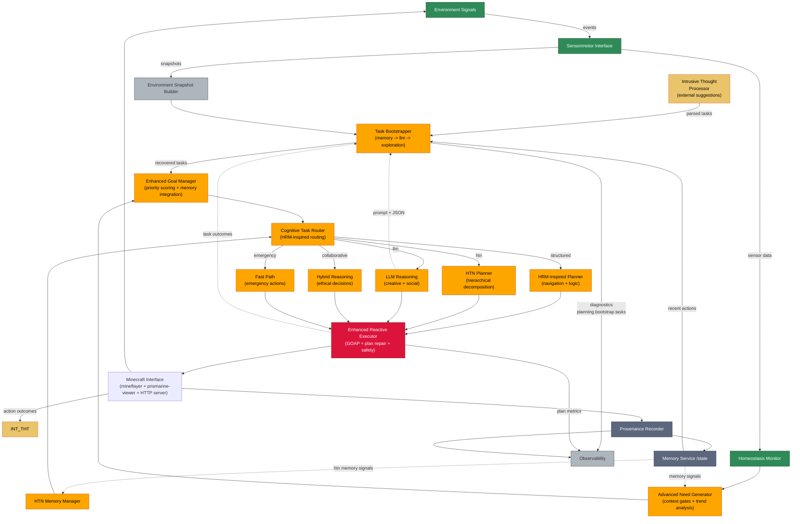

# Cognitive Architecture: Component Design & Rationale

This document explains the design decisions behind our autonomous bot's cognitive architecture. Each component serves a specific purpose in creating a robust, learning system that can operate independently in Minecraft while maintaining safety and accountability.

This section extends the "why" behind each architectural choice and makes the handoff from **brain → body** explicit, so plans reliably become actions. Where relevant, it borrows the **capability discipline** from MCP while keeping **behavior trees (BTs)** as our execution substrate.

## Architectural Thesis

* **Hybrid reasoning is not optional**: Minecraft is a mixed environment—structured subgoals (HTN/HRM), dynamic physics (GOAP-style repair), and ambiguous social/creative work (LLM). Each approach has known blind spots; the router's job is to keep us within the convex hull of their strengths.
* **Plans are only potential energy**: The only thing that matters is whether a plan reliably **activates** into world-changing actions. Our core job is to turn "intent" into a **serializable, testable, interruptible action stream**.
* **Safety is an end-to-end property**: Input filters, route constraints, execution guards, and post-hoc provenance together form our "defense-in-depth." No single layer carries the whole burden.

## Core Components & Their Roles

### Input Processing Layer
Components that gather and interpret environmental and cognitive inputs:

- **Intrusive Thought Processor**: Handles external suggestions and commands from users or other systems, converting natural language into structured tasks while applying safety filters and ethical validation.

- **Environment Signals**: Raw sensory data from Minecraft (blocks, entities, weather, time) that provides the foundation for situational awareness.

- **Sensorimotor Interface**: The bridge between raw environmental data and cognitive processing, handling input filtering and action execution.

- **Homeostasis Monitor**: Tracks the bot's internal state (health, hunger, inventory) and environmental threats to ensure survival needs are prioritized.

### Memory & Learning Layer
Systems that store experiences and enable learning:

- **Memory Service**: Persistent storage and retrieval of episodic memories, plans, and learning data. Provides the foundation for experience-based decision making.

- **Provenance Recorder**: Maintains detailed audit trails of decisions and actions for accountability and debugging.

- **HTN Memory Manager**: Specialized memory system that tracks task effectiveness and method performance across executions, enabling the system to learn which approaches work best for specific situations.

### Planning & Reasoning Layer
The brain of the system - deciding what to do and how to do it:

- **Task Bootstrapper**: Recovers unfinished tasks from memory or generates new exploration goals when no clear objectives exist. This ensures the bot always has purposeful behavior.

- **Advanced Need Generator**: Processes context-aware needs using trend analysis and memory integration. Context gates consider environmental factors, temporal patterns, and social context to determine urgency.

- **Cognitive Task Router**: Routes tasks to appropriate reasoning systems based on characteristics like complexity, time-sensitivity, and historical success patterns. This is inspired by Hierarchical Reasoning Modules (HRM) research.

- **Planning Systems**:
  - **HTN Planner**: Hierarchical Task Network planning with memory-integrated effectiveness tracking. Breaks complex goals into manageable subtasks and learns from success/failure patterns.
  - **HRM Planner**: Structured, logic-based planning for navigation, puzzles, and resource optimization where predictable outcomes are needed.
  - **LLM Reasoning**: Natural language processing for creative tasks, social interaction, and open-ended queries where structured planning is insufficient.
  - **Collaborative Reasoning**: Hybrid approach combining structured logic with narrative understanding for complex ethical decisions.

### Execution Layer
Components that turn plans into actions:

- **Enhanced Reactive Executor**: GOAP-based (Goal-Oriented Action Planning) execution system that builds action sequences and repairs plans when conditions change unexpectedly.

- **Minecraft Interface**: Integration layer using Mineflayer for bot control, Prismarine-Viewer for 3D visualization, and HTTP server for external monitoring and control.

## Component Coupling and Contracts

### 1) Input Processing ↔ Planning: "Intent Objects"

**Why:** LLM output and external suggestions are probabilistic; we normalize them into structured **Intent** objects that are easy to route, reason about, and audit.

**Contract: `Intent`**

```ts
type Intent = {
  id: string;                      // traceability
  source: 'user'|'system'|'memory';
  goal: string;                    // e.g., "AcquireWood"
  context: Record<string, any>;    // env snapshot deltas, constraints
  urgency: number;                 // 0..1
  safety: { allowed: boolean; reason?: string };
  timeBudgetMs?: number;           // soft budget
  provenanceRef?: string;          // link to raw prompt/log
};
```

**Design Rationale**

* Normalization here lets **Cognitive Task Router** compare apples to apples across HRM/HTN/LLM options.
* Safety gating early ("allowed: boolean") reduces wasted planner cycles.

---

### 2) Planning & Reasoning ↔ Execution: "PlanStep → Action" Contract

**Why:** This is the crux of your failure-to-act loop: plan steps must be **executable atoms** with known preconditions/effects and a stable translation to Mineflayer behaviors.

**Contract: `PlanStep` and `Action`**

```ts
type PlanStep = {
  stepId: string;
  type: string;               // canonical verb: 'navigate', 'dig_block', 'craft_item', ...
  args: Record<string, any>;  // structured arguments
  // For repair/learning:
  preconds?: string[];        // declarative predicates (world/inventory)
  effects?: string[];         // expected post-conditions
  cost?: number;              // planner-estimated effort
  priority?: number;          // execution priority / deadline handling
  safetyLevel?: 'safe'|'caution'|'restricted';
  expectedDurationMs?: number;
  idempotencyKey?: string;    // to avoid double-execution
};

type ActionResult = {
  ok: boolean;
  error?: { code: string; detail?: string; retryable?: boolean };
  startedAt: number; endedAt: number;
  observables?: Record<string, any>; // facts for memory/provenance
};
```

**Design Rationale**

* **Canonical verbs** remove the impedance mismatch between planner outputs and the **ActionTranslator** switch—this was a root cause suspect in the inaction loop.
* **Preconditions/effects** give us a substrate for GOAP repair and post-execution verification.
* **Idempotency** protects against duplicate dispatch when retries or re-plans occur.

---

### 3) Behavior Trees (Execution Substrate) with MCP-Style Capability Discipline

**Why BTs:**

* Deterministic control flow, local guard conditions, and composability ("selectors" for fallbacks, "sequences" for recipes).
* Natural home for state machines like **crafting**, **gather-then-build**, etc.

**What MCP taught us to adopt (without the MCP server):**

* **Capability registry**: Every complex verb ('craft\_item', 'build\_structure', 'navigate\_to\_POI') is a registered capability with a name, input schema, and acceptance tests.
* **Single entrypoint per capability** (even if implemented as a BT/state machine inside).
* **Health & SLA for each capability**: success rate, mean duration, last failure reasons.

**Capability Manifest (per verb)**

```ts
type CapabilitySpec = {
  name: 'craft_item' | 'build_structure' | ...;
  version: '1.2.0';
  inputSchema: ZodSchema<any>;   // or JSON schema
  guard: (ctx) => boolean;       // cheap safety/feasibility gate
  runner: (ctx, args) => Promise<ActionResult>; // often BT/SM wrapper
  acceptance: (pre, post) => boolean; // effect verification
};
```

**Design Rationale**

* The registry is the **table of contents** between plan and body. If the planner emits a verb not in the registry, we **fail fast** with a clear error instead of silently doing nothing.
* Versioned capabilities let us improve behaviors without breaking planner assumptions.

---

### 4) Execution Orchestration: Enhanced Reactive Executor (ERE)

**Why:** Plans fail in the wild; the ERE converts **PlanStep**s into actions, monitors progress, and triggers **localized repair** without "boomeranging" back to full-replanning.

**Core invariants**

* **I1**: Exactly one PlanStep is **active** per executor per stream.
* **I2**: Every active step has a **deadline** and **timeout**.
* **I3**: On timeout, try local repair (e.g., re-pathfinding) up to `N` attempts; escalate to Router/Planner only after local options are exhausted.
* **I4**: Only **registry-known** verbs can be executed.

**Preemption/Interrupt Policy**

* **Safety > Goal**: Any "threat" signal (health drop, lava, hostile close) can preempt with a **Fast Path** capability ('flee', 'pillar\_up', 'eat\_food').
* **Urgent > Routine**: A high-urgency intent may pause low-priority steps if **I1–I3** won't be violated (we don't abandon mid-atomic actions).

---

### 5) Sensorimotor Interface (SMI) and Homeostasis

**Why:** Stable execution depends on tight feedback loops. SMI exposes world state as **derived signals** (e.g., "path blocked," "inventory near full," "hostile proximity").

**Design choices**

* **Signal taxonomy**: safety, navigation, inventory, time-of-day, weather, social.
* **Rate-limited updates**: avoid thrashing the router/executor.
* **Edge detection**: emit on **change** ("fell below 6 hearts"), not on every tick.


 

## Architecture Design Decisions

### Why This Layered Architecture?

Our design follows a **hierarchical cognitive architecture** inspired by research in autonomous systems and cognitive science. This structure provides several key benefits:

1. **Separation of Concerns**: Each layer has a distinct responsibility, making the system easier to understand, test, and maintain.

2. **Robustness Through Redundancy**: Multiple reasoning systems (HTN, HRM, LLM) ensure the bot can adapt when one approach fails.

3. **Learning Integration**: Memory systems are embedded throughout, enabling continuous improvement rather than static behavior.

4. **Safety by Design**: Input filtering, ethical validation, and emergency responses are built into the architecture from the ground up.

### Component Rationale & Trade-offs

**Intrusive Thought Processor**
- **Why chosen**: Enables external control and testing of the bot's reasoning capabilities
- **Alternative considered**: Direct LLM integration (rejected due to lack of safety filtering)
- **Key benefit**: Allows systematic testing of the bot's ability to handle both helpful and harmful suggestions

**Multi-Modal Planning (HTN + HRM + LLM)**
- **Why multiple systems**: No single planning approach works for all scenarios:
  - HTN excels at structured, hierarchical tasks with clear subtasks
  - HRM provides reliable logic for navigation and resource optimization
  - LLM handles creative, social, and ambiguous situations
- **Routing strategy**: Cognitive Task Router selects based on task characteristics and historical performance

**Memory Integration Throughout**
- **Why distributed**: Avoids memory becoming a bottleneck while ensuring all components learn from experience
- **Specialization**: HTN Memory Manager focuses on method effectiveness, while Memory Service handles episodic experiences

**Reactive Execution with Plan Repair**
- **Why GOAP**: Provides robust execution that can adapt to changing conditions without replanning from scratch
- **Alternative considered**: Pure HTN execution (rejected due to brittleness in dynamic environments)

## Routing Strategy (Cognitive Task Router)

**Goal:** Map **Intent** → **Reasoning Mode** with memory-aware priors.

**Routing matrix (sketch)**

| Feature / Task traits                    | HRM | HTN | LLM | Collaborative | Fast Path |
| ---------------------------------------- | :-: | :-: | :-: | :-----------: | :-------: |
| Deterministic navigation                 |  ✓  |  –  |  –  |       –       |     –     |
| Multi-step crafting/building             |  –  |  ✓  |  –  |       –       |     –     |
| Ambiguity / social / NL tasks            |  –  |  –  |  ✓  |       ✓       |     –     |
| Ethical constraints / trade-offs         |  –  |  –  |  –  |       ✓       |     –     |
| Time-critical safety                     |  –  |  –  |  –  |       –       |     ✓     |
| Known failure patterns (memory says "X") |  ✓  |  ✓  |  ✓  |       ✓       |     ✓     |

**Memory-conditioned priors**

* If **HTN Memory Manager** shows low success for method M in biome B at night, reduce its prior; prefer HRM/LLM or alternate HTN method bindings.

## How Components Work Together

### The Cognitive Flow: From Input to Action

```
External Suggestions → Intrusive Thought Processor → Task Bootstrapper → Need Generation → Task Routing → Planning → Execution → Memory → Learning
```

1. **Input Processing**: External suggestions are filtered through the Intrusive Thought Processor, while environmental signals flow through the Sensorimotor Interface to the Homeostasis Monitor.

2. **Task Generation**: TaskBootstrapper either recovers incomplete tasks from memory or generates new exploration goals. AdvancedNeedGenerator processes these through context gates considering environmental factors, time, and social context.

3. **Intelligent Routing**: CognitiveTaskRouter analyzes the task and selects the appropriate reasoning system:
   - **HTN Planner** for structured, hierarchical tasks
   - **HRM Planner** for navigation and resource optimization
   - **LLM Reasoning** for creative or social tasks
   - **Fast Path** for emergencies

4. **Plan Execution**: EnhancedReactiveExecutor converts plans into Minecraft actions, monitoring for unexpected changes and repairing plans as needed.

5. **Learning Loop**: All outcomes are recorded in memory systems, with HTNMemoryManager tracking method effectiveness for future planning decisions.

### Real-World Example: Resource Gathering

**Scenario**: Bot needs wood but is low on health and night is approaching.

1. **Input Processing**:
   - Homeostasis Monitor detects low health (high priority)
   - Environment Signals show night approaching (time pressure)
   - No external suggestions received

2. **Need Generation**:
   - Context gates prioritize health over resource gathering
   - Trend analysis suggests shelter is needed before nightfall
   - Memory integration recalls past successful shelter-building experiences

3. **Task Routing**:
   - Health crisis triggers Fast Path routing
   - CognitiveTaskRouter selects HRM Planner for reliable shelter construction

4. **Planning**:
   - HRM Planner creates sequence: find shelter → build basic protection → gather minimal wood
   - HTN Planner breaks this into subtasks with effectiveness tracking

5. **Execution**:
   - ReactiveExecutor monitors plan execution
   - If attacked during execution, plan is repaired to prioritize defense
   - Outcomes recorded for future learning

### Safety & Emergency Systems

The architecture includes multiple safety layers:

- **Proactive Safety**: Homeostasis Monitor continuously tracks health/threats
- **Input Safety**: Intrusive Thought Processor filters harmful suggestions
- **Planning Safety**: Constitutional filters in routing decisions
- **Execution Safety**: Emergency fast-path for life-threatening situations
- **Learning Safety**: Memory systems track both successful and dangerous outcomes

## Plan→Body Interface (PBI) Working Spec

**Acceptance for "step activation"**

* **A1**: For any `PlanStep` with a registry match, **Time-to-First-Action (TTFA)** ≤ **2s** from dispatch.
* **A2**: ≥ **95%** of steps either **complete** or **emit explicit failure** (no silent drops).
* **A3**: For retryable errors, **≤ 2** local retry attempts before escalation.
* **A4**: Stuckness detector trips if **no actuator command** has been issued for **> 3s**, producing a `stuck.loop` error.

**Quick-checks (verification)**

* **V1**: `step.type` ∈ `CapabilityRegistry`.
* **V2**: `inputSchema.parse(args)` passes.
* **V3**: `guard(ctx)` is true.
* **V4**: After run, `acceptance(pre, post)` is true or we emit a structured failure with `effects_unmet`.

**Minimal PBI pseudocode**

```ts
for (const step of plan.steps) {
  assert(registry.has(step.type), 'unknown_verb');

  const cap = registry.get(step.type);
  cap.inputSchema.parse(step.args);
  if (!cap.guard(ctx)) return fail('guard_failed');

  startTimer(step.expectedDurationMs ?? defaults);
  const pre = observeWorld(ctx);
  const res = await cap.runner(ctx, step.args); // BT/SM inside
  const post = observeWorld(ctx);

  if (!res.ok) return escalateOrRetry(res.error);
  if (!cap.acceptance(pre, post)) return escalate('effects_unmet');
}
```

## Key Architectural Patterns

### Event-Driven Architecture with State Management

Our system uses **event-driven architecture** for loose coupling between components:

- **Mineflayer Events**: Real-time world updates (health, inventory, block changes) flow through the Sensorimotor Interface
- **Internal Events**: Planning decisions, execution outcomes, and safety alerts are broadcast to interested components
- **Observer Pattern**: Components subscribe to relevant events without tight coupling

**Example**: When the bot takes damage:
1. Mineflayer emits `health` event → Sensorimotor Interface → Homeostasis Monitor
2. Homeostasis Monitor detects threat → broadcasts `safety_threat` event
3. CognitiveTaskRouter receives event → may trigger Fast Path routing
4. EnhancedReactiveExecutor receives event → may repair current plan

### Memory-First Planning with Continuous Learning

**Memory Integration Pattern**: All planning decisions are informed by past experiences:

- **Contextual Recall**: Before planning, systems query relevant memories for similar situations
- **Effectiveness Tracking**: HTN Memory Manager records which methods work in which contexts
- **Pattern Recognition**: Memory systems identify trends and predict likely outcomes
- **Experience Reuse**: Successful strategies are recalled and adapted for new situations

### Hierarchical Planning with Multiple Reasoning Modes

**Multi-Modal Reasoning**: The system selects planning approaches based on task characteristics:

| Task Type | Reasoning System | Why This Choice |
|-----------|-----------------|-----------------|
| **Structured tasks** (build shelter, gather resources) | HTN Planner | Reliable decomposition into proven subtasks |
| **Navigation/puzzles** | HRM Planner | Logic-based spatial reasoning with predictable outcomes |
| **Creative/social tasks** | LLM Reasoning | Natural language understanding and creative problem-solving |
| **Ethical dilemmas** | Collaborative | Combines structured logic with narrative understanding |
| **Emergencies** | Fast Path | Pre-defined responses for time-critical situations |

### Safety-First Design with Multiple Protection Layers

**Defense in Depth**: Safety is built into every layer:

1. **Input Layer**: Intrusive Thought Processor filters harmful suggestions
2. **Planning Layer**: Cognitive Task Router applies constitutional constraints
3. **Execution Layer**: Reactive Executor monitors for plan deviations
4. **Memory Layer**: Systems learn from both successes and dangerous outcomes

## Why BTs + MCP-Style Discipline (and not one or the other)

* **Pure BT**: Excellent local control, but without a registry/contract you're prone to "silent branch" bugs—exactly the failure-to-act class (unknown verb, missing wire-up).
* **Pure MCP**: Great capability hygiene, but most MCP systems still need a **control substrate** for long-running, interruptible, condition-rich tasks—BT/state machines do this well.
* **Hybrid**: Capabilities are the **API**; BTs are the **implementation**. The registry is the linchpin that keeps planning and body in lockstep.

**Trade-offs**

* Slight overhead to maintain schemas/acceptance tests—but we gain observability, safer refactors, and repairable failures.
* Registry forces naming discipline—planners must output canonical verbs. That's good friction.

## Integration Points for External Control

### HTTP API for Monitoring and Control
- `/api/bot/status` - Real-time bot health, position, and activity status
- `/api/cognitive/signals` - Send external suggestions to the Intrusive Thought Processor
- `/api/cognitive/execute` - Direct execution of specific plans or actions
- `/api/viewer/control` - 3D visualization and debugging controls

### WebSocket Events for Real-Time Updates
- `botEvent` - Live bot state changes (position, health, inventory)
- `planGenerated` - Planning decisions with reasoning traces
- `executionComplete` - Task completion status with outcomes
- `safety_emergency` - Emergency responses and safety interventions

### Configuration-Driven Behavior
All components accept configuration objects allowing runtime behavior modification without code changes. This enables:
- Different personalities or risk tolerances
- Environment-specific adaptations
- A/B testing of planning strategies
- Safety constraint adjustments

## Observability & Metrics

**Execution health**

* **TTFA** (ms) per step, p50/p95
* **Action throughput**: actions/sec
* **Plan repair rate**: repairs/plan
* **Local retry success rate**
* **Mean steps-to-success** per goal type
* **Timeouts / Stuck loops** per hour

**Routing quality**

* **Router disagreement** (how often we override historical best)
* **Capability SLA** per verb: success %, mean duration, last N failures

**Memory impact**

* **Method uplift**: Δ success rate after N memory updates
* **Hazard recall**: fraction of emergencies avoided due to learned priors

**Provenance**

* Every step links: `intentId → planId → stepId → capability(ver) → action trace → effects`.

## Conclusion

This architecture represents a **cognitive middleware** layer that transforms raw environmental inputs into intelligent, safe, and learning-capable behavior. The design prioritizes robustness, explainability, and continuous improvement over simplistic rule-based approaches.

The system demonstrates that complex autonomous behavior can be achieved through careful orchestration of specialized components, each handling specific aspects of cognition while maintaining safety and accountability throughout the decision-making process.

## Failure-Mode Cards (focused on "failure to act")

**FM-01: Unknown Verb / Missing Capability**

* **Symptom**: Step logged as started; no actuator calls; immediate no-op.
* **Likely cause**: Planner emitted `type` not in registry; translator defaulted.
* **Detect**: `!registry.has(step.type)`; TTFA > 2s; no `bot` method invoked.
* **Fix**: Add capability stub; or planner mapping; add CI test to fail on unmapped verbs.

**FM-02: Guarded Out / Preconditions Unmet**

* **Symptom**: Repeated retries without progress.
* **Likely cause**: `guard()` false (e.g., no crafting table); planner unaware.
* **Detect**: guard failures with same reason > 2x.
* **Fix**: Emit `effects_unmet.precond_missing` and **re-plan** with subgoal to satisfy precond (e.g., "place crafting table").

**FM-03: BT Branch Hang**

* **Symptom**: Step active, but no state transitions for ≥ 3s.
* **Likely cause**: Missing tick condition or never-satisfied wait node.
* **Detect**: SM/BT heartbeat metric; "no state change" timer.
* **Fix**: Add **maxStateDuration** + fallback; enforce acceptance post-conditions.

**FM-04: Pathfinding Flap**

* **Symptom**: Alternating "goal\_reached/path\_stop" without net motion.
* **Likely cause**: Goal tolerance too tight; dynamic obstacles.
* **Detect**: > 3 reversals within 10s.
* **Fix**: Expand tolerance; switch to "approach + raycast check"; drop to HRM nav.

**FM-05: Double-Dispatch**

* **Symptom**: Two identical actions run (e.g., duplicate dig).
* **Likely cause**: Retry without idempotency.
* **Detect**: Same `(type,args)` with identical `idempotencyKey` within window.
* **Fix**: De-dupe on key; mark inflight; collapse retries.

## Worked Example: From "Need Wood" to World Change

1. **Need**: Homeostasis says "tools low, wood needed," urgency 0.6.
2. **Intent**: `{ goal: "AcquireWood", context: biome:Taiga, time:Dusk }`.
3. **Router**: Chooses **HTN** → `plan: navigate→fell_tree→collect_drops`.
4. **PlanSteps**:

   * `navigate` → `{ x,y,z }`
   * `craft_item` → `{ item:"stone_axe" }` (precond: has\_stone, has\_sticks)
   * `dig_block` → `{ block:"log", pos:nearby }`
5. **Execution**:

   * `navigate`: BT pathfinder; acceptance = "within 2 blocks of POI".
   * `craft_item` guard fails: no sticks. **ERE** emits subgoal "craft\_sticks"; runs capability chain `craft_item(stick)` → `craft_item(stone_axe)`.
   * `dig_block` succeeds; drops collected.
6. **Provenance**: Links intent→plan→steps; records that "craft via stick subgoal" succeeded, improving priors for future dusk scenarios in Taiga.

---

### Why this solves the failure-to-act loop

* **Registry + canonical verbs** eliminates silent translator fallthroughs.
* **TTFA and stuckness timers** surface any dead BT branches immediately.
* **Guards + acceptance** convert "looks done" into "verified done."
* **Local repair + subgoal precond-satisfaction** turns brittleness into progress.
* **Preemption policy** prevents the bot from *choosing inaction* in emergencies.

---

## Roadmap: Minimal Changes, Max Reliability

1. **Introduce the Capability Registry** (thin layer; keep BTs)

   * Register the verbs your planner emits today (`navigate`, `dig_block`, `craft_item`, `consume_food`, `place_block`, `build_structure`).
   * Add input schemas + guards + acceptance functions.
2. **Normalize Planner Output to Canonical Verbs**

   * One canonical name per behavior; update translator/BT names to match.
3. **Enforce PBI Acceptance (V1–V4) in Executor**

   * TTFA timers, stuckness detector, and fail-fast on unknown verbs.
4. **Codify Precond Satisfaction as Subgoals**

   * If acceptance fails with preconditions, emit subgoals (e.g., "obtain X" or "place Y") before retrying the parent step.
5. **Observability**

   * Emit TTFA, capability SLA, and stuckness metrics; add a simple `/api/cognitive/health` endpoint for live dashboards.

---

## Validation & Test Harness

**Unit**

* Schema round-trip: planner emits → schema parse → guard pass/fail matrix.
* Acceptance tests per capability (golden pre/post snapshots).

**Integration**

* Simulated worlds: "no crafting table," "hostile swarm," "nightfall."
* Forced failures to test local repair vs. re-plan boundaries.

**Runtime canaries**

* Shadow-run new capability alongside stable one (log only); promote on SLA.

**CI gates**

* Fail build if planner verb set and registry verb set diverge.
* Fail on missing acceptance tests for any new capability.

---

If you want, I can turn the **Capability Registry** and **PBI checks** above into a small `@conscious-bot/executor-contracts` package (types + helpers + runtime guards), plus a codemod to auto-wrap your existing BT runners with schema/guard/acceptance stubs. That's typically a ≤300-line addition that pays for itself the first time a planner emits an unknown verb.
 
