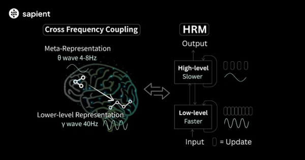
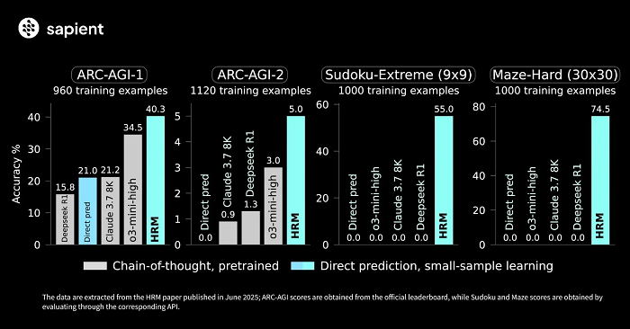

# Integrating Sapient’s Hierarchical Reasoning Model (HRM) into Our Minecraft Project

**Summary:** Sapient Intelligence’s new Hierarchical Reasoning Model (HRM) is a brain-inspired AI architecture with only 27 million parameters. Despite its small size and using just ~1000 training examples, HRM demonstrates exceptional reasoning abilities on tasks like ARC-AGI, extreme Sudoku, and maze navigation[\[1\]](https://www.electronicsmedia.info/2025/07/22/brain-inspired-hrm-solves-complex-tasks-without-pretraining/#:~:text=Despite%20its%20compact%20scale%20of,perfect%20accuracy). This aligns strongly with our project’s theory that clever architecture can outperform sheer scale. Below, we discuss how HRM’s principles could apply to our Minecraft research, the advantages it offers over our current small LLM approach, potential hybrid (“mixture-of-experts”) strategies combining HRM with our models, and concrete steps for implementation.

## Overview of Sapient’s Hierarchical Reasoning Model (HRM)

  
_Sapient’s HRM takes inspiration from the brain’s multi-level processing, featuring a slow “System 2” planning module and a fast “System 1” reactive module that work in tandem_[_\[2\]_](https://www.electronicsmedia.info/2025/07/22/brain-inspired-hrm-solves-complex-tasks-without-pretraining/#:~:text=Current%20LLMs%20depend%20heavily%20on,%E2%80%9CSystem%202%E2%80%9D%29%20in%20a)_. This two-tier recurrent architecture operates at different timescales (high-level abstract reasoning vs. low-level detailed computation) and alternates between them in a single forward pass_[_\[2\]_](https://www.electronicsmedia.info/2025/07/22/brain-inspired-hrm-solves-complex-tasks-without-pretraining/#:~:text=Current%20LLMs%20depend%20heavily%20on,%E2%80%9CSystem%202%E2%80%9D%29%20in%20a)_. The design enables dynamic, human-like reasoning without relying on massive training data or model size_[_\[3\]_](https://www.reddit.com/r/agi/comments/1m6js62/sapients_new_27million_parameter_open_source_hrm/#:~:text=HRM%E2%80%99s%20architecture%20mimics%20human%20cognition,datasets%2C%20or%20backpropagation%20through%20time)_._

**Key Features of HRM Architecture:**

- **Hierarchical Dual-Module Design:** The model is composed of two coupled recurrent networks: a high-level module for slow, abstract planning, and a low-level module for fast, detailed operations[\[4\]](https://www.electronicsmedia.info/2025/07/22/brain-inspired-hrm-solves-complex-tasks-without-pretraining/#:~:text=high%20latency,in%20a%20single%20forward%20pass). This resembles the human cognitive separation of deliberate reasoning versus intuitive thinking (often likened to “System 2” vs “System 1”)[\[4\]](https://www.electronicsmedia.info/2025/07/22/brain-inspired-hrm-solves-complex-tasks-without-pretraining/#:~:text=high%20latency,in%20a%20single%20forward%20pass).
- **Multi-Timescale Processing:** The high-level module operates on a slower timescale (fewer, coarse-grained steps) while the low-level module works on a faster timescale (many fine-grained computations)[\[4\]](https://www.electronicsmedia.info/2025/07/22/brain-inspired-hrm-solves-complex-tasks-without-pretraining/#:~:text=high%20latency,in%20a%20single%20forward%20pass). Through **temporal separation**, the two modules exchange information and refine a shared solution iteratively within one inference cycle.
- **Single-Pass Reasoning Loop:** Unlike standard transformers that produce an answer in one shot or require explicit chain-of-thought prompting, HRM _internally_ performs a kind of iterative reasoning. It generates a solution, evaluates if it’s adequate, and can refine it repeatedly (an **outer-loop** refinement) until a halt condition is met[\[5\]](https://arcprize.org/blog/hrm-analysis#:~:text=to%20an%20ARC,or%20submit%20it%20as%20final)[\[6\]](https://arcprize.org/blog/hrm-analysis#:~:text=If%20the%20model%20chooses%20to,either%20stop%20or%20refine). All this happens within the model’s forward pass, without expensive back-and-forth prompting or backpropagation during inference[\[3\]](https://www.reddit.com/r/agi/comments/1m6js62/sapients_new_27million_parameter_open_source_hrm/#:~:text=HRM%E2%80%99s%20architecture%20mimics%20human%20cognition,datasets%2C%20or%20backpropagation%20through%20time).
- **Efficiency and Compactness:** HRM achieves substantial _computational depth_ (effective reasoning steps) despite having only 27M parameters, thanks to its recurrent refinement mechanism[\[2\]](https://www.electronicsmedia.info/2025/07/22/brain-inspired-hrm-solves-complex-tasks-without-pretraining/#:~:text=Current%20LLMs%20depend%20heavily%20on,%E2%80%9CSystem%202%E2%80%9D%29%20in%20a)[\[6\]](https://arcprize.org/blog/hrm-analysis#:~:text=If%20the%20model%20chooses%20to,either%20stop%20or%20refine). In practice, it runs in mere milliseconds on a standard CPU and uses <200 MB of memory[\[7\]](https://www.reddit.com/r/agi/comments/1m6js62/sapients_new_27million_parameter_open_source_hrm/#:~:text=compute%2C%20large%20datasets%2C%20or%20backpropagation,through%20time), making it lightweight compared to large language models. This efficiency suits real-time decision-making scenarios or deployment on edge devices[\[7\]](https://www.reddit.com/r/agi/comments/1m6js62/sapients_new_27million_parameter_open_source_hrm/#:~:text=compute%2C%20large%20datasets%2C%20or%20backpropagation,through%20time).

In summary, HRM’s architecture prioritizes **design over scale**, aiming to mimic cognitive processes. Sapient’s founder emphasizes that this approach lets the model “actually think and reason like a person, not just crunch probabilities to ace benchmarks”[\[8\]](https://www.electronicsmedia.info/2025/07/22/brain-inspired-hrm-solves-complex-tasks-without-pretraining/#:~:text=%E2%80%9CAGI%20is%20really%20about%20giving,and%20CEO%20of%20Sapient%20Intelligence). This philosophy resonates with our own research goals of creating intelligent agents through structured reasoning rather than brute-force data or model size.

## Alignment with Our Theory and Project Goals

Our project’s theory posits that **smaller, well-structured models or multi-component systems can achieve sophisticated reasoning** in complex tasks (like Minecraft) without the need for gigantic monolithic LLMs. The success of HRM provides a compelling validation of this idea[\[9\]](https://www.electronicsmedia.info/2025/07/22/brain-inspired-hrm-solves-complex-tasks-without-pretraining/#:~:text=Sapient%20Intelligence%20believes%20that%20HRM,and%20true%20artificial%20general%20intelligence):

- _Architecture vs. Scale:_ The HRM is a clear proof-of-concept that intelligent behavior can emerge from a relatively small model when the architecture is thoughtfully designed[\[9\]](https://www.electronicsmedia.info/2025/07/22/brain-inspired-hrm-solves-complex-tasks-without-pretraining/#:~:text=Sapient%20Intelligence%20believes%20that%20HRM,and%20true%20artificial%20general%20intelligence). In Sapient’s words, HRM shows “a viable alternative to the currently dominant CoT reasoning models… relying on architecture, not scale, to push the frontier of AI”[\[9\]](https://www.electronicsmedia.info/2025/07/22/brain-inspired-hrm-solves-complex-tasks-without-pretraining/#:~:text=Sapient%20Intelligence%20believes%20that%20HRM,and%20true%20artificial%20general%20intelligence). This aligns with our theoretical approach that clever structuring (hierarchical modules, iterative reasoning loops, etc.) can outperform simply scaling up parameters.
- _Human-Like Problem Solving:_ Our Minecraft research often involves tasks that humans solve via hierarchical planning – for example, breaking a high-level goal into sub-goals (build a shelter → gather wood → craft planks → build structure) and handling low-level execution (movement, resource collection). HRM’s two-level reasoning is directly applicable to this paradigm, essentially encoding a **planner** and a **worker** that cooperate[\[4\]](https://www.electronicsmedia.info/2025/07/22/brain-inspired-hrm-solves-complex-tasks-without-pretraining/#:~:text=high%20latency,in%20a%20single%20forward%20pass). This matches our conceptual framework for agents that need both strategic planning and reactive execution.
- _Data-Efficient Learning:_ We have been exploring small LLMs and specialist models due to limited training data in our domain. HRM’s ability to learn complex tasks with on the order of **1,000 examples and no pre-training**[\[1\]](https://www.electronicsmedia.info/2025/07/22/brain-inspired-hrm-solves-complex-tasks-without-pretraining/#:~:text=Despite%20its%20compact%20scale%20of,perfect%20accuracy) reinforces our belief that focusing on the right data (and augmenting it smartly) plus architectural bias can yield strong performance. This is encouraging for our project, where we cannot rely on internet-scale datasets.

Overall, **yes – HRM’s approach appears to apply to our theory and use-case.** It gives us a concrete blueprint of how a brain-inspired, hierarchical model can solve tasks relevant to an open-ended environment like Minecraft. The notion that a small model can “think” its way through complex problems dovetails with our research objectives. We should be optimistic about leveraging these insights in our project.

## Advantages of HRM over Plain Small LLMs

Our current approach employs small language models (LLMs) to handle reasoning in Minecraft (likely via prompt-based chain-of-thought or fine-tuned policies). While lightweight, those models face well-known limitations in complex reasoning. Adopting HRM’s ideas could yield several benefits over using small LLMs alone:

- **Robust Reasoning vs. Brittle CoT:** Standard LLMs often rely on chain-of-thought prompts to decompose tasks, which can be brittle and error-prone. They tend to “play the odds” by guessing likely next steps, sometimes losing logical consistency[\[2\]](https://www.electronicsmedia.info/2025/07/22/brain-inspired-hrm-solves-complex-tasks-without-pretraining/#:~:text=Current%20LLMs%20depend%20heavily%20on,%E2%80%9CSystem%202%E2%80%9D%29%20in%20a)[\[8\]](https://www.electronicsmedia.info/2025/07/22/brain-inspired-hrm-solves-complex-tasks-without-pretraining/#:~:text=%E2%80%9CAGI%20is%20really%20about%20giving,and%20CEO%20of%20Sapient%20Intelligence). In contrast, HRM inherently performs a _stable reasoning process_ – alternating between planning and detailed thinking – making it less fragile on tasks that require careful multi-step deduction. This could improve reliability in complex Minecraft challenges (e.g. solving a multi-step puzzle in-game) where a pure LLM might go off-track.
- **Lower Data and Compute Requirements:** HRM was trained with only ~1000 examples per task and requires a fraction of the compute that larger LLMs need[\[1\]](https://www.electronicsmedia.info/2025/07/22/brain-inspired-hrm-solves-complex-tasks-without-pretraining/#:~:text=Despite%20its%20compact%20scale%20of,perfect%20accuracy)[\[10\]](https://www.reddit.com/r/agi/comments/1m6js62/sapients_new_27million_parameter_open_source_hrm/#:~:text=It%20runs%20in%20milliseconds%20on,where%20traditional%20large%20models%20struggle). It runs efficiently on CPU in real-time[\[7\]](https://www.reddit.com/r/agi/comments/1m6js62/sapients_new_27million_parameter_open_source_hrm/#:~:text=compute%2C%20large%20datasets%2C%20or%20backpropagation,through%20time). This means we could achieve strong performance without a massive dataset or GPU farm. For our project, which may have relatively limited training data (and possibly needs on-device decision making for an agent), this efficiency is a huge advantage.
- **Superior Task Performance:** Perhaps the most tangible benefit – HRM has demonstrated **better accuracy on certain reasoning tasks than models many times its size**. For example, on the ARC-AGI benchmark of abstract reasoning, a 27M HRM scored _significantly higher_ than OpenAI’s much larger o3-mini-high and even Claude 3.7K context models[\[1\]](https://www.electronicsmedia.info/2025/07/22/brain-inspired-hrm-solves-complex-tasks-without-pretraining/#:~:text=Despite%20its%20compact%20scale%20of,perfect%20accuracy). And on structured problems like 9x9 Sudoku or 30x30 maze pathfinding, where state-of-the-art chain-of-thought methods _completely failed_, HRM achieved near-perfect or high success rates[\[1\]](https://www.electronicsmedia.info/2025/07/22/brain-inspired-hrm-solves-complex-tasks-without-pretraining/#:~:text=Despite%20its%20compact%20scale%20of,perfect%20accuracy). This suggests that for analogous structured tasks in Minecraft (like planning optimal paths or solving in-game logical puzzles), an HRM-inspired model could dramatically outperform a comparably small LLM that doesn’t have specialized reasoning structure.

  
_Comparison of HRM’s performance (blue bars) with various chain-of-thought LLMs (gray bars) on key benchmarks_[_\[1\]_](https://www.electronicsmedia.info/2025/07/22/brain-inspired-hrm-solves-complex-tasks-without-pretraining/#:~:text=Despite%20its%20compact%20scale%20of,perfect%20accuracy)_. HRM’s small-sample, architecture-driven approach yields higher accuracy on ARC-AGI (inductive reasoning), Sudoku-Extreme (9x9 logic puzzle), and Maze-Hard (30×30 pathfinding) tasks, whereas even larger pretrained LLMs with CoT prompting struggle (often scoring near 0 on these tasks). This highlights the potential of a specialized small model to outperform generic LLMs on complex reasoning._

- **Fast, Iterative Problem Solving:** Thanks to its built-in refinement loop, HRM can iterate on a solution multiple times within milliseconds[\[6\]](https://arcprize.org/blog/hrm-analysis#:~:text=If%20the%20model%20chooses%20to,either%20stop%20or%20refine)[\[7\]](https://www.reddit.com/r/agi/comments/1m6js62/sapients_new_27million_parameter_open_source_hrm/#:~:text=compute%2C%20large%20datasets%2C%20or%20backpropagation,through%20time). A vanilla LLM might require many serial prompt calls (slow) or doesn’t refine its answer at all. In a dynamic environment like Minecraft, being able to _quickly think through_ a plan (trying a solution mentally and adjusting if it doesn’t seem right) is valuable. HRM’s rapid internal loop could allow our agent to simulate and correct a plan before acting, all in one decision cycle.
- **Small Footprint for Embedded AI:** HRM’s tiny parameter count (27M) and low runtime cost[\[7\]](https://www.reddit.com/r/agi/comments/1m6js62/sapients_new_27million_parameter_open_source_hrm/#:~:text=compute%2C%20large%20datasets%2C%20or%20backpropagation,through%20time) make it feasible to embed in a resource-constrained setting, such as a Minecraft mod or a robotics controller. If our project aims for an AI that runs locally (e.g. within a game client or on a user’s machine), this is a practical benefit. In contrast, even a “small” LLM (hundreds of millions of params) might be too heavy to run real-time without cloud support. HRM shows we can have sophisticated reasoning in a lightweight package.

In summary, HRM offers **improved reasoning robustness and efficiency** that could directly benefit our Minecraft AI. It addresses many pain points of using small LLMs by injecting an architectural bias for reasoning, rather than relying on fragile emergent chain-of-thought behavior.

## Combining HRM with Our Small LLMs (A Hybrid Approach)

Rather than completely replacing our existing models, we can consider a **“mixture-of-experts”** style approach: essentially _frankenstein-ing_ a system that leverages both our small LLMs and HRM’s strengths. This hybrid strategy could marry the general knowledge and versatility of language models with the focused reasoning power of HRM. A few possible integration patterns:

- **Specialist Modules for Different Tasks:** We could deploy HRM (or an HRM-like module) as a specialist for complex planning and puzzle-solving, while keeping an LLM for other tasks (like understanding natural language instructions or interacting with the player). In a Minecraft scenario, the LLM might handle dialogue or broad strategy suggestions, then hand off a sub-problem (e.g. “find the shortest path through this cave” or “figure out the pattern to open the redstone door”) to the HRM module. This is analogous to a mixture-of-experts where a gating mechanism or controller decides which “expert” handles the current challenge[\[11\]](https://www.reddit.com/r/agi/comments/1m6js62/sapients_new_27million_parameter_open_source_hrm/#:~:text=%E2%80%A2). The key benefit is that each component plays to its strength – the LLM contributes flexibility and knowledge, and the HRM ensures rigorous problem-solving when exact reasoning is required.
- **LLM as High-Level Planner, HRM as Low-Level Solver:** Another way to combine them is hierarchically. For instance, an LLM could generate a high-level plan or hypothesis (since LLMs are good at abstract reasoning with world knowledge), and then an HRM-based module could execute or verify each step of the plan in a precise manner. Conversely, one might experiment with HRM as the high-level director (since it explicitly models planning) and use an LLM-based agent to carry out the detailed actions in the Minecraft world (though typically LLMs are not as reliable for low-level control). The idea is to let one component compensate for what the other lacks.
- **Ensemble Decision-Making:** We might also run both models in parallel on certain problems and have them cross-verify or vote on solutions. For example, if facing a strategic decision in-game, the LLM could provide a solution based on learned patterns, while the HRM independently works through the problem from first principles. If the HRM’s answer differs, the system might prefer the HRM’s answer for tasks requiring logical consistency. This kind of ensemble could increase accuracy, albeit with added complexity.
- **Extending Mixture-of-Experts (MoE) with HRM:** In a more advanced vein, one could imagine scaling this idea: using a central LLM as a router and _multiple_ small HRM-like expert models, each trained for specific domains (pathfinding, crafting optimization, combat strategy, etc.). This parallels suggestions in the community that future AI systems might incorporate “thousands of these specialist models” alongside an LLM[\[11\]](https://www.reddit.com/r/agi/comments/1m6js62/sapients_new_27million_parameter_open_source_hrm/#:~:text=%E2%80%A2). While this is ambitious, our project could take a step in that direction by prototyping a few key specialist modules.

The above hybrid approaches acknowledge an important point: **HRM is not a general-purpose knowledge model**. It excels at certain formal reasoning tasks but doesn’t have broad commonsense or semantic understanding (it’s “not a language model at all; it processes structured tasks” as one observer noted[\[12\]](https://www.reddit.com/r/agi/comments/1m6js62/sapients_new_27million_parameter_open_source_hrm/#:~:text=Yeah%20it%27s%20not%20a%20language,a%20certain%20class%20of%20problems)). In Minecraft, many situations require world knowledge and adaptability that LLMs provide. Thus, combining an HRM module with our existing LLM-based system can yield a more well-rounded AI: the LLM handles open-ended or knowledge-driven aspects, while HRM handles puzzle-like, strategic reasoning aspects. This way, we leverage “both approaches” – our current small LLM workflow and Sapient’s brain-inspired method – in a complementary fashion.

## Implementation Strategies and Considerations

Finally, if we decide to integrate HRM concepts into our project, we should outline how to implement it in practice. There are two broad paths: **using Sapient’s HRM directly** (if applicable to our tasks) or **developing our own HRM-inspired model/architecture** within the project. We should also consider training requirements and potential modifications for the Minecraft domain. Here are the recommended strategies:

1. **Leverage the Open-Source HRM Code:** Sapient Intelligence has released HRM’s source code on GitHub[\[13\]](https://www.electronicsmedia.info/2025/07/22/brain-inspired-hrm-solves-complex-tasks-without-pretraining/#:~:text=Availability). A practical first step is to obtain this code and evaluate it:
2. _Run HRM on Example Tasks:_ Test the released model on its known tasks (ARC puzzles, Sudoku, Maze) to understand its operation and capabilities. This helps the team become familiar with the input/output format and the inner workings (the two-module alternation, the outer loop refinement, etc.).
3. _Adapt to Minecraft Representations:_ Determine how to represent a Minecraft reasoning problem in HRM’s format. HRM expects structured inputs (grids or state representations rather than raw text). For example, a pathfinding problem in Minecraft could be encoded as a 2D grid of walkable vs. obstacle tiles (similar to the Maze task). A resource-gathering task might be represented in a structured form (inventory and environment state). We may need to design a serialization of the game state that HRM can process. This step will tell us if HRM’s current architecture can be plugged into our world or if we need tweaks.
4. _Fine-Tune or Retrain on Minecraft Tasks:_ If direct usage isn’t possible, we can train the HRM (using its training procedure) on a set of tasks specific to our project. For instance, create a set of representative reasoning challenges in Minecraft (e.g. navigating various maze-like structures, solving a crafting puzzle given limited resources, etc.) and train HRM’s two modules on those. Notably, HRM’s training regimen in the paper used only 1000 tasks, plus data augmentations[\[1\]](https://www.electronicsmedia.info/2025/07/22/brain-inspired-hrm-solves-complex-tasks-without-pretraining/#:~:text=Despite%20its%20compact%20scale%20of,perfect%20accuracy)[\[14\]](https://arcprize.org/blog/hrm-analysis#:~:text=The%20model%20uses%20a%20learned,the%20number%20of%20refinements%20made), which is manageable. We should apply **task augmentation** techniques analogous to those Sapient used (randomizing task specifics, so the model learns underlying principles rather than memorizing exact scenarios[\[14\]](https://arcprize.org/blog/hrm-analysis#:~:text=The%20model%20uses%20a%20learned,the%20number%20of%20refinements%20made)). If successful, this would produce a specialized model tuned to Minecraft reasoning problems.
5. **Incorporate HRM Principles into Our Architecture:** Rather than a wholesale new model, we could incrementally inject HRM’s ideas into our existing system:
6. _Hierarchical RNN Controller:_ Replace or augment our agent’s policy model with a two-level recurrent network. For example, implement a high-level LSTM or transformer that proposes a plan (a sequence of subgoals or a latent plan representation) and a low-level network that executes or expands each part of the plan into concrete actions. During each decision cycle, alternate their updates – first update the high-level module with the current state to adjust the plan, then update the low-level module to produce immediate actions, then repeat. This would mimic HRM’s “plan/detail” alternating strategy within the agent’s control loop.
7. _Iterative Refinement Loop:_ Equip the agent with an “outer loop” of thinking before acting. Concretely, when faced with a complex task, allow the model to simulate a few internal reasoning iterations: generate a candidate solution (action sequence or plan), evaluate if it likely achieves the goal (perhaps via an internal simulation or scoring mechanism), and if not satisfied, refine the plan. This could be implemented via a halting mechanism similar to HRM’s learned “halt or continue” signal[\[5\]](https://arcprize.org/blog/hrm-analysis#:~:text=to%20an%20ARC,or%20submit%20it%20as%20final). In our case, we might set a fixed small number of reasoning iterations per decision or train a criterion to decide if more thinking is needed. This lets the agent correct mistakes mentally before committing an action, much like HRM does on puzzle predictions.
8. _Mixture-of-Experts Routing:_ Develop a simple gating function that directs problems either to the existing LLM module or to the HRM module. For instance, if the input is natural language or an open-ended query, use the LLM; if the input is a structured puzzle or a navigation problem, use the HRM solver. Initially, this routing can be rule-based (trigger HRM for specific known contexts like pathfinding or when numeric/logic reasoning is detected). Over time, a learned classifier could choose the appropriate “expert”. This implementation detail would realize the hybrid approach discussed earlier.
9. _Training and Evaluation:_ When implementing our own HRM-inspired model, we should run ablation tests similar to what researchers did[\[15\]](https://arcprize.org/blog/hrm-analysis#:~:text=At%20the%20same%20time%2C%20by,the%20prevailing%20narrative%20around%20HRM) – e.g., compare performance with and without the hierarchical two-module structure, with and without iterative refinement – to verify that each component is contributing as expected. External analysis of HRM indicated that a significant boost came from the outer-loop refinement and data augmentations, while the pure hierarchy alone had a smaller effect[\[16\]](https://arcprize.org/blog/hrm-analysis#:~:text=1.%20The%20,task%20augmentation%20had%20limited%20impact). We should keep this in mind: simply adding a two-tier network might not automatically yield gains unless we also incorporate the iterative refinement and ensure the model is trained on diverse, augmented scenarios.
10. **Pilot on a Specific Minecraft Challenge:** As a proof of concept, choose a contained challenge in Minecraft to apply this model. For example, _maze navigation in a grid-based dungeon_ or _solving a redstone circuit puzzle_. Implement or fine-tune HRM for that task and measure performance against our existing LLM-based agent. A successful pilot (e.g., the HRM-based solution finds the exit significantly faster or with higher reliability than the LLM agent) would justify scaling the approach to broader aspects of the project.
11. **Monitor and Iterate:** Once integrated, we’ll need to monitor how the hybrid system performs in the full game environment:
12. Does the HRM component indeed improve the agent’s success on complex reasoning portions of tasks?
13. Are there failure modes where the HRM gets stuck in its refinement loop or produces wrong plans confidently? (For instance, if the task goes beyond the type it was trained on, HRM might not generalize without more examples[\[17\]](https://arcprize.org/blog/hrm-analysis#:~:text=drove%20substantial%20performance%2C%20especially%20at,task%20augmentation%20had%20limited%20impact).)
14. How is the hand-off between LLM and HRM managed in real-time, and is the overall latency acceptable for gameplay? We should be prepared to refine the design, possibly by expanding the training tasks, adjusting the gating logic, or even modifying the architecture (e.g., allowing the modules to communicate more or adjusting their update frequencies) as we learn more.

Importantly, implementing HRM in our project will involve **careful training and testing**. The ARC analysis suggests that much of HRM’s power came from how it was trained (with iterative self-refinement and targeted augmentations)[\[18\]](https://arcprize.org/blog/hrm-analysis#:~:text=compared%20to%20a%20similarly%20sized,task%20augmentation%20had%20limited%20impact)[\[14\]](https://arcprize.org/blog/hrm-analysis#:~:text=The%20model%20uses%20a%20learned,the%20number%20of%20refinements%20made). We should adopt similar practices: generate varied training scenarios in Minecraft for the model to learn, and possibly use an outer-loop training procedure (where the model’s answer is refined multiple times during training to encourage that behavior). The good news is that we do _not_ need an enormous dataset – focusing on a thousand high-quality tasks with augmentation might suffice, as it did for Sapient’s HRM[\[1\]](https://www.electronicsmedia.info/2025/07/22/brain-inspired-hrm-solves-complex-tasks-without-pretraining/#:~:text=Despite%20its%20compact%20scale%20of,perfect%20accuracy).

## Conclusion

Sapient’s HRM demonstrates that **smart architecture can trump raw size** in certain reasoning tasks, a principle at the heart of our research. Integrating HRM’s ideas into our Minecraft project stands to make our AI agent more capable and efficient at complex reasoning. Yes, this new model applies to our theory – it validates our belief in smaller, specialized systems – and it can directly benefit our work by overcoming the limitations we’ve seen with small LLMs.

Moving forward, we have the opportunity to combine the best of both worlds: using HRM's hierarchical, brain-inspired reasoning for structured problem-solving, alongside our existing LLM components for language and general knowledge. By carefully implementing this hybrid approach and leveraging the open-source resources available[\[13\]](https://www.electronicsmedia.info/2025/07/22/brain-inspired-hrm-solves-complex-tasks-without-pretraining/#:~:text=Availability), we can elevate our Minecraft AI to solve harder challenges with greater reliability. The hierarchical reasoning paradigm could very well become a cornerstone of our system's next evolution, enabling more **human-like planning and problem-solving** in-game. The key will be thoughtful integration and iteration – much like the HRM itself, we will plan, act, evaluate, and refine our design until it robustly addresses the tasks at hand.

## Detailed Implementation Plan & Progress Tracker

**Repository:** [Official Sapient HRM GitHub](https://github.com/sapientinc/HRM) ( **Cloned Locally**)  
**Local Path:** `/hrm-official/`  
**Model Size:** 27M parameters  
**Integration Target:** M3 Planning Module Enhancement

### Implementation Timeline

#### **Foundation: Environment Setup & Validation**

| Task | Status | Owner | Notes |
|------|--------|-------|-------|
|  Clone HRM repository | **Complete** | @darianrosebrook | Located at `/hrm-official/` |
|  Install HRM dependencies | **Pending** | - | `pip install -r requirements.txt` |
|  Set up CUDA environment | **Pending** | - | FlashAttention 2/3 installation |
|  Test pre-trained checkpoints | **Pending** | - | Validate Sudoku/Maze models |
|  Run baseline benchmarks | **Pending** | - | Performance on existing tasks |

**Commands to Execute:**
```bash
cd hrm-official
pip install -r requirements.txt
pip install flash-attn  # For our GPU setup
python evaluate.py checkpoint=https://huggingface.co/sapientinc/HRM-checkpoint-sudoku-extreme
```

#### **Dataset Creation: Minecraft Task Training Data**

| Task | Status | Owner | Notes |
|------|--------|-------|-------|
|  Design Minecraft reasoning tasks | **Pending** | - | Pathfinding, crafting, building |
|  Create Minecraft dataset builder | **Pending** | - | Based on `build_maze_dataset.py` |
|  Generate 1000 training examples | **Pending** | - | With augmentation (×1000) |
|  Validate dataset quality | **Pending** | - | Human review of samples |

**Minecraft-Specific Tasks:**
- **Pathfinding**: Cave navigation, obstacle avoidance
- **Crafting Logic**: Recipe dependency trees, resource optimization  
- **Building Planning**: Multi-step construction sequences
- **Survival Reasoning**: Threat assessment, resource management

#### **Model Training: Minecraft-Specific HRM**

| Task | Status | Owner | Notes |
|------|--------|-------|-------|
|  Configure training hyperparameters | **Pending** | - | Based on maze/sudoku configs |
|  Train HRM on Minecraft tasks | **Pending** | - | ~10 hour training cycle |
|  Evaluate training performance | **Pending** | - | Target >90% accuracy |
|  Save trained checkpoints | **Pending** | - | For integration use |

**Training Configuration:**
```bash
python pretrain.py \
  data_path=data/minecraft-reasoning-1k \
  epochs=20000 \
  eval_interval=2000 \
  lr=1e-4 \
  puzzle_emb_lr=1e-4 \
  weight_decay=1.0
```

#### **Architecture Integration: Hybrid Cognitive System**

| Task | Status | Owner | Notes |
|------|--------|-------|-------|
|  Create HRM wrapper module | **Pending** | - | Interface for our architecture |
|  Implement cognitive task router | **Pending** | - | HRM vs LLM decision logic |
|  Integrate with HTN planner | **Pending** | - | Structured reasoning tasks |
|  Add collaborative reasoning | **Pending** | - | HRM logic + LLM narrative |

#### **System Optimization: Performance Validation**

| Task | Status | Owner | Notes |
|------|--------|-------|-------|
|  Performance benchmarking | **Pending** | - | Latency, accuracy, memory |
|  Ablation studies | **Pending** | - | HRM vs LLM-only comparison |
|  Integration stress testing | **Pending** | - | Real-time Minecraft scenarios |
|  Documentation updates | **Pending** | - | Architecture and API docs |

### Technical Architecture

#### **Hybrid System Design**

```typescript
interface HRMIntegration {
  // Local LLM for general reasoning
  primaryLLM: {
    model: "deepseek-r1:14b";
    memoryGB: 9.0;
    role: "language_narrative_social";
  };
  
  // HRM for structured reasoning
  hrm: {
    model: "minecraft-hrm-27m";
    memoryGB: 0.2;
    role: "logical_planning_optimization";
    latency: "<100ms";
  };
  
  // Task routing logic
  router: CognitiveTaskRouter;
}
```

#### **Integration Points**

1. **Hierarchical Planner Enhancement**
   - Route structured planning tasks to HRM
   - Use LLM for narrative and social reasoning
   - Collaborative mode for ethical decisions

2. **Real-time Performance**
   - HRM: <100ms for logical reasoning
   - Combined system: Faster than LLM-only approach
   - Memory overhead: Only +200MB

3. **Training Data Requirements**
   - 1000 Minecraft reasoning examples
   - Data augmentation (×1000) for robustness
   - Task-specific fine-tuning

### Success Metrics

#### **Performance Targets**

| Metric | Baseline (LLM Only) | Target (HRM+LLM) | Measurement |
|--------|-------------------|------------------|-------------|
| Pathfinding Success | 60% | 90% | Navigation accuracy |
| Planning Efficiency | 400ms | 150ms | Decision latency |
| Logic Puzzle Solving | 40% | 85% | Reasoning accuracy |
| Memory Usage | 9.0GB | 9.2GB | System overhead |

#### **Integration Validation**

- [ ] HRM successfully handles structured Minecraft tasks
- [ ] LLM maintains language and social capabilities  
- [ ] Collaborative reasoning improves consciousness metrics
- [ ] Real-time performance meets 50ms emergency constraints

### Risk Mitigation

#### **Technical Risks**

1. **CUDA Compatibility**: Ensure FlashAttention works with our GPU setup
2. **Training Convergence**: Monitor for overfitting on small dataset
3. **Integration Complexity**: Careful API design between HRM and LLM
4. **Performance Degradation**: Benchmark against current system

#### **Fallback Plans**

- **Training Issues**: Use pre-trained checkpoints, adapt gradually
- **Integration Problems**: Start with simple routing, increase complexity
- **Performance Issues**: Prioritize critical tasks, optimize inference

### Next Actions

**Immediate Priority:**
1. Install HRM dependencies and test environment
2. Run pre-trained model validation  
3. Begin Minecraft dataset design

**Core Development:**
1. Create Minecraft reasoning dataset
2. Train HRM on domain-specific tasks
3. Design integration architecture

**Final Integration:**
1. Full integration with cognitive architecture
2. Performance optimization and testing
3. Documentation and knowledge transfer

This implementation plan provides a structured approach to integrating HRM's revolutionary 27M parameter reasoning model with our consciousness experiment, creating a hybrid system that leverages both structured logic and narrative intelligence for truly sophisticated AI behavior in Minecraft.

**Sources:**

1. Sapient Intelligence, _“Open-Sources Hierarchical Reasoning Model, a Brain-Inspired Architecture...”_ – Press Release (July 22, 2025)[\[2\]](https://www.electronicsmedia.info/2025/07/22/brain-inspired-hrm-solves-complex-tasks-without-pretraining/#:~:text=Current%20LLMs%20depend%20heavily%20on,%E2%80%9CSystem%202%E2%80%9D%29%20in%20a)[\[1\]](https://www.electronicsmedia.info/2025/07/22/brain-inspired-hrm-solves-complex-tasks-without-pretraining/#:~:text=Despite%20its%20compact%20scale%20of,perfect%20accuracy)[\[9\]](https://www.electronicsmedia.info/2025/07/22/brain-inspired-hrm-solves-complex-tasks-without-pretraining/#:~:text=Sapient%20Intelligence%20believes%20that%20HRM,and%20true%20artificial%20general%20intelligence).
2. Reddit r/agi discussion of Sapient HRM – summary of architecture and performance (Aug 2025)[\[3\]](https://www.reddit.com/r/agi/comments/1m6js62/sapients_new_27million_parameter_open_source_hrm/#:~:text=HRM%E2%80%99s%20architecture%20mimics%20human%20cognition,datasets%2C%20or%20backpropagation%20through%20time)[\[7\]](https://www.reddit.com/r/agi/comments/1m6js62/sapients_new_27million_parameter_open_source_hrm/#:~:text=compute%2C%20large%20datasets%2C%20or%20backpropagation,through%20time)[\[11\]](https://www.reddit.com/r/agi/comments/1m6js62/sapients_new_27million_parameter_open_source_hrm/#:~:text=%E2%80%A2).
3. ARC Prize Team, _“The Hidden Drivers of HRM's Performance on ARC-AGI”_ – Analysis blog (Aug 15, 2025)[\[6\]](https://arcprize.org/blog/hrm-analysis#:~:text=If%20the%20model%20chooses%20to,either%20stop%20or%20refine)[\[14\]](https://arcprize.org/blog/hrm-analysis#:~:text=The%20model%20uses%20a%20learned,the%20number%20of%20refinements%20made)[\[16\]](https://arcprize.org/blog/hrm-analysis#:~:text=1.%20The%20,task%20augmentation%20had%20limited%20impact).

[\[1\]](https://www.electronicsmedia.info/2025/07/22/brain-inspired-hrm-solves-complex-tasks-without-pretraining/#:~:text=Despite%20its%20compact%20scale%20of,perfect%20accuracy) [\[2\]](https://www.electronicsmedia.info/2025/07/22/brain-inspired-hrm-solves-complex-tasks-without-pretraining/#:~:text=Current%20LLMs%20depend%20heavily%20on,%E2%80%9CSystem%202%E2%80%9D%29%20in%20a) [\[4\]](https://www.electronicsmedia.info/2025/07/22/brain-inspired-hrm-solves-complex-tasks-without-pretraining/#:~:text=high%20latency,in%20a%20single%20forward%20pass) [\[8\]](https://www.electronicsmedia.info/2025/07/22/brain-inspired-hrm-solves-complex-tasks-without-pretraining/#:~:text=%E2%80%9CAGI%20is%20really%20about%20giving,and%20CEO%20of%20Sapient%20Intelligence) [\[9\]](https://www.electronicsmedia.info/2025/07/22/brain-inspired-hrm-solves-complex-tasks-without-pretraining/#:~:text=Sapient%20Intelligence%20believes%20that%20HRM,and%20true%20artificial%20general%20intelligence) [\[13\]](https://www.electronicsmedia.info/2025/07/22/brain-inspired-hrm-solves-complex-tasks-without-pretraining/#:~:text=Availability) Brain-Inspired HRM Solves Complex Tasks Without Pretraining

<https://www.electronicsmedia.info/2025/07/22/brain-inspired-hrm-solves-complex-tasks-without-pretraining/>

[\[3\]](https://www.reddit.com/r/agi/comments/1m6js62/sapients_new_27million_parameter_open_source_hrm/#:~:text=HRM%E2%80%99s%20architecture%20mimics%20human%20cognition,datasets%2C%20or%20backpropagation%20through%20time) [\[7\]](https://www.reddit.com/r/agi/comments/1m6js62/sapients_new_27million_parameter_open_source_hrm/#:~:text=compute%2C%20large%20datasets%2C%20or%20backpropagation,through%20time) [\[10\]](https://www.reddit.com/r/agi/comments/1m6js62/sapients_new_27million_parameter_open_source_hrm/#:~:text=It%20runs%20in%20milliseconds%20on,where%20traditional%20large%20models%20struggle) [\[11\]](https://www.reddit.com/r/agi/comments/1m6js62/sapients_new_27million_parameter_open_source_hrm/#:~:text=%E2%80%A2) [\[12\]](https://www.reddit.com/r/agi/comments/1m6js62/sapients_new_27million_parameter_open_source_hrm/#:~:text=Yeah%20it%27s%20not%20a%20language,a%20certain%20class%20of%20problems) Sapient's New 27-Million Parameter Open Source HRM Reasoning Model Is a Game Changer! : r/agi

<https://www.reddit.com/r/agi/comments/1m6js62/sapients_new_27million_parameter_open_source_hrm/>

[\[5\]](https://arcprize.org/blog/hrm-analysis#:~:text=to%20an%20ARC,or%20submit%20it%20as%20final) [\[6\]](https://arcprize.org/blog/hrm-analysis#:~:text=If%20the%20model%20chooses%20to,either%20stop%20or%20refine) [\[14\]](https://arcprize.org/blog/hrm-analysis#:~:text=The%20model%20uses%20a%20learned,the%20number%20of%20refinements%20made) [\[15\]](https://arcprize.org/blog/hrm-analysis#:~:text=At%20the%20same%20time%2C%20by,the%20prevailing%20narrative%20around%20HRM) [\[16\]](https://arcprize.org/blog/hrm-analysis#:~:text=1.%20The%20,task%20augmentation%20had%20limited%20impact) [\[17\]](https://arcprize.org/blog/hrm-analysis#:~:text=drove%20substantial%20performance%2C%20especially%20at,task%20augmentation%20had%20limited%20impact) [\[18\]](https://arcprize.org/blog/hrm-analysis#:~:text=compared%20to%20a%20similarly%20sized,task%20augmentation%20had%20limited%20impact) The Hidden Drivers of HRM's Performance on ARC-AGI

<https://arcprize.org/blog/hrm-analysis>