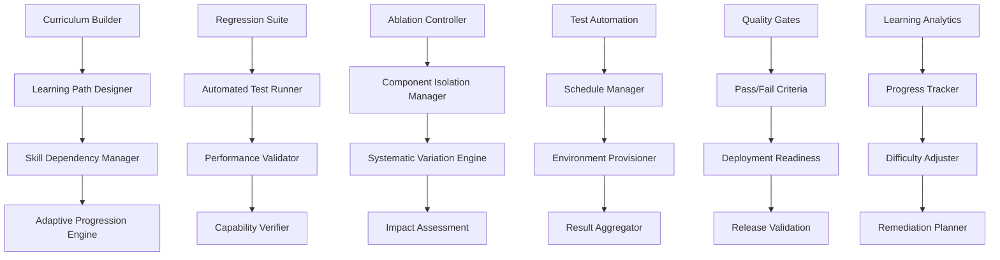

# Curriculum - Progressive Skill Building and Regression Testing

**Author:** @darianrosebrook

## Overview

The Curriculum module provides systematic progressive skill building, automated regression testing, and comprehensive ablation study coordination for the conscious agent. This system implements adaptive learning pathways, continuous validation of capabilities, and systematic exploration of system architecture contributions to enable robust development and reliable performance assessment.

## Purpose and Context

### Educational Philosophy

Effective agent development requires structured curriculum design:

1. **Progressive Mastery**: Skills build systematically from foundation to advanced levels
2. **Scaffolded Learning**: Support structures that enable successful skill acquisition
3. **Adaptive Pathways**: Personalized learning progression based on individual capabilities
4. **Continuous Assessment**: Ongoing evaluation to ensure skill retention and transfer
5. **Remediation Support**: Targeted interventions for identified weaknesses

### Quality Assurance Philosophy

Reliable agent operation requires comprehensive validation:

1. **Regression Prevention**: Continuous testing to prevent capability degradation
2. **Architecture Understanding**: Systematic exploration of component contributions
3. **Performance Benchmarking**: Standardized testing for capability verification
4. **Safety Validation**: Ongoing verification of safety and ethical compliance
5. **Deployment Readiness**: Systematic assessment of production deployment suitability

## Architecture

### System Components



### Core Components

#### 1. Curriculum Builder (`curriculum_builder.py`)

**Purpose:** Design and manage progressive learning curricula

```python
class CurriculumBuilder:
    """
    Designs and manages progressive learning curricula for agent development.
    
    Curriculum Design:
    - Learning objective definition and organization
    - Skill dependency mapping and sequencing
    - Progressive difficulty calibration
    - Assessment integration and validation
    - Adaptive pathway personalization
    """
    
    def __init__(self, config: CurriculumConfig):
        self.learning_objectives = LearningObjectiveManager(config.objectives)
        self.dependency_mapper = SkillDependencyMapper()
        self.difficulty_calibrator = DifficultyCalibrator()
        self.pathway_designer = LearningPathwayDesigner()
        self.assessment_integrator = AssessmentIntegrator()
        
    def design_learning_curriculum(self, domain: str, skill_requirements: SkillRequirements) -> LearningCurriculum:
        """Design comprehensive learning curriculum for domain."""
        pass
    
    def map_skill_dependencies(self, skills: List[Skill]) -> DependencyGraph:
        """Map dependencies between skills to determine learning sequence."""
        pass
    
    def calibrate_difficulty_progression(self, skill_sequence: List[Skill], target_population: AgentPopulation) -> DifficultyProgression:
        """Calibrate difficulty progression for optimal learning."""
        pass
    
    def create_adaptive_pathways(self, curriculum: LearningCurriculum, individual_profiles: List[LearnerProfile]) -> List[AdaptivePathway]:
        """Create personalized learning pathways for different learner profiles."""
        pass
    
    def integrate_assessment_framework(self, curriculum: LearningCurriculum, assessment_strategy: AssessmentStrategy) -> AssessmentIntegratedCurriculum:
        """Integrate comprehensive assessment framework into curriculum."""
        pass
```

**Curriculum Data Structures:**

```python
@dataclass
class LearningObjective:
    objective_id: str
    name: str
    description: str
    domain: str
    skill_level: SkillLevel
    prerequisites: List[str]
    learning_outcomes: List[LearningOutcome]
    assessment_criteria: List[AssessmentCriterion]
    estimated_learning_time: timedelta
    
@dataclass
class LearningCurriculum:
    curriculum_id: str
    name: str
    description: str
    target_domain: str
    learning_objectives: List[LearningObjective]
    skill_sequence: List[SkillSequence]
    assessment_points: List[AssessmentPoint]
    adaptive_pathways: List[AdaptivePathway]
    remediation_strategies: List[RemediationStrategy]
    
@dataclass
class SkillDependency:
    prerequisite_skill: str
    dependent_skill: str
    dependency_type: DependencyType
    strength: float
    validation_criteria: List[ValidationCriterion]
    
class SkillLevel(Enum):
    FOUNDATION = 1      # Basic foundational skills
    DEVELOPING = 2      # Intermediate skill development
    PROFICIENT = 3      # Competent skill application
    ADVANCED = 4        # Sophisticated skill integration
    EXPERT = 5          # Innovation and mastery
```

#### 2. Adaptive Progression Engine (`adaptive_progression.py`)

**Purpose:** Manage personalized learning progression based on individual performance

```python
class AdaptiveProgressionEngine:
    """
    Manages personalized learning progression based on individual agent performance.
    
    Adaptation Features:
    - Dynamic difficulty adjustment
    - Learning pace optimization
    - Remediation pathway activation
    - Accelerated progression for advanced learners
    - Learning style accommodation
    """
    
    def __init__(self):
        self.performance_analyzer = LearningPerformanceAnalyzer()
        self.difficulty_adjuster = DynamicDifficultyAdjuster()
        self.pace_optimizer = LearningPaceOptimizer()
        self.pathway_adapter = PathwayAdapter()
        
    def analyze_learning_performance(self, agent_id: str, performance_history: LearningPerformanceHistory) -> PerformanceAnalysis:
        """Analyze agent's learning performance patterns."""
        pass
    
    def adjust_learning_difficulty(self, current_difficulty: DifficultyLevel, performance_data: PerformanceData) -> DifficultyAdjustment:
        """Dynamically adjust learning difficulty based on performance."""
        pass
    
    def optimize_learning_pace(self, agent_id: str, learning_objectives: List[LearningObjective]) -> PaceOptimization:
        """Optimize learning pace for individual agent."""
        pass
    
    def adapt_learning_pathway(self, agent_id: str, current_pathway: LearningPathway, adaptation_triggers: List[AdaptationTrigger]) -> PathwayAdaptation:
        """Adapt learning pathway based on performance and needs."""
        pass
    
    def recommend_remediation(self, identified_gaps: List[SkillGap], available_resources: List[LearningResource]) -> RemediationPlan:
        """Recommend remediation strategies for identified skill gaps."""
        pass
```

**Adaptive Learning Framework:**

```python
@dataclass
class LearnerProfile:
    agent_id: str
    learning_style: LearningStyle
    current_skill_levels: dict
    learning_pace: LearningPace
    strength_areas: List[str]
    challenge_areas: List[str]
    motivation_factors: List[MotivationFactor]
    preferred_learning_modalities: List[LearningModality]
    
@dataclass
class AdaptivePathway:
    pathway_id: str
    learner_profile: LearnerProfile
    customized_sequence: List[LearningObjective]
    difficulty_adjustments: List[DifficultyAdjustment]
    pace_modifications: List[PaceModification]
    remediation_points: List[RemediationPoint]
    acceleration_opportunities: List[AccelerationOpportunity]
    
class AdaptationTrigger(Enum):
    PERFORMANCE_DECLINE = "performance_decline"
    MASTERY_ACHIEVEMENT = "mastery_achievement"
    LEARNING_PLATEAU = "learning_plateau"
    SKILL_GAP_IDENTIFIED = "skill_gap"
    MOTIVATION_CHANGE = "motivation_change"
    EXTERNAL_REQUIREMENT = "external_requirement"
```

#### 3. Regression Test Suite (`regression_suite.py`)

**Purpose:** Automated continuous testing to prevent capability degradation

```python
class RegressionTestSuite:
    """
    Automated regression testing suite to prevent capability degradation.
    
    Test Categories:
    - Core capability validation tests
    - Integration functionality tests
    - Performance benchmark tests
    - Safety and compliance tests
    - Edge case and stress tests
    """
    
    def __init__(self, config: RegressionConfig):
        self.test_manager = TestManager(config.test_definitions)
        self.automation_engine = TestAutomationEngine()
        self.result_validator = ResultValidator()
        self.regression_detector = RegressionDetector()
        self.alert_manager = RegressionAlertManager()
        
    def execute_regression_suite(self, agent_build: AgentBuild, test_scope: TestScope) -> RegressionTestResults:
        """Execute complete regression test suite for agent build."""
        pass
    
    def validate_core_capabilities(self, agent: Agent, capability_tests: List[CapabilityTest]) -> CapabilityValidationResults:
        """Validate that core capabilities remain functional."""
        pass
    
    def run_performance_benchmarks(self, agent: Agent, benchmark_suite: BenchmarkSuite) -> BenchmarkResults:
        """Run performance benchmarks to detect degradation."""
        pass
    
    def detect_regressions(self, current_results: TestResults, baseline_results: TestResults) -> RegressionDetection:
        """Detect regressions by comparing current results with baseline."""
        pass
    
    def generate_regression_report(self, regression_detection: RegressionDetection) -> RegressionReport:
        """Generate comprehensive regression analysis report."""
        pass
```

**Regression Testing Framework:**

```python
@dataclass
class RegressionTest:
    test_id: str
    test_name: str
    test_category: TestCategory
    capability_domain: str
    test_procedure: TestProcedure
    success_criteria: List[SuccessCriterion]
    performance_thresholds: PerformanceThresholds
    execution_environment: TestEnvironment
    expected_outcomes: List[ExpectedOutcome]
    
@dataclass
class RegressionTestResults:
    test_execution_id: str
    agent_build_id: str
    execution_timestamp: datetime
    overall_status: TestStatus
    individual_test_results: List[IndividualTestResult]
    performance_metrics: PerformanceMetrics
    regression_indicators: List[RegressionIndicator]
    comparison_with_baseline: BaselineComparison
    
class TestCategory(Enum):
    CORE_CAPABILITY = "core_capability"
    INTEGRATION = "integration"
    PERFORMANCE = "performance"
    SAFETY = "safety"
    COMPLIANCE = "compliance"
    EDGE_CASE = "edge_case"
    STRESS_TEST = "stress_test"
    
class TestStatus(Enum):
    PASSED = "passed"
    FAILED = "failed"
    DEGRADED = "degraded"
    IMPROVED = "improved"
    INCONCLUSIVE = "inconclusive"
```

#### 4. Ablation Study Controller (`ablation_controller.py`)

**Purpose:** Systematic exploration of system component contributions

```python
class AblationController:
    """
    Controls systematic ablation studies to understand component contributions.
    
    Ablation Study Types:
    - Individual component removal studies
    - Component interaction analysis
    - Parameter sensitivity analysis
    - Architecture comparison studies
    - Feature importance ranking
    """
    
    def __init__(self):
        self.component_manager = ComponentManager()
        self.variation_engine = SystematicVariationEngine()
        self.impact_assessor = ComponentImpactAssessor()
        self.interaction_analyzer = ComponentInteractionAnalyzer()
        self.study_coordinator = AblationStudyCoordinator()
        
    def design_ablation_study(self, research_question: ResearchQuestion, system_components: List[SystemComponent]) -> AblationStudyDesign:
        """Design systematic ablation study to answer research question."""
        pass
    
    def execute_component_ablation(self, component: SystemComponent, ablation_conditions: List[AblationCondition]) -> ComponentAblationResults:
        """Execute ablation study for specific component."""
        pass
    
    def analyze_component_interactions(self, component_pairs: List[ComponentPair], interaction_tests: List[InteractionTest]) -> InteractionAnalysis:
        """Analyze interactions between system components."""
        pass
    
    def assess_component_importance(self, ablation_results: List[AblationResult]) -> ComponentImportanceRanking:
        """Assess relative importance of components based on ablation results."""
        pass
    
    def generate_architecture_insights(self, study_results: AblationStudyResults) -> ArchitectureInsights:
        """Generate insights about system architecture from ablation studies."""
        pass
```

**Ablation Study Framework:**

```python
@dataclass
class AblationStudyDesign:
    study_id: str
    research_question: str
    hypothesis: str
    target_components: List[SystemComponent]
    ablation_conditions: List[AblationCondition]
    evaluation_metrics: List[EvaluationMetric]
    control_conditions: List[ControlCondition]
    sample_size: int
    statistical_power: float
    
@dataclass
class AblationCondition:
    condition_id: str
    condition_name: str
    component_modifications: List[ComponentModification]
    parameter_changes: dict
    expected_impact: ExpectedImpact
    measurement_focus: List[str]
    
@dataclass
class ComponentAblationResults:
    component_id: str
    ablation_conditions: List[AblationCondition]
    performance_impacts: List[PerformanceImpact]
    capability_changes: List[CapabilityChange]
    interaction_effects: List[InteractionEffect]
    statistical_significance: StatisticalSignificance
    
class AblationType(Enum):
    COMPLETE_REMOVAL = "complete_removal"
    FUNCTIONALITY_DISABLE = "functionality_disable"
    PARAMETER_MODIFICATION = "parameter_modification"
    REPLACEMENT_STUDY = "replacement_study"
    SCALING_STUDY = "scaling_study"
```

#### 5. Quality Gate Manager (`quality_gates.py`)

**Purpose:** Implement quality gates and deployment readiness criteria

```python
class QualityGateManager:
    """
    Manages quality gates and deployment readiness assessment.
    
    Quality Gate Types:
    - Capability validation gates
    - Performance benchmark gates
    - Safety and compliance gates
    - Regression prevention gates
    - Integration readiness gates
    """
    
    def __init__(self, config: QualityGateConfig):
        self.gate_definitions = GateDefinitionManager(config.gate_definitions)
        self.criteria_evaluator = CriteriaEvaluator()
        self.readiness_assessor = DeploymentReadinessAssessor()
        self.approval_manager = ApprovalManager()
        
    def evaluate_quality_gate(self, gate_id: str, agent_build: AgentBuild, evaluation_data: EvaluationData) -> QualityGateResult:
        """Evaluate specific quality gate for agent build."""
        pass
    
    def assess_deployment_readiness(self, agent_build: AgentBuild, deployment_context: DeploymentContext) -> DeploymentReadinessAssessment:
        """Assess overall deployment readiness of agent build."""
        pass
    
    def validate_capability_requirements(self, required_capabilities: List[CapabilityRequirement], agent_capabilities: AgentCapabilities) -> CapabilityValidation:
        """Validate that agent meets required capability standards."""
        pass
    
    def check_performance_criteria(self, performance_data: PerformanceData, performance_requirements: PerformanceRequirements) -> PerformanceCriteriaCheck:
        """Check performance against defined criteria."""
        pass
    
    def verify_safety_compliance(self, safety_test_results: SafetyTestResults, compliance_standards: ComplianceStandards) -> SafetyComplianceVerification:
        """Verify safety and compliance requirements."""
        pass
```

**Quality Gate Framework:**

```python
@dataclass
class QualityGate:
    gate_id: str
    gate_name: str
    gate_type: QualityGateType
    evaluation_criteria: List[EvaluationCriterion]
    success_thresholds: SuccessThresholds
    mandatory_requirements: List[MandatoryRequirement]
    approval_requirements: ApprovalRequirements
    escalation_procedures: EscalationProcedures
    
@dataclass
class QualityGateResult:
    gate_id: str
    evaluation_timestamp: datetime
    overall_status: GateStatus
    criteria_results: List[CriterionResult]
    approval_status: ApprovalStatus
    recommendations: List[Recommendation]
    next_steps: List[NextStep]
    
class QualityGateType(Enum):
    CAPABILITY_VALIDATION = "capability_validation"
    PERFORMANCE_BENCHMARK = "performance_benchmark"
    SAFETY_COMPLIANCE = "safety_compliance"
    REGRESSION_CHECK = "regression_check"
    INTEGRATION_READINESS = "integration_readiness"
    DEPLOYMENT_APPROVAL = "deployment_approval"
    
class GateStatus(Enum):
    PASSED = "passed"
    FAILED = "failed"
    CONDITIONAL_PASS = "conditional_pass"
    PENDING_APPROVAL = "pending_approval"
    REQUIRES_REMEDIATION = "requires_remediation"
```

### Automation and Orchestration

#### 6. Test Automation Engine (`test_automation.py`)

**Purpose:** Automate test execution, scheduling, and result processing

```python
class TestAutomationEngine:
    """
    Automates test execution, scheduling, and result processing.
    
    Automation Features:
    - Automated test scheduling and execution
    - Environment provisioning and cleanup
    - Parallel test execution coordination
    - Result collection and processing
    - Failure investigation and reporting
    """
    
    def __init__(self, config: AutomationConfig):
        self.scheduler = TestScheduler(config.scheduling_config)
        self.executor = TestExecutor(config.execution_config)
        self.environment_manager = TestEnvironmentManager()
        self.result_processor = ResultProcessor()
        self.failure_investigator = FailureInvestigator()
        
    def schedule_automated_tests(self, test_suite: TestSuite, schedule_config: ScheduleConfig) -> SchedulingResult:
        """Schedule automated execution of test suite."""
        pass
    
    def execute_test_batch(self, test_batch: TestBatch, execution_context: ExecutionContext) -> BatchExecutionResult:
        """Execute batch of tests with coordinated environments."""
        pass
    
    def provision_test_environments(self, environment_requirements: List[EnvironmentRequirement]) -> EnvironmentProvisioningResult:
        """Provision required test environments for execution."""
        pass
    
    def process_test_results(self, raw_results: List[RawTestResult]) -> ProcessedTestResults:
        """Process and analyze raw test results."""
        pass
    
    def investigate_test_failures(self, failed_tests: List[FailedTest]) -> FailureInvestigationReport:
        """Investigate test failures and provide diagnostic information."""
        pass
```

#### 7. Continuous Integration Pipeline (`ci_pipeline.py`)

**Purpose:** Integrate curriculum testing into continuous development pipeline

```python
class ContinuousIntegrationPipeline:
    """
    Integrates curriculum testing into continuous development pipeline.
    
    CI/CD Integration:
    - Automated testing on code changes
    - Progressive testing stages
    - Quality gate enforcement
    - Deployment pipeline integration
    - Feedback loop management
    """
    
    def __init__(self, config: CIPipelineConfig):
        self.pipeline_orchestrator = PipelineOrchestrator()
        self.stage_manager = StageManager(config.stages)
        self.gate_enforcer = QualityGateEnforcer()
        self.feedback_manager = FeedbackManager()
        
    def trigger_pipeline_execution(self, trigger_event: TriggerEvent, agent_build: AgentBuild) -> PipelineExecution:
        """Trigger execution of CI/CD pipeline for agent build."""
        pass
    
    def execute_testing_stage(self, stage: TestingStage, agent_build: AgentBuild) -> StageExecutionResult:
        """Execute specific testing stage in pipeline."""
        pass
    
    def enforce_quality_gates(self, stage_results: StageResults, quality_gates: List[QualityGate]) -> GateEnforcementResult:
        """Enforce quality gates based on stage results."""
        pass
    
    def manage_feedback_loops(self, pipeline_results: PipelineResults, development_team: DevelopmentTeam) -> FeedbackResult:
        """Manage feedback loops to development team."""
        pass
    
    def coordinate_deployment_pipeline(self, approved_build: ApprovedBuild, deployment_targets: List[DeploymentTarget]) -> DeploymentCoordination:
        """Coordinate deployment pipeline for approved builds."""
        pass
```

### Learning Analytics and Optimization

#### 8. Learning Analytics Engine (`learning_analytics.py`)

**Purpose:** Analyze learning data and optimize curriculum effectiveness

```python
class LearningAnalyticsEngine:
    """
    Analyzes learning data and optimizes curriculum effectiveness.
    
    Analytics Capabilities:
    - Learning pathway effectiveness analysis
    - Curriculum optimization recommendations
    - Learner progress prediction
    - Intervention timing optimization
    - Resource allocation guidance
    """
    
    def __init__(self):
        self.data_analyzer = LearningDataAnalyzer()
        self.pattern_detector = LearningPatternDetector()
        self.predictive_modeler = LearningPredictiveModeler()
        self.optimization_engine = CurriculumOptimizationEngine()
        
    def analyze_learning_effectiveness(self, learning_data: LearningData, curriculum: LearningCurriculum) -> LearningEffectivenessAnalysis:
        """Analyze effectiveness of learning curriculum."""
        pass
    
    def detect_learning_patterns(self, learner_interactions: List[LearnerInteraction]) -> LearningPatternDetection:
        """Detect patterns in learner interactions and progress."""
        pass
    
    def predict_learning_outcomes(self, learner_profile: LearnerProfile, planned_pathway: LearningPathway) -> LearningOutcomePrediction:
        """Predict learning outcomes for learner and pathway."""
        pass
    
    def optimize_curriculum_design(self, effectiveness_data: EffectivenessData, optimization_goals: OptimizationGoals) -> CurriculumOptimization:
        """Optimize curriculum design based on effectiveness data."""
        pass
    
    def recommend_interventions(self, learner_difficulties: List[LearnerDifficulty], available_interventions: List[Intervention]) -> InterventionRecommendations:
        """Recommend interventions for learner difficulties."""
        pass
```

#### 9. Curriculum Evolution Manager (`curriculum_evolution.py`)

**Purpose:** Manage evolution and improvement of curriculum over time

```python
class CurriculumEvolutionManager:
    """
    Manages evolution and continuous improvement of curriculum.
    
    Evolution Processes:
    - Curriculum version management
    - Evidence-based curriculum updates
    - A/B testing of curriculum changes
    - Feedback integration and iteration
    - Legacy curriculum migration
    """
    
    def __init__(self):
        self.version_manager = CurriculumVersionManager()
        self.update_engine = CurriculumUpdateEngine()
        self.testing_framework = CurriculumTestingFramework()
        self.feedback_integrator = FeedbackIntegrator()
        
    def manage_curriculum_versions(self, curriculum_family: CurriculumFamily) -> VersionManagementResult:
        """Manage versions and evolution of curriculum family."""
        pass
    
    def implement_curriculum_updates(self, update_proposals: List[UpdateProposal], validation_data: ValidationData) -> UpdateImplementationResult:
        """Implement validated curriculum updates."""
        pass
    
    def conduct_curriculum_ab_testing(self, curriculum_variants: List[CurriculumVariant], test_population: TestPopulation) -> ABTestingResults:
        """Conduct A/B testing of curriculum variants."""
        pass
    
    def integrate_feedback_data(self, feedback_data: FeedbackData, current_curriculum: LearningCurriculum) -> FeedbackIntegrationResult:
        """Integrate feedback data into curriculum improvement process."""
        pass
    
    def migrate_legacy_curricula(self, legacy_curricula: List[LegacyCurriculum], migration_strategy: MigrationStrategy) -> MigrationResult:
        """Migrate learners from legacy curricula to updated versions."""
        pass
```

## Configuration and Curriculum Definitions

### Curriculum Configuration

```yaml
curriculum:
  version: "1.0"
  
  # Learning progression settings
  progression:
    adaptive_difficulty: true
    prerequisite_enforcement: "strict"
    learning_pace_adjustment: true
    remediation_enabled: true
    acceleration_enabled: true
    
  # Skill framework
  skill_framework:
    foundation_skills:
      - "basic_survival"
      - "movement_navigation"
      - "tool_usage"
      - "resource_gathering"
      
    developing_skills:
      - "construction_planning"
      - "social_interaction"
      - "problem_solving"
      - "resource_management"
      
    proficient_skills:
      - "complex_construction"
      - "team_coordination"
      - "strategic_planning"
      - "creative_problem_solving"
      
    advanced_skills:
      - "leadership"
      - "innovation"
      - "ethical_reasoning"
      - "system_integration"
      
    expert_skills:
      - "mastery_demonstration"
      - "knowledge_transfer"
      - "curriculum_contribution"
      - "research_collaboration"
      
  # Assessment strategy
  assessment:
    formative_assessment: true
    summative_assessment: true
    peer_assessment: false
    self_assessment: true
    
    assessment_frequency:
      formative: "after_each_objective"
      summative: "end_of_level"
      comprehensive: "quarterly"
      
    mastery_criteria:
      minimum_score: 0.8
      consistency_requirement: 3
      transfer_demonstration: true
      
  # Regression testing
  regression_testing:
    nightly_runs: true
    weekly_comprehensive: true
    pre_deployment: true
    
    test_categories:
      - "core_capabilities"
      - "integration_functions"
      - "performance_benchmarks"
      - "safety_compliance"
      - "edge_case_handling"
      
    pass_criteria:
      capability_retention: 0.95
      performance_degradation_threshold: 0.1
      safety_compliance: 1.0
      
  # Ablation studies
  ablation_studies:
    systematic_component_analysis: true
    interaction_effect_studies: true
    parameter_sensitivity_analysis: true
    
    study_frequency: "monthly"
    component_coverage: "comprehensive"
    statistical_power: 0.8
    
  # Quality gates
  quality_gates:
    capability_validation:
      enabled: true
      threshold: 0.9
      mandatory: true
      
    performance_benchmark:
      enabled: true
      baseline_comparison: true
      degradation_threshold: 0.05
      
    safety_compliance:
      enabled: true
      zero_tolerance_violations: true
      comprehensive_testing: true
      
    regression_prevention:
      enabled: true
      historical_comparison: true
      trend_analysis: true
      
  # Automation settings
  automation:
    test_scheduling: "event_driven"
    environment_provisioning: "on_demand"
    result_processing: "real_time"
    failure_investigation: "automated"
    
    parallel_execution: true
    resource_optimization: true
    cost_management: true
    
  # Learning analytics
  analytics:
    effectiveness_tracking: true
    pattern_detection: true
    predictive_modeling: true
    optimization_recommendations: true
    
    data_retention: "indefinite"
    privacy_protection: true
    anonymization: true
```

### BASALT-Style Task Definitions

```yaml
basalt_tasks:
  # Foundation level BASALT tasks
  foundation:
    find_cave:
      description: "Find and approach a cave entrance"
      success_criteria: ["locate_cave", "approach_within_5_blocks"]
      time_limit: "5m"
      difficulty: 1
      
    make_waterfall:
      description: "Create a waterfall using water bucket"
      success_criteria: ["water_flows_downward", "aesthetic_placement"]
      time_limit: "10m"
      difficulty: 1
      
    animal_pen:
      description: "Create a pen and put an animal inside"
      success_criteria: ["enclosed_area", "animal_contained", "accessible_gate"]
      time_limit: "15m"
      difficulty: 2
      
  # Developing level BASALT tasks  
  developing:
    village_house:
      description: "Build a house suitable for a village"
      success_criteria: ["appropriate_materials", "village_style", "functional_design"]
      time_limit: "30m"
      difficulty: 3
      
    obtain_diamond:
      description: "Obtain a diamond through mining"
      success_criteria: ["diamond_in_inventory", "mining_method", "safety_maintained"]
      time_limit: "45m"
      difficulty: 3
      
  # Advanced level BASALT tasks
  advanced:
    collaborative_build:
      description: "Work with another agent to build something together"
      success_criteria: ["joint_construction", "communication_maintained", "shared_goal_achieved"]
      time_limit: "60m"
      difficulty: 4
      
    aesthetic_creation:
      description: "Create something beautiful or artistic"
      success_criteria: ["aesthetic_appeal", "creative_elements", "intentional_design"]
      time_limit: "90m"
      difficulty: 5
```

## Testing Strategy

### Curriculum System Testing

```python
class TestCurriculumSystem(unittest.TestCase):
    """Test curriculum system functionality."""
    
    def test_learning_progression_logic(self):
        """Test learning progression and prerequisite enforcement."""
        pass
    
    def test_adaptive_pathway_generation(self):
        """Test generation of adaptive learning pathways."""
        pass
    
    def test_curriculum_effectiveness_measurement(self):
        """Test measurement of curriculum effectiveness."""
        pass
    
    def test_quality_gate_enforcement(self):
        """Test quality gate evaluation and enforcement."""
        pass

class TestRegressionSuite(unittest.TestCase):
    """Test regression testing capabilities."""
    
    def test_automated_test_execution(self):
        """Test automated execution of regression tests."""
        pass
    
    def test_regression_detection_accuracy(self):
        """Test accuracy of regression detection algorithms."""
        pass
    
    def test_performance_benchmark_validation(self):
        """Test performance benchmark validation."""
        pass
```

### Ablation Study Testing

```python
class TestAblationController(unittest.TestCase):
    """Test ablation study capabilities."""
    
    def test_systematic_component_ablation(self):
        """Test systematic component ablation studies."""
        pass
    
    def test_interaction_effect_analysis(self):
        """Test analysis of component interaction effects."""
        pass
    
    def test_statistical_significance_validation(self):
        """Test statistical significance of ablation results."""
        pass
```

### Integration Testing

```python
class TestCurriculumIntegration(unittest.TestCase):
    """Test integration with other systems."""
    
    def test_scenario_integration(self):
        """Test integration with scenario execution system."""
        pass
    
    def test_metrics_integration(self):
        """Test integration with metrics collection system."""
        pass
    
    def test_ci_pipeline_integration(self):
        """Test integration with CI/CD pipeline."""
        pass
```

## Implementation Timeline

### Development Schedule

#### Sprint 1: Core Curriculum Framework 
- [ ] Curriculum builder and learning objective management
- [ ] Adaptive progression engine
- [ ] Basic regression test framework
- [ ] Learning analytics foundation

#### Sprint 2: Automation and Quality Gates 
- [ ] Test automation engine
- [ ] Quality gate management system
- [ ] CI/CD pipeline integration
- [ ] Automated result processing

#### Sprint 3: Advanced Analysis 
- [ ] Ablation study controller
- [ ] Comprehensive learning analytics
- [ ] Curriculum evolution management
- [ ] Performance optimization

#### Sprint 4: Integration and Validation 
- [ ] System integration testing
- [ ] Comprehensive validation
- [ ] Performance optimization
- [ ] Documentation and deployment

### Success Criteria

1. **Learning Effectiveness**
   - Curriculum completion rate >85% for target population
   - Skill mastery achievement >90% for completed objectives
   - Learning time optimization shows >20% improvement
   - Adaptive pathways reduce failure rate by >30%

2. **Quality Assurance**
   - Regression detection accuracy >95%
   - Zero critical capability regressions in production
   - Quality gate false positive rate <5%
   - Automated test coverage >90% of critical paths

3. **Research Capability**
   - Ablation studies provide statistically significant results
   - Component importance rankings validated by expert judgment
   - Architecture insights lead to measurable improvements
   - Research findings contribute to publication-quality work

## Conclusion

The Curriculum module provides comprehensive progressive skill building, systematic quality assurance, and rigorous research capabilities essential for conscious agent development. By implementing adaptive learning pathways, automated regression testing, and systematic ablation studies, this system ensures reliable capability development while advancing scientific understanding of artificial consciousness.

The integration of educational best practices with software engineering quality assurance creates a robust framework for both learning and validation. The automated testing and continuous integration capabilities ensure reliable operation while the research-oriented ablation studies advance theoretical understanding.

This curriculum foundation enables systematic, evidence-based development of conscious AI capabilities while maintaining the quality assurance necessary for reliable deployment and continued advancement of the field.

## Implementation Verification

**Confidence Score: 35%** - Curriculum module not implemented, needs complete development

### ❌ Missing Implementation

**Curriculum System:**
- No curriculum components implemented
- Progressive skill building missing
- Regression testing not implemented
- Ablation study coordination missing

**Curriculum Builder:**
- Curriculum builder not implemented
- Learning path design missing
- Skill dependency management not implemented
- Adaptive progression missing

**Regression Suite:**
- Regression suite not implemented
- Automated test running missing
- Performance validation not implemented
- Capability verification missing

**Ablation Controller:**
- Ablation controller not implemented
- Component isolation missing
- Systematic variation not implemented
- Impact assessment missing

### 🔄 Planned Features (Not Implemented)

**Test Automation:**
- Test automation planned but not implemented
- Schedule management missing
- Environment provisioning not implemented
- Result aggregation missing

**Quality Gates:**
- Quality gates planned but not implemented
- Pass/fail criteria missing
- Deployment readiness not implemented
- Release validation missing

**Learning Analytics:**
- Learning analytics planned but not implemented
- Progress tracking missing
- Difficulty adjustment not implemented
- Remediation planning missing

### Next Steps for Implementation

1. **Core Curriculum System** (Priority: High)
   - Implement curriculum builder system
   - Add learning path design capabilities
   - Implement skill dependency management
   - Add adaptive progression

2. **Regression Testing Suite** (Priority: High)
   - Implement regression suite
   - Add automated test running
   - Implement performance validation
   - Add capability verification

3. **Ablation Study System** (Priority: Medium)
   - Implement ablation controller
   - Add component isolation
   - Implement systematic variation
   - Add impact assessment

4. **Test Automation** (Priority: Medium)
   - Implement test automation
   - Add schedule management
   - Implement environment provisioning
   - Add result aggregation

5. **Quality Assurance** (Priority: Medium)
   - Implement quality gates
   - Add pass/fail criteria
   - Implement deployment readiness
   - Add release validation

### Integration Requirements

- **Evaluation System**: Need integration for assessment coordination
- **Performance System**: Need integration for capability testing
- **Research System**: Need integration for ablation studies
- **Deployment System**: Need integration for quality validation

**Overall Assessment**: The curriculum module is completely unimplemented and represents a major development area. The specification is comprehensive but requires full implementation of progressive skill building, regression testing, and ablation study capabilities. This is a critical component for systematic agent development and quality assurance.
