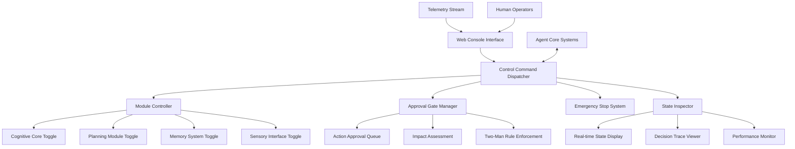

# Human Controls - Live Oversight and Debugging Interface

**Author:** @darianrosebrook

## Overview

The Human Controls module provides real-time oversight, intervention capabilities, and debugging interfaces for human operators monitoring and interacting with the conscious agent. This system ensures safe operation in shared environments while enabling detailed analysis and control for research and development purposes.

## Purpose and Context

### Operational Safety

In environments where the agent operates alongside humans or in shared spaces, direct human oversight becomes critical for:

1. **Emergency Intervention**: Immediate stopping or redirecting of harmful behavior
2. **Learning Supervision**: Guiding the agent through complex scenarios requiring human judgment
3. **Ethical Oversight**: Ensuring adherence to social norms and platform rules
4. **Research Control**: Enabling controlled experiments and behavioral analysis

### Development and Research Support

For research and development, human controls enable:

1. **Real-time Debugging**: Inspection of internal state during operation
2. **Ablation Studies**: Selective enabling/disabling of system components
3. **Behavioral Analysis**: Recording and analyzing decision-making processes
4. **Safety Validation**: Testing system responses under controlled conditions

## Architecture

### System Components



### Core Components

#### 1. Web Console Interface (`web_console.py`)

**Purpose:** Primary human-machine interface for agent oversight

```python
class WebConsole:
    """
    Web-based interface for real-time agent monitoring and control.
    
    Features:
    - Real-time agent state visualization
    - Interactive control panels
    - Decision history and reasoning display
    - Performance metrics dashboard
    - Emergency controls and alerts
    """
    
    def __init__(self, agent_interface: AgentInterface):
        self.agent = agent_interface
        self.websocket_manager = WebSocketManager()
        self.security_manager = SecurityManager()
        self.session_manager = SessionManager()
    
    def render_main_dashboard(self) -> str:
        """Render the main oversight dashboard."""
        pass
    
    def handle_control_command(self, command: ControlCommand, operator: Operator) -> CommandResult:
        """Process control commands from authorized operators."""
        pass
    
    def stream_telemetry_updates(self, websocket: WebSocket):
        """Stream real-time agent updates to connected clients."""
        pass
```

**Dashboard Features:**

1. **Agent Status Overview**
   - Current goal and active tasks
   - Health and internal state indicators
   - Location and environmental context
   - Recent actions and decisions

2. **Real-time Monitoring**
   - Live action stream with timestamps
   - Decision reasoning traces
   - Performance metrics (latency, success rate)
   - Alert notifications and warnings

3. **Interactive Controls**
   - Pause/resume operation
   - Step-by-step execution mode
   - Emergency stop button
   - Module enable/disable toggles

#### 2. Control Command Dispatcher (`control_dispatcher.py`)

**Purpose:** Secure processing and routing of human control commands

```python
class ControlCommandDispatcher:
    """
    Processes and routes control commands with security validation.
    
    Command Categories:
    - EMERGENCY: Immediate safety interventions
    - OPERATIONAL: Runtime control and guidance
    - DIAGNOSTIC: Information gathering and analysis
    - EXPERIMENTAL: Research and testing commands
    """
    
    def __init__(self):
        self.command_validators = CommandValidatorRegistry()
        self.authorization_manager = AuthorizationManager()
        self.command_logger = CommandLogger()
    
    def dispatch_command(self, command: ControlCommand, operator: Operator) -> CommandResult:
        """
        Validate, authorize, and execute control command.
        
        Process:
        1. Security validation and operator authorization
        2. Command syntax and parameter validation
        3. Impact assessment and safety checking
        4. Command execution with proper logging
        5. Result reporting and state updates
        """
        pass
    
    def validate_command_security(self, command: ControlCommand, operator: Operator) -> bool:
        """Validate command against security policies."""
        pass
    
    def execute_emergency_command(self, command: EmergencyCommand) -> EmergencyResult:
        """Handle emergency commands with minimal delay."""
        pass
```

**Command Types:**

```python
class CommandType(Enum):
    EMERGENCY_STOP = "emergency_stop"
    PAUSE_EXECUTION = "pause"
    RESUME_EXECUTION = "resume" 
    STEP_EXECUTION = "step"
    MODULE_TOGGLE = "toggle_module"
    FORCE_GOAL = "force_goal"
    APPROVE_ACTION = "approve_action"
    REJECT_ACTION = "reject_action"
    INJECT_INTRUSION = "inject_intrusion"
    REQUEST_STATE = "request_state"
    EXPORT_LOGS = "export_logs"
    RESET_MODULE = "reset_module"
```

#### 3. Module Controller (`module_controller.py`)

**Purpose:** Enable/disable system components for ablation studies and debugging

```python
class ModuleController:
    """
    Controls individual system modules for research and debugging.
    
    Capabilities:
    - Safe module shutdown and restart
    - State preservation during transitions
    - Dependency management between modules
    - Performance impact monitoring
    """
    
    def __init__(self, agent_systems: Dict[str, SystemModule]):
        self.modules = agent_systems
        self.dependency_graph = self.build_dependency_graph()
        self.state_manager = ModuleStateManager()
        
    def toggle_module(self, module_name: str, enabled: bool, operator: Operator) -> ToggleResult:
        """
        Safely enable or disable a system module.
        
        Considerations:
        - Check dependencies before disabling
        - Preserve state for potential re-enabling
        - Monitor for cascading effects
        - Provide fallback behaviors
        """
        pass
    
    def get_module_status(self) -> Dict[str, ModuleStatus]:
        """Get current status of all controllable modules."""
        pass
    
    def create_module_configuration(self) -> ModuleConfiguration:
        """Generate configuration snapshot for reproducible experiments."""
        pass
```

**Controllable Modules:**

1. **Cognitive Core**
   - LLM-based reasoning
   - Internal dialogue generation
   - Social communication

2. **Planning System**
   - Hierarchical planner (HRM/HTN)
   - Reactive executor (GOAP)
   - Goal formulation

3. **Memory Systems**
   - Episodic memory
   - Semantic memory
   - Working memory

4. **Sensory Processing**
   - Vision/perception
   - Homeostasis monitoring
   - Environmental awareness

5. **Social Cognition**
   - Theory of mind
   - Social modeling
   - Communication processing

#### 4. Approval Gate Manager (`approval_gates.py`)

**Purpose:** Implement human-in-the-loop approval for high-impact actions

```python
class ApprovalGateManager:
    """
    Manages human approval requirements for significant agent actions.
    
    Gate Types:
    - Destructive actions (breaking blocks, using TNT)
    - High-value transactions (trading valuable items)
    - Social interactions (private messages, invitations)
    - Exploration decisions (entering dangerous areas)
    - Resource allocation (using limited materials)
    """
    
    def __init__(self):
        self.approval_queues = {}
        self.gate_configurations = self.load_gate_config()
        self.approval_policies = ApprovalPolicyManager()
        
    def requires_approval(self, action: AgentAction, context: ActionContext) -> bool:
        """Determine if action requires human approval."""
        pass
    
    def submit_for_approval(self, action: AgentAction, justification: str) -> ApprovalRequest:
        """Submit action to appropriate approval queue."""
        pass
    
    def process_approval_response(self, request_id: str, decision: ApprovalDecision) -> None:
        """Process human approval/rejection decision."""
        pass
    
    def handle_approval_timeout(self, request_id: str) -> DefaultAction:
        """Handle cases where approval times out."""
        pass
```

**Gate Configuration:**

```yaml
approval_gates:
  version: "1.0"
  
  # Destructive action gates
  destructive_actions:
    enabled: true
    timeout: 60s
    default_action: "reject"
    actions:
      - "break_block"
      - "place_lava"
      - "place_tnt"
      - "ignite_tnt"
    
  # High-value transaction gates  
  valuable_transactions:
    enabled: true
    timeout: 120s
    default_action: "defer"
    value_threshold: 100  # emerald value equivalent
    
  # Social interaction gates
  social_interactions:
    enabled: false
    timeout: 30s
    default_action: "allow"
    sensitive_actions:
      - "private_message"
      - "friend_request"
      - "invitation"
      
  # Two-man rule gates
  two_man_required:
    enabled: true
    actions:
      - "admin_command"
      - "system_reset"
      - "constitution_override"
```

#### 5. Two-Man Rule Enforcement (`two_man_rule.py`)

**Purpose:** Require multiple operator approval for critical operations

```python
class TwoManRuleEnforcer:
    """
    Implements two-man rule for critical system operations.
    
    Critical Operations:
    - System shutdown or restart
    - Constitutional rule changes
    - Emergency override commands
    - Data deletion or export
    - Research protocol changes
    """
    
    def __init__(self):
        self.pending_operations = {}
        self.operator_registry = OperatorRegistry()
        self.approval_tracking = ApprovalTracker()
        
    def submit_critical_operation(self, operation: CriticalOperation, initiator: Operator) -> SubmissionResult:
        """Submit operation requiring two-man approval."""
        pass
    
    def provide_secondary_approval(self, operation_id: str, approver: Operator) -> ApprovalResult:
        """Provide second approval for pending operation."""
        pass
    
    def validate_approval_authority(self, operator: Operator, operation: CriticalOperation) -> bool:
        """Verify operator has authority for this operation type."""
        pass
    
    def execute_approved_operation(self, operation_id: str) -> ExecutionResult:
        """Execute operation with complete approval chain."""
        pass
```

### Emergency and Safety Controls

#### 6. Emergency Stop System (`emergency_stop.py`)

**Purpose:** Immediate agent intervention and safety protocols

```python
class EmergencyStopSystem:
    """
    Provides immediate shutdown and safety intervention capabilities.
    
    Emergency Types:
    - IMMEDIATE_STOP: Halt all actions instantly
    - SAFE_MODE: Switch to minimal safe operation
    - ISOLATE: Disconnect from external interactions
    - REVERT: Undo recent actions if possible
    """
    
    def __init__(self, agent_core: AgentCore):
        self.agent = agent_core
        self.emergency_protocols = EmergencyProtocolRegistry()
        self.safety_monitor = SafetyMonitor()
        
    def emergency_stop(self, stop_type: EmergencyStopType, reason: str, operator: Operator) -> StopResult:
        """Execute emergency stop with specified protocol."""
        pass
    
    def activate_safe_mode(self) -> SafeModeResult:
        """Switch agent to minimal safe operation mode."""
        pass
    
    def revert_recent_actions(self, time_window: timedelta) -> RevertResult:
        """Attempt to undo recent agent actions."""
        pass
    
    def assess_emergency_need(self, situation: SituationReport) -> EmergencyAssessment:
        """Evaluate if emergency intervention is needed."""
        pass
```

**Emergency Protocols:**

1. **Immediate Stop**
   - Cancel all pending actions
   - Stop movement and interaction
   - Enter passive monitoring mode
   - Log emergency reason and operator

2. **Safe Mode**
   - Disable risky modules (planning, social)
   - Enable basic survival behaviors only
   - Increase monitoring frequency
   - Await operator instruction

3. **Isolation Mode**
   - Disconnect from chat and social features
   - Disable external intrusion processing
   - Focus on self-preservation only
   - Maintain telemetry connection only

4. **Revert Mode**
   - Analyze recent action history
   - Identify reversible actions
   - Execute compensating actions
   - Report irreversible changes

### Debugging and Analysis Tools

#### 7. State Inspector (`state_inspector.py`)

**Purpose:** Real-time inspection of agent internal state

```python
class StateInspector:
    """
    Provides detailed inspection of agent's internal state and processes.
    
    Inspection Categories:
    - Cognitive state (goals, plans, reasoning)
    - Memory contents (episodic, semantic, working)
    - Sensory data (observations, perceptions)
    - Decision traces (action selection, evaluation)
    - Performance metrics (timing, success rates)
    """
    
    def __init__(self, agent_core: AgentCore):
        self.agent = agent_core
        self.data_formatters = DataFormatterRegistry()
        self.query_engine = StateQueryEngine()
        
    def get_current_state_snapshot(self) -> StateSnapshot:
        """Capture complete current state of agent."""
        pass
    
    def query_memory_contents(self, query: MemoryQuery) -> MemoryResults:
        """Search and retrieve specific memory contents."""
        pass
    
    def trace_decision_process(self, decision_id: str) -> DecisionTrace:
        """Retrieve complete trace of specific decision."""
        pass
    
    def analyze_performance_trends(self, time_window: timedelta) -> PerformanceAnalysis:
        """Analyze agent performance over time period."""
        pass
```

**State Inspection Interface:**

```python
class StateQuery:
    """Query interface for agent state inspection."""
    
    def current_goals(self) -> List[Goal]:
        """Get agent's current active goals."""
        pass
    
    def active_plans(self) -> List[Plan]:
        """Get currently executing plans."""
        pass
    
    def recent_memories(self, count: int = 10) -> List[Memory]:
        """Get most recent memory entries."""
        pass
    
    def current_observations(self) -> ObservationSet:
        """Get current sensory observations."""
        pass
    
    def internal_dialogue_history(self, count: int = 5) -> List[DialogueEntry]:
        """Get recent internal dialogue entries."""
        pass
    
    def performance_metrics(self) -> PerformanceMetrics:
        """Get current performance statistics."""
        pass
```

#### 8. Decision Trace Viewer (`decision_tracer.py`)

**Purpose:** Detailed analysis of agent decision-making processes

```python
class DecisionTracer:
    """
    Records and analyzes agent decision-making processes.
    
    Trace Components:
    - Input conditions and observations
    - Goal evaluation and selection
    - Plan generation and refinement
    - Action selection and execution
    - Outcome evaluation and learning
    """
    
    def __init__(self):
        self.trace_recorder = TraceRecorder()
        self.trace_analyzer = TraceAnalyzer()
        self.visualization_engine = VisualizationEngine()
        
    def start_decision_trace(self, decision_context: DecisionContext) -> TraceSession:
        """Begin recording decision process trace."""
        pass
    
    def record_decision_step(self, step_type: str, data: dict, reasoning: str):
        """Record individual step in decision process."""
        pass
    
    def complete_decision_trace(self, outcome: DecisionOutcome) -> CompletedTrace:
        """Finalize and analyze completed decision trace."""
        pass
    
    def generate_decision_visualization(self, trace_id: str) -> DecisionVisualization:
        """Create visual representation of decision process."""
        pass
```

## User Interface Design

### Web Dashboard Layout

#### Main Dashboard Sections

1. **Agent Status Panel**
   ```html
   <div class="agent-status">
     <div class="basic-info">
       <h3>Agent Status</h3>
       <p>Health: <span class="health-bar">85%</span></p>
       <p>Location: <span class="coords">X: 127, Y: 64, Z: -45</span></p>
       <p>Time: <span class="game-time">Day 15, 14:32</span></p>
     </div>
     
     <div class="current-activity">
       <h4>Current Activity</h4>
       <p>Goal: <span class="current-goal">Gather wood for shelter</span></p>
       <p>Action: <span class="current-action">Walking to forest</span></p>
       <p>Progress: <span class="progress-bar">67%</span></p>
     </div>
   </div>
   ```

2. **Control Panel**
   ```html
   <div class="control-panel">
     <h3>Agent Controls</h3>
     
     <div class="emergency-controls">
       <button class="emergency-stop" onclick="emergencyStop()">
         EMERGENCY STOP
       </button>
       <button class="safe-mode" onclick="activateSafeMode()">
         Safe Mode
       </button>
     </div>
     
     <div class="operational-controls">
       <button class="pause-btn" onclick="pauseAgent()">Pause</button>
       <button class="step-btn" onclick="stepExecution()">Step</button>
       <button class="resume-btn" onclick="resumeAgent()">Resume</button>
     </div>
     
     <div class="module-toggles">
       <label><input type="checkbox" checked> Cognitive Core</label>
       <label><input type="checkbox" checked> Planning System</label>
       <label><input type="checkbox" checked> Memory System</label>
       <label><input type="checkbox" checked> Social Cognition</label>
     </div>
   </div>
   ```

3. **Real-time Activity Feed**
   ```html
   <div class="activity-feed">
     <h3>Activity Stream</h3>
     <div class="activity-list">
       <div class="activity-item">
         <span class="timestamp">14:31:45</span>
         <span class="activity-type">DECISION</span>
         <span class="description">Selected goal: Gather wood</span>
         <button class="trace-btn" onclick="viewTrace('dec_001')">
           View Trace
         </button>
       </div>
       
       <div class="activity-item">
         <span class="timestamp">14:31:50</span>
         <span class="activity-type">ACTION</span>
         <span class="description">Started walking to coordinates (150, 64, -30)</span>
       </div>
       
       <div class="activity-item">
         <span class="timestamp">14:32:10</span>
         <span class="activity-type">OBSERVATION</span>
         <span class="description">Spotted oak tree at (145, 65, -28)</span>
       </div>
     </div>
   </div>
   ```

4. **Approval Queue**
   ```html
   <div class="approval-queue">
     <h3>Pending Approvals</h3>
     <div class="approval-item">
       <div class="action-description">
         <strong>Break Block:</strong> Stone block at (142, 63, -31)
         <br><small>Reason: Clearing path to tree</small>
       </div>
       <div class="approval-controls">
         <button class="approve-btn" onclick="approveAction('act_001')">
           Approve
         </button>
         <button class="reject-btn" onclick="rejectAction('act_001')">
           Reject
         </button>
       </div>
       <div class="approval-timer">
         Timeout: <span class="countdown">45s</span>
       </div>
     </div>
   </div>
   ```

#### Advanced Analysis Views

1. **Decision Trace Visualization**
   - Flow chart of decision process
   - Input factors and weights
   - Alternative options considered
   - Reasoning explanations

2. **Memory Browser**
   - Searchable episodic memory timeline
   - Semantic knowledge graph visualization
   - Memory influence tracking

3. **Performance Analytics**
   - Success rate trends
   - Decision latency histograms
   - Module performance metrics
   - Error rate tracking

### Mobile Interface

For field monitoring and emergency control:

```html
<div class="mobile-interface">
  <div class="status-summary">
    <h2>Agent Status</h2>
    <div class="status-indicators">
      <span class="status-healthy">🟢 Operational</span>
      <span class="location-info">📍 Forest Area</span>
      <span class="goal-info">🎯 Gathering Resources</span>
    </div>
  </div>
  
  <div class="emergency-controls">
    <button class="big-emergency-btn" onclick="emergencyStop()">
      🛑 EMERGENCY STOP
    </button>
  </div>
  
  <div class="quick-actions">
    <button onclick="pauseAgent()">⏸️ Pause</button>
    <button onclick="resumeAgent()">▶️ Resume</button>
    <button onclick="activateSafeMode()">🛡️ Safe Mode</button>
  </div>
</div>
```

## Security and Authorization

### Operator Authentication

```python
class OperatorRegistry:
    """
    Manages authorized operators and their permissions.
    
    Permission Levels:
    - OBSERVER: View-only access to status and logs
    - OPERATOR: Basic control commands and approvals
    - ADMINISTRATOR: Full system control and configuration
    - RESEARCHER: Experimental controls and data export
    - EMERGENCY: Emergency intervention authority
    """
    
    def __init__(self):
        self.operators = {}
        self.sessions = {}
        self.audit_logger = AuditLogger()
        
    def authenticate_operator(self, credentials: OperatorCredentials) -> AuthenticationResult:
        """Verify operator credentials and establish session."""
        pass
    
    def authorize_command(self, operator: Operator, command: ControlCommand) -> bool:
        """Check if operator has permission for specific command."""
        pass
    
    def log_operator_action(self, operator: Operator, action: str, result: str):
        """Record operator action for audit trail."""
        pass
```

### Access Control Matrix

| Permission Level | View Status | Basic Control | Emergency Stop | Module Toggle | System Config | Data Export |
|-----------------|-------------|---------------|----------------|---------------|---------------|-------------|
| Observer        | ✅          | ❌            | ❌             | ❌            | ❌            | ❌          |
| Operator        | ✅          | ✅            | ✅             | ❌            | ❌            | ❌          |
| Administrator   | ✅          | ✅            | ✅             | ✅            | ✅            | ✅          |
| Researcher      | ✅          | ✅            | ❌             | ✅            | ❌            | ✅          |
| Emergency       | ✅          | ❌            | ✅             | ❌            | ❌            | ❌          |

### Session Management

```python
class SessionManager:
    """
    Manages operator sessions and access control.
    
    Features:
    - Session timeout and renewal
    - Concurrent session limits
    - Activity monitoring and logging
    - Automatic logout on inactivity
    """
    
    def create_session(self, operator: Operator) -> Session:
        """Create new operator session with appropriate permissions."""
        pass
    
    def validate_session(self, session_token: str) -> SessionValidation:
        """Verify session is valid and active."""
        pass
    
    def refresh_session_activity(self, session_token: str):
        """Update session last activity timestamp."""
        pass
    
    def terminate_session(self, session_token: str, reason: str):
        """End operator session and log termination reason."""
        pass
```

## Integration with Agent Systems

### Agent Interface Adapter

```python
class AgentControlInterface:
    """
    Provides safe interface between human controls and agent systems.
    
    Responsibilities:
    - Command translation and validation
    - State change coordination
    - Safety interlock enforcement
    - Rollback capability management
    """
    
    def __init__(self, agent_core: AgentCore):
        self.agent = agent_core
        self.command_translator = CommandTranslator()
        self.safety_interlocks = SafetyInterlockManager()
        self.state_manager = StateChangeManager()
        
    def execute_control_command(self, command: ControlCommand) -> CommandResult:
        """Execute human control command on agent systems."""
        pass
    
    def pause_agent_execution(self) -> PauseResult:
        """Safely pause agent execution preserving state."""
        pass
    
    def resume_agent_execution(self) -> ResumeResult:
        """Resume agent execution from paused state."""
        pass
    
    def toggle_system_module(self, module_name: str, enabled: bool) -> ToggleResult:
        """Enable or disable agent system module."""
        pass
```

### Telemetry Integration

```python
class ControlTelemetryManager:
    """
    Manages telemetry data for human control interface.
    
    Data Sources:
    - Agent internal state updates
    - Decision and action events
    - Performance metrics
    - Error and exception events
    - Operator command events
    """
    
    def subscribe_to_agent_events(self, event_types: List[str]):
        """Subscribe to relevant agent events for display."""
        pass
    
    def process_telemetry_update(self, update: TelemetryUpdate):
        """Process incoming telemetry for display formatting."""
        pass
    
    def format_for_display(self, data: Any) -> DisplayData:
        """Format internal data for human-readable display."""
        pass
    
    def stream_to_interface(self, formatted_data: DisplayData):
        """Send formatted data to connected user interfaces."""
        pass
```

## Configuration and Customization

### Interface Configuration

```yaml
human_controls:
  version: "1.0"
  
  # Web interface settings
  web_interface:
    host: "localhost"
    port: 8080
    ssl_enabled: false
    session_timeout: 30m
    max_concurrent_sessions: 5
    
  # Authorization settings
  authorization:
    require_authentication: true
    session_duration: 8h
    password_policy:
      min_length: 8
      require_special_chars: true
      
  # Approval gate configuration
  approval_gates:
    default_timeout: 60s
    require_justification: true
    auto_reject_on_timeout: false
    
  # Emergency controls
  emergency:
    enable_emergency_stop: true
    require_confirmation: true
    auto_safe_mode_triggers:
      - "repeated_failures"
      - "safety_violations"
      - "performance_degradation"
      
  # Module control settings
  module_control:
    enable_module_toggling: true
    require_admin_approval: false
    preserve_state_on_disable: true
    
  # Telemetry and monitoring
  monitoring:
    update_frequency: 1s
    max_activity_history: 1000
    enable_decision_tracing: true
    performance_monitoring: true
```

### Customization Points

1. **Dashboard Layout**: Configurable panel arrangement and visibility
2. **Control Permissions**: Granular permission assignments per operator
3. **Approval Workflows**: Custom approval processes for different action types
4. **Monitoring Displays**: Selectable metrics and visualization formats
5. **Alert Conditions**: Configurable thresholds and notification settings

## Testing Strategy

### Functional Testing

```python
class TestHumanControlsInterface(unittest.TestCase):
    """Test human controls interface functionality."""
    
    def test_operator_authentication(self):
        """Test operator login and permission validation."""
        pass
    
    def test_emergency_stop_execution(self):
        """Test emergency stop command execution."""
        pass
    
    def test_module_toggle_functionality(self):
        """Test enabling/disabling of agent modules."""
        pass
    
    def test_approval_gate_workflow(self):
        """Test approval request and response workflow."""
        pass

class TestControlCommandValidation(unittest.TestCase):
    """Test control command validation and authorization."""
    
    def test_unauthorized_command_rejection(self):
        """Test rejection of commands from unauthorized operators."""
        pass
    
    def test_malformed_command_handling(self):
        """Test handling of malformed control commands."""
        pass
    
    def test_two_man_rule_enforcement(self):
        """Test two-man rule requirement enforcement."""
        pass
```

### Security Testing

```python
class TestControlSecurity(unittest.TestCase):
    """Test security aspects of human controls."""
    
    def test_session_security(self):
        """Test session management and timeout behavior."""
        pass
    
    def test_command_injection_protection(self):
        """Test protection against command injection attacks."""
        pass
    
    def test_privilege_escalation_prevention(self):
        """Test prevention of unauthorized privilege escalation."""
        pass

class TestEmergencyProcedures(unittest.TestCase):
    """Test emergency control procedures."""
    
    def test_emergency_stop_response_time(self):
        """Test emergency stop execution speed."""
        pass
    
    def test_safe_mode_activation(self):
        """Test safe mode activation and behavior."""
        pass
    
    def test_system_recovery_procedures(self):
        """Test recovery from emergency states."""
        pass
```

### Usability Testing

```python
class TestInterfaceUsability(unittest.TestCase):
    """Test user interface usability and responsiveness."""
    
    def test_dashboard_responsiveness(self):
        """Test dashboard update speed and accuracy."""
        pass
    
    def test_mobile_interface_functionality(self):
        """Test mobile interface operation."""
        pass
    
    def test_operator_workflow_efficiency(self):
        """Test efficiency of common operator workflows."""
        pass
```

## Performance Requirements

### Response Time Targets

| Operation | Target Response Time | Maximum Acceptable |
|-----------|---------------------|-------------------|
| Emergency Stop | < 100ms | < 500ms |
| Status Update | < 200ms | < 1s |
| Command Execution | < 500ms | < 2s |
| Module Toggle | < 1s | < 5s |
| State Inspection | < 1s | < 3s |
| Decision Trace | < 2s | < 10s |

### Scalability Requirements

- Support 5+ concurrent operator sessions
- Handle 100+ telemetry updates per second
- Maintain <1MB memory overhead per session
- Process 1000+ historical events without performance degradation

### Reliability Targets

- 99.9% uptime during agent operation
- <0.1% command failure rate
- <1s recovery time from minor failures
- Complete audit trail for all operations

## Implementation Timeline

### Development Schedule

#### Sprint 1: Basic Interface (2 weeks)
- [ ] Web dashboard framework
- [ ] Basic agent status display
- [ ] Emergency stop functionality
- [ ] Simple control commands

#### Sprint 2: Advanced Controls (2 weeks)
- [ ] Approval gate system
- [ ] Module toggle functionality
- [ ] State inspection tools
- [ ] Decision trace viewer

#### Sprint 3: Security and Auth (1 week)
- [ ] Operator authentication system
- [ ] Permission management
- [ ] Session security
- [ ] Audit logging

#### Sprint 4: Polish and Testing (1 week)
- [ ] Mobile interface optimization
- [ ] Performance tuning
- [ ] Comprehensive testing
- [ ] Documentation completion

### Success Criteria

1. **Functional Requirements**
   - All control commands execute reliably
   - Emergency stop responds within 100ms
   - State inspection provides accurate real-time data
   - Approval workflow operates smoothly

2. **Security Requirements**
   - Authentication system prevents unauthorized access
   - Permission system enforces appropriate restrictions
   - All operations properly logged for audit
   - No security vulnerabilities in testing

3. **Usability Requirements**
   - Operators can efficiently monitor agent status
   - Emergency procedures are intuitive and fast
   - Interface remains responsive under normal load
   - Mobile interface provides essential functionality

## Conclusion

The Human Controls module provides essential oversight capabilities for safe and controlled operation of the conscious agent. By combining real-time monitoring, interactive controls, and robust security measures, the system enables confident deployment in shared environments while supporting detailed research and development activities.

The modular architecture allows for customization based on specific operational requirements while maintaining consistent security and safety standards. The comprehensive testing framework ensures reliable operation under various conditions and use cases.

This interface serves as a critical bridge between human judgment and artificial agency, enabling collaborative operation while preserving human authority over critical decisions and system behavior.
