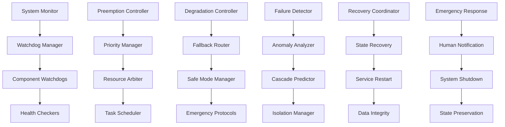

# Fail-Safes - Watchdogs, Preemption, and Graceful Degradation

**Author:** @darianrosebrook

## Overview

The Fail-Safes module implements comprehensive safety mechanisms to ensure reliable operation under adverse conditions. This system provides watchdog monitoring, preemption hierarchies, graceful degradation pathways, and emergency response coordination to maintain agent safety and operational continuity even when individual components fail.

## Purpose and Context

### Safety-Critical Operation

The conscious agent operates in real-time environments where failures can have immediate consequences:

1. **Real-Time Constraints**: Must respond within strict timing budgets to avoid dangerous situations
2. **Component Dependencies**: Failure of one component can cascade to others
3. **Environmental Hazards**: Must react quickly to in-game threats (lava, monsters, falls)
4. **Resource Limitations**: Must operate within CPU, memory, and time constraints
5. **Unpredictable Conditions**: Must handle unexpected inputs and environmental changes

### Fail-Safe Philosophy

The system implements multiple layers of protection:

1. **Prevention**: Proactive monitoring to prevent failures before they occur
2. **Detection**: Rapid identification of failures and anomalous conditions
3. **Isolation**: Containment of failures to prevent cascading effects
4. **Recovery**: Automatic recovery mechanisms and fallback procedures
5. **Escalation**: Human notification and intervention when automatic recovery fails

## Architecture

### System Components



### Core Components

#### 1. Watchdog Manager (`watchdog.py`)

**Purpose:** Monitor system components for failures and performance degradation

```python
class WatchdogManager:
    """
    Manages watchdog monitoring for all system components.
    
    Monitoring Capabilities:
    - Component health and responsiveness
    - Performance metric thresholds
    - Resource usage monitoring
    - Deadlock and hang detection
    - Communication timeout detection
    """
    
    def __init__(self, config: WatchdogConfig):
        self.component_watchdogs = {}
        self.health_checkers = {}
        self.timeout_manager = TimeoutManager()
        self.failure_detector = FailureDetector()
        self.escalation_manager = EscalationManager()
        
    def register_component(self, component_name: str, watchdog_config: ComponentWatchdogConfig):
        """Register component for watchdog monitoring."""
        pass
    
    def start_monitoring(self, component_name: str):
        """Start watchdog monitoring for specific component."""
        pass
    
    def check_component_health(self, component_name: str) -> HealthStatus:
        """Check current health status of component."""
        pass
    
    def handle_component_failure(self, component_name: str, failure_type: FailureType) -> FailureResponse:
        """Handle detected component failure with appropriate response."""
        pass
    
    def trigger_emergency_stop(self, reason: str, severity: EmergencySeverity):
        """Trigger emergency stop procedures."""
        pass
```

**Watchdog Configuration:**

```python
@dataclass
class ComponentWatchdogConfig:
    component_name: str
    health_check_interval: timedelta
    timeout_threshold: timedelta
    max_consecutive_failures: int
    recovery_strategy: RecoveryStrategy
    escalation_policy: EscalationPolicy
    
@dataclass
class WatchdogMetrics:
    last_heartbeat: datetime
    response_time: float
    health_score: float
    consecutive_failures: int
    total_failures: int
    uptime_percentage: float
```

#### 2. Component Health Checkers (`health_checkers.py`)

**Purpose:** Implement specific health checks for different system components

```python
class HealthCheckerRegistry:
    """
    Registry of health checkers for different component types.
    
    Health Check Types:
    - Ping/pong responsiveness checks
    - Resource usage validation
    - Functional capability tests
    - Data integrity verification
    - Performance threshold validation
    """
    
    def __init__(self):
        self.checkers = {}
        self.check_scheduler = HealthCheckScheduler()
        self.result_aggregator = HealthResultAggregator()
        
    def register_health_checker(self, component_type: str, checker: HealthChecker):
        """Register health checker for specific component type."""
        pass
    
    def run_health_check(self, component: Component) -> HealthCheckResult:
        """Run appropriate health check for component."""
        pass
    
    def aggregate_health_results(self, results: List[HealthCheckResult]) -> SystemHealthStatus:
        """Aggregate individual health results into system status."""
        pass

class CognitiveHealthChecker(HealthChecker):
    """Health checker for cognitive core components."""
    
    def check_llm_responsiveness(self, llm_interface: LLMInterface) -> HealthCheckResult:
        """Check LLM interface responsiveness and quality."""
        pass
    
    def check_reasoning_capability(self, cognitive_core: CognitiveCore) -> HealthCheckResult:
        """Test cognitive core reasoning capability.""" 
        pass
    
    def check_memory_coherence(self, memory_system: MemorySystem) -> HealthCheckResult:
        """Verify memory system coherence and accessibility."""
        pass

class PlanningHealthChecker(HealthChecker):
    """Health checker for planning system components."""
    
    def check_planner_responsiveness(self, planner: Planner) -> HealthCheckResult:
        """Check planner responsiveness to planning requests."""
        pass
    
    def check_plan_quality(self, planner: Planner) -> HealthCheckResult:
        """Validate quality of generated plans."""
        pass
    
    def check_execution_capability(self, executor: Executor) -> HealthCheckResult:
        """Test action execution capability."""
        pass
```

#### 3. Preemption Manager (`preemption_manager.py`)

**Purpose:** Implement preemption hierarchy for time-critical operations

```python
class PreemptionManager:
    """
    Manages preemption hierarchy to ensure time-critical operations take priority.
    
    Preemption Hierarchy (highest to lowest priority):
    1. Safety reflexes (immediate danger response)
    2. Emergency protocols (system-level emergencies)
    3. Constitutional violations (ethical boundary enforcement)
    4. Critical operations (essential system functions)
    5. Normal operations (standard planning and execution)
    6. Background tasks (learning, optimization, maintenance)
    """
    
    def __init__(self, config: PreemptionConfig):
        self.priority_levels = self.initialize_priority_levels()
        self.running_tasks = RunningTaskManager()
        self.preemption_policy = PreemptionPolicy(config)
        self.resource_manager = ResourceManager()
        
    def request_execution(self, task: Task, priority: Priority) -> ExecutionGrant:
        """Request execution slot for task with specified priority."""
        pass
    
    def preempt_lower_priority_tasks(self, incoming_priority: Priority) -> PreemptionResult:
        """Preempt lower priority tasks to make room for higher priority task."""
        pass
    
    def check_preemption_eligibility(self, task: Task) -> PreemptionEligibility:
        """Check if task can be preempted by higher priority tasks."""
        pass
    
    def restore_preempted_tasks(self, available_resources: ResourceAllocation):
        """Restore preempted tasks when resources become available."""
        pass
```

**Preemption Priority Levels:**

```python
class PreemptionPriority(Enum):
    SAFETY_REFLEX = 1        # Immediate danger response (flee, dodge)
    EMERGENCY_PROTOCOL = 2   # System emergencies (safe mode, shutdown)
    CONSTITUTIONAL = 3       # Constitutional violation prevention
    CRITICAL_OPERATION = 4   # Essential system functions
    HIGH_PRIORITY = 5        # Important but non-critical operations
    NORMAL_OPERATION = 6     # Standard planning and execution
    LOW_PRIORITY = 7         # Background optimization
    MAINTENANCE = 8          # System maintenance tasks

@dataclass
class PreemptionEvent:
    timestamp: datetime
    preempted_task: str
    preempting_task: str
    preempted_priority: PreemptionPriority
    preempting_priority: PreemptionPriority
    reason: str
    restoration_time: Optional[datetime]
```

#### 4. Graceful Degradation Controller (`degradation_controller.py`)

**Purpose:** Manage graceful degradation when components fail or resources are constrained

```python
class GracefulDegradationController:
    """
    Manages system degradation strategies when components fail or resources are limited.
    
    Degradation Strategies:
    - LLM → HRM: Fall back from LLM reasoning to hierarchical reasoning
    - HRM → GOAP: Fall back from complex planning to reactive planning
    - GOAP → Reflex: Fall back to hardcoded safety reflexes
    - Full Memory → Working Memory: Reduce memory scope
    - Complex Social → Basic Social: Simplify social interactions
    """
    
    def __init__(self, config: DegradationConfig):
        self.degradation_policies = self.load_policies(config)
        self.fallback_router = FallbackRouter()
        self.capability_manager = CapabilityManager()
        self.performance_monitor = PerformanceMonitor()
        
    def assess_degradation_need(self, system_state: SystemState) -> DegradationAssessment:
        """Assess whether degradation is needed based on system state."""
        pass
    
    def trigger_degradation(self, degradation_type: DegradationType, reason: str) -> DegradationResult:
        """Trigger specific degradation strategy."""
        pass
    
    def monitor_degraded_performance(self) -> PerformanceReport:
        """Monitor system performance in degraded mode."""
        pass
    
    def attempt_capability_restoration(self) -> RestorationResult:
        """Attempt to restore full capabilities when conditions improve."""
        pass
```

**Degradation Pathways:**

```python
class DegradationPath:
    """Defines specific degradation pathway between system states."""
    
    def __init__(self, from_mode: OperationMode, to_mode: OperationMode, triggers: List[DegradationTrigger]):
        self.from_mode = from_mode
        self.to_mode = to_mode
        self.triggers = triggers
        self.fallback_implementations = {}
        
class OperationMode(Enum):
    FULL_CAPABILITY = "full"           # All systems operating normally
    LLM_DEGRADED = "llm_degraded"      # LLM unavailable, use HRM
    PLANNING_DEGRADED = "plan_degraded" # Complex planning unavailable
    BASIC_OPERATION = "basic"          # Only reactive capabilities
    SAFE_MODE = "safe"                 # Minimal safe operation only
    EMERGENCY_STOP = "emergency"       # All non-essential functions stopped

# Example degradation pathway configuration
DEGRADATION_PATHWAYS = {
    (OperationMode.FULL_CAPABILITY, OperationMode.LLM_DEGRADED): {
        "triggers": ["llm_timeout", "llm_error_rate_high"],
        "fallback": "use_hrm_for_reasoning",
        "restoration_condition": "llm_health_restored"
    },
    (OperationMode.LLM_DEGRADED, OperationMode.PLANNING_DEGRADED): {
        "triggers": ["hrm_timeout", "planning_failures"],
        "fallback": "use_goap_only",
        "restoration_condition": "planning_health_restored"
    }
}
```

#### 5. Emergency Response Coordinator (`emergency_coordinator.py`)

**Purpose:** Coordinate emergency responses and crisis management

```python
class EmergencyResponseCoordinator:
    """
    Coordinates emergency responses for crisis situations.
    
    Emergency Types:
    - System failures (component crashes, memory exhaustion)
    - Safety violations (constitutional breaches, dangerous actions)
    - Environmental threats (immediate in-game dangers)
    - Performance failures (timeout cascades, deadlocks)
    - Security incidents (unauthorized access, data breaches)
    """
    
    def __init__(self, config: EmergencyConfig):
        self.response_protocols = self.load_protocols(config)
        self.notification_manager = EmergencyNotificationManager()
        self.state_preserv_manager = StatePreservationManager()
        self.recovery_coordinator = RecoveryCoordinator()
        
    def declare_emergency(self, emergency_type: EmergencyType, severity: EmergencySeverity, context: dict) -> EmergencyDeclaration:
        """Declare emergency and initiate appropriate response protocol."""
        pass
    
    def execute_emergency_protocol(self, emergency: Emergency) -> ProtocolExecutionResult:
        """Execute emergency response protocol."""
        pass
    
    def coordinate_with_human_operators(self, emergency: Emergency) -> HumanCoordinationResult:
        """Coordinate emergency response with human operators."""
        pass
    
    def assess_emergency_resolution(self, emergency: Emergency) -> ResolutionAssessment:
        """Assess whether emergency has been resolved."""
        pass
```

**Emergency Response Protocols:**

```yaml
emergency_protocols:
  version: "1.0"
  
  # System failure protocols
  system_failure:
    component_crash:
      immediate_actions:
        - "isolate_failed_component"
        - "activate_fallback_systems"
        - "preserve_current_state"
      notification_targets: ["system_admin", "monitoring_dashboard"]
      escalation_timeout: "5m"
      
    memory_exhaustion:
      immediate_actions:
        - "trigger_garbage_collection"
        - "clear_non_essential_caches"
        - "enter_minimal_operation_mode"
      notification_targets: ["system_admin"]
      escalation_timeout: "2m"
      
  # Safety violation protocols  
  safety_violation:
    constitutional_breach:
      immediate_actions:
        - "halt_current_action"
        - "enter_safe_mode"
        - "log_violation_details"
        - "notify_human_oversight"
      notification_targets: ["safety_team", "human_operators"]
      escalation_timeout: "30s"
      
    dangerous_action_attempt:
      immediate_actions:
        - "block_action_execution"
        - "analyze_decision_chain"
        - "enter_supervised_mode"
      notification_targets: ["safety_team"]
      escalation_timeout: "1m"
      
  # Environmental threat protocols
  environmental_threat:
    immediate_danger:
      immediate_actions:
        - "execute_safety_reflex"
        - "move_to_safe_location"
        - "activate_defensive_measures"
      notification_targets: ["monitoring_dashboard"]
      escalation_timeout: "10s"
```

### Safe Mode Implementation

#### 6. Safe Mode Manager (`safe_mode_manager.py`)

**Purpose:** Manage safe mode operation with minimal risk

```python
class SafeModeManager:
    """
    Manages safe mode operation when normal operation is compromised.
    
    Safe Mode Characteristics:
    - Minimal resource usage
    - Conservative decision-making
    - Increased monitoring and logging
    - Human oversight required for risky actions
    - Automatic safety reflex activation
    """
    
    def __init__(self, config: SafeModeConfig):
        self.safe_mode_config = config
        self.active_restrictions = []
        self.safe_action_validator = SafeActionValidator()
        self.oversight_manager = OversightManager()
        
    def enter_safe_mode(self, trigger_reason: str, severity: SafeModeSeverity) -> SafeModeEntry:
        """Enter safe mode with specified restrictions."""
        pass
    
    def validate_action_in_safe_mode(self, action: Action) -> SafeModeValidation:
        """Validate whether action is permitted in safe mode."""
        pass
    
    def monitor_safe_mode_conditions(self) -> SafeModeMonitoring:
        """Monitor conditions for potential safe mode exit."""
        pass
    
    def attempt_safe_mode_exit(self, exit_conditions: List[str]) -> SafeModeExitResult:
        """Attempt to exit safe mode when conditions are met."""
        pass
```

**Safe Mode Configuration:**

```python
@dataclass
class SafeModeConfig:
    allowed_actions: List[str]           # Whitelist of permitted actions
    forbidden_actions: List[str]         # Blacklist of prohibited actions
    max_movement_distance: float         # Limit movement range
    require_human_approval: bool         # Require approval for actions
    enable_automatic_reflexes: bool      # Enable safety reflexes
    monitoring_frequency: timedelta      # Increased monitoring frequency
    
class SafeModeSeverity(Enum):
    MINIMAL = "minimal"       # Minor restrictions, most capabilities available
    MODERATE = "moderate"     # Significant restrictions, core capabilities only
    STRICT = "strict"         # Severe restrictions, survival actions only
    LOCKDOWN = "lockdown"     # Maximum restrictions, observation only
```

### Failure Recovery Systems

#### 7. Recovery Coordinator (`recovery_coordinator.py`)

**Purpose:** Coordinate automatic recovery from failures

```python
class RecoveryCoordinator:
    """
    Coordinates automatic recovery from various types of failures.
    
    Recovery Strategies:
    - Component restart and reinitialization
    - State restoration from checkpoints
    - Graceful service degradation and restoration
    - Data integrity verification and repair
    - Configuration rollback to known good state
    """
    
    def __init__(self, config: RecoveryConfig):
        self.recovery_strategies = self.load_strategies(config)
        self.checkpoint_manager = CheckpointManager()
        self.state_validator = StateValidator()
        self.service_manager = ServiceManager()
        
    def attempt_automatic_recovery(self, failure: Failure) -> RecoveryResult:
        """Attempt automatic recovery from detected failure."""
        pass
    
    def create_recovery_checkpoint(self, checkpoint_type: CheckpointType) -> Checkpoint:
        """Create recovery checkpoint for potential rollback."""
        pass
    
    def validate_recovery_success(self, recovery_attempt: RecoveryAttempt) -> ValidationResult:
        """Validate that recovery attempt was successful."""
        pass
    
    def escalate_recovery_failure(self, failed_recovery: FailedRecovery) -> EscalationResult:
        """Escalate to human intervention when automatic recovery fails."""
        pass
```

**Recovery Strategy Types:**

```python
class RecoveryStrategy(Enum):
    RESTART_COMPONENT = "restart"         # Restart failed component
    RESTORE_FROM_CHECKPOINT = "restore"   # Restore from saved state
    FALLBACK_TO_BACKUP = "fallback"      # Switch to backup system
    CLEAR_AND_REINITIALIZE = "clear"     # Clear state and reinitialize
    ROLLBACK_CONFIGURATION = "rollback"   # Revert to previous config
    HUMAN_INTERVENTION = "human"          # Require human intervention

@dataclass
class RecoveryAttempt:
    failure_id: str
    strategy: RecoveryStrategy
    start_time: datetime
    end_time: Optional[datetime]
    success: Optional[bool]
    error_message: Optional[str]
    state_before: dict
    state_after: Optional[dict]
```

#### 8. State Preservation Manager (`state_preservation.py`)

**Purpose:** Preserve critical state during failures and emergencies

```python
class StatePreservationManager:
    """
    Manages preservation of critical system state during failures.
    
    Preserved State:
    - Current goals and active plans
    - Recent memories and experiences
    - Social relationships and commitments
    - Constitutional compliance history
    - Performance baselines and learned behaviors
    """
    
    def __init__(self, config: PreservationConfig):
        self.preservation_policies = self.load_policies(config)
        self.storage_manager = PersistentStorageManager()
        self.state_serializer = StateSerializer()
        self.integrity_checker = StateIntegrityChecker()
        
    def preserve_critical_state(self, preservation_reason: str) -> PreservationResult:
        """Preserve critical system state for recovery."""
        pass
    
    def restore_preserved_state(self, preservation_id: str) -> RestorationResult:
        """Restore system state from preservation checkpoint."""
        pass
    
    def validate_state_integrity(self, state_snapshot: StateSnapshot) -> IntegrityValidation:
        """Validate integrity of preserved state."""
        pass
    
    def cleanup_old_preserved_states(self, retention_policy: RetentionPolicy):
        """Clean up old preserved states according to retention policy."""
        pass
```

## Performance and Resource Management

### Resource Monitoring and Control

#### 9. Resource Monitor (`resource_monitor.py`)

**Purpose:** Monitor and control resource usage to prevent exhaustion

```python
class ResourceMonitor:
    """
    Monitors and controls system resource usage.
    
    Monitored Resources:
    - CPU usage and processing time
    - Memory allocation and garbage collection
    - Disk I/O and storage space
    - Network bandwidth and API calls
    - External service quotas and rate limits
    """
    
    def __init__(self, config: ResourceConfig):
        self.resource_limits = config.resource_limits
        self.usage_trackers = self.initialize_trackers()
        self.quota_managers = self.initialize_quota_managers()
        self.alert_thresholds = config.alert_thresholds
        
    def monitor_resource_usage(self) -> ResourceUsageReport:
        """Monitor current resource usage across all categories."""
        pass
    
    def check_resource_limits(self) -> List[ResourceViolation]:
        """Check for resource usage violations."""
        pass
    
    def enforce_resource_quotas(self, request: ResourceRequest) -> QuotaEnforcement:
        """Enforce resource quotas for system operations."""
        pass
    
    def predict_resource_exhaustion(self, usage_trends: UsageTrends) -> ExhaustionPrediction:
        """Predict potential resource exhaustion based on trends."""
        pass
```

**Resource Limits Configuration:**

```yaml
resource_limits:
  version: "1.0"
  
  # CPU limits
  cpu:
    max_usage_percent: 80
    max_sustained_usage: 60
    alert_threshold: 70
    critical_threshold: 90
    
  # Memory limits  
  memory:
    max_heap_size: "2GB"
    max_working_set: "1.5GB"
    alert_threshold: "1.2GB"
    gc_trigger_threshold: "1GB"
    
  # I/O limits
  io:
    max_disk_writes_per_second: 100
    max_network_requests_per_minute: 1000
    max_file_descriptors: 1000
    
  # External service limits
  external_services:
    llm_api:
      max_requests_per_minute: 60
      max_tokens_per_hour: 100000
      cost_limit_per_day: 10.00
      
    database:
      max_connections: 10
      max_queries_per_second: 50
```

### Timeout Management

#### 10. Timeout Manager (`timeout_manager.py`)

**Purpose:** Manage timeouts and prevent hanging operations

```python
class TimeoutManager:
    """
    Manages timeouts for all system operations to prevent hangs.
    
    Timeout Categories:
    - Operation timeouts (individual function calls)
    - Service timeouts (external API calls)
    - Communication timeouts (inter-component messaging)
    - Resource acquisition timeouts (locks, semaphores)
    - User interaction timeouts (approval gates)
    """
    
    def __init__(self, config: TimeoutConfig):
        self.timeout_policies = self.load_policies(config)
        self.active_timers = {}
        self.timeout_handlers = self.initialize_handlers()
        self.escalation_manager = TimeoutEscalationManager()
        
    def set_operation_timeout(self, operation_id: str, timeout: timedelta, handler: TimeoutHandler) -> Timer:
        """Set timeout for specific operation."""
        pass
    
    def cancel_timeout(self, operation_id: str) -> CancellationResult:
        """Cancel timeout for completed operation."""
        pass
    
    def handle_timeout_event(self, timeout_event: TimeoutEvent) -> TimeoutResponse:
        """Handle timeout event with appropriate response."""
        pass
    
    def escalate_repeated_timeouts(self, operation_type: str, timeout_count: int) -> EscalationResult:
        """Escalate when operation repeatedly times out."""
        pass
```

## Integration with Agent Systems

### Fail-Safe Integration Points

```python
class FailSafeIntegrationManager:
    """
    Integrates fail-safe mechanisms throughout the agent architecture.
    
    Integration Points:
    - Cognitive Core: LLM timeout and fallback handling
    - Planning System: Plan execution monitoring and recovery
    - Memory System: Data corruption detection and recovery
    - Action Execution: Safety checking and emergency stops
    - Communication: Message delivery and response monitoring
    """
    
    def integrate_cognitive_failsafes(self, cognitive_core: CognitiveCore):
        """Integrate fail-safe mechanisms into cognitive core."""
        pass
    
    def integrate_planning_failsafes(self, planning_system: PlanningSystem):
        """Integrate fail-safe mechanisms into planning system."""
        pass
    
    def integrate_memory_failsafes(self, memory_system: MemorySystem):
        """Integrate fail-safe mechanisms into memory system."""
        pass
    
    def integrate_action_failsafes(self, action_executor: ActionExecutor):
        """Integrate fail-safe mechanisms into action execution."""
        pass
```

## Configuration and Monitoring

### Fail-Safe Configuration

```yaml
fail_safes:
  version: "1.0"
  
  # Watchdog configuration
  watchdogs:
    cognitive_core:
      health_check_interval: "10s"
      timeout_threshold: "30s"
      max_consecutive_failures: 3
      recovery_strategy: "restart_with_fallback"
      
    planning_system:
      health_check_interval: "5s"
      timeout_threshold: "15s"
      max_consecutive_failures: 2
      recovery_strategy: "degrade_to_reactive"
      
    memory_system:
      health_check_interval: "30s"
      timeout_threshold: "60s"
      max_consecutive_failures: 1
      recovery_strategy: "restore_from_checkpoint"
      
  # Preemption configuration
  preemption:
    enable_preemption: true
    preemption_overhead_budget: "5ms"
    restoration_delay: "100ms"
    max_preemption_depth: 3
    
  # Safe mode configuration
  safe_mode:
    auto_enter_conditions:
      - "constitutional_violation"
      - "repeated_component_failures"
      - "resource_exhaustion"
    auto_exit_conditions:
      - "all_components_healthy"
      - "resources_available"
      - "human_approval"
    restrictions:
      movement_limit: 50  # blocks
      action_whitelist: ["move", "look", "communicate"]
      require_approval: true
      
  # Emergency response
  emergency_response:
    notification_channels:
      - type: "webhook"
        url: "https://alerts.example.com/emergency"
      - type: "email"
        recipients: ["admin@example.com"]
    escalation_delays:
      warning: "5m"
      critical: "1m"
      emergency: "30s"
```

## Testing Strategy

### Fail-Safe Testing

```python
class TestFailSafeMechanisms(unittest.TestCase):
    """Test fail-safe mechanisms under various failure conditions."""
    
    def test_component_failure_detection(self):
        """Test detection of component failures."""
        pass
    
    def test_preemption_hierarchy(self):
        """Test preemption hierarchy enforcement."""
        pass
    
    def test_graceful_degradation(self):
        """Test graceful degradation pathways."""
        pass
    
    def test_emergency_response(self):
        """Test emergency response protocols."""
        pass

class TestRecoveryMechanisms(unittest.TestCase):
    """Test automatic recovery mechanisms."""
    
    def test_automatic_component_restart(self):
        """Test automatic restart of failed components."""
        pass
    
    def test_state_preservation_and_restoration(self):
        """Test state preservation during failures."""
        pass
    
    def test_fallback_system_activation(self):
        """Test activation of fallback systems."""
        pass
```

### Chaos Testing

```python
class TestChaosEngineering(unittest.TestCase):
    """Chaos engineering tests for resilience validation."""
    
    def test_random_component_failures(self):
        """Test system response to random component failures."""
        pass
    
    def test_resource_exhaustion_scenarios(self):
        """Test system behavior under resource exhaustion."""
        pass
    
    def test_network_partition_handling(self):
        """Test handling of network partitions and timeouts."""
        pass
    
    def test_cascading_failure_prevention(self):
        """Test prevention of cascading failures."""
        pass
```

## Implementation Timeline

### Development Schedule

#### Sprint 1: Core Infrastructure (3 weeks)
- [ ] Watchdog manager and health checkers
- [ ] Basic preemption framework
- [ ] Timeout management system
- [ ] Emergency response protocols

#### Sprint 2: Advanced Fail-Safes (3 weeks)
- [ ] Graceful degradation controller
- [ ] Safe mode implementation
- [ ] Recovery coordination system
- [ ] State preservation manager

#### Sprint 3: Integration and Testing (2 weeks)
- [ ] Integration with all agent systems
- [ ] Comprehensive testing suite
- [ ] Chaos engineering tests
- [ ] Performance impact assessment

#### Sprint 4: Optimization and Documentation (1 week)
- [ ] Performance optimization
- [ ] Configuration refinement
- [ ] Documentation completion
- [ ] Operational procedures

### Success Criteria

1. **Reliability Requirements**
   - System survives 95% of simulated component failures
   - Average recovery time <30 seconds for component failures
   - No cascading failures in testing
   - Emergency protocols activate within timeout thresholds

2. **Performance Requirements**
   - Fail-safe overhead <1% of total system performance
   - Watchdog checks complete within budget timeouts
   - Preemption latency <5ms for safety-critical operations
   - State preservation completes within 10 seconds

3. **Safety Requirements**
   - Zero safety violations during failure scenarios
   - All emergency protocols tested and verified
   - Human notification delivery <30 seconds
   - Safe mode prevents all risky operations

## Conclusion

The Fail-Safes module provides essential safety mechanisms that ensure reliable operation of the conscious agent under adverse conditions. By implementing comprehensive watchdog monitoring, preemption hierarchies, graceful degradation pathways, and emergency response protocols, the system maintains safety and operational continuity even when individual components fail.

The multi-layered approach provides defense in depth, with multiple independent mechanisms protecting against different types of failures. The integration throughout the agent architecture ensures that safety considerations are embedded at every level, from individual component operations to system-wide coordination.

This robust safety foundation enables confident deployment of the conscious agent in dynamic environments while providing the reliability necessary for real-world operation and research applications.
