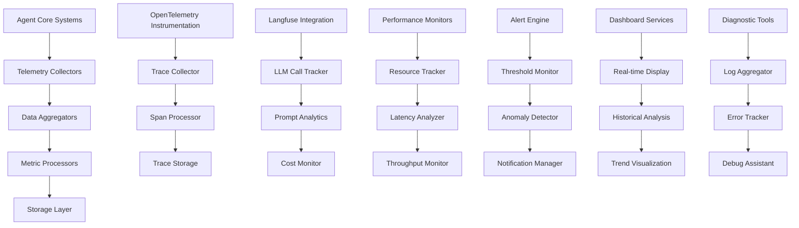

# Monitoring - Telemetry, Performance Tracking, and Diagnostics

**Author:** @darianrosebrook

## Overview

The Monitoring module provides comprehensive telemetry collection, performance tracking, and diagnostic capabilities for the conscious agent. This system enables real-time observation of agent behavior, performance optimization, and proactive issue detection while maintaining detailed audit trails for research and safety analysis.

## Purpose and Context

### Operational Monitoring Needs

Effective monitoring is essential for:

1. **Performance Optimization**: Identifying bottlenecks and optimization opportunities
2. **Safety Assurance**: Detecting anomalous behavior and potential safety issues
3. **Research Insights**: Collecting data for behavioral analysis and system improvement
4. **Debugging Support**: Providing detailed information for troubleshooting issues
5. **Compliance Verification**: Ensuring adherence to safety and ethical guidelines

### Telemetry Philosophy

The monitoring system follows key principles:

1. **Comprehensive Coverage**: Monitor all critical system components and interactions
2. **Low Overhead**: Minimize performance impact of monitoring itself
3. **Actionable Insights**: Focus on metrics that enable decision-making
4. **Privacy Awareness**: Respect privacy requirements while gathering necessary data
5. **Scalable Architecture**: Support growth in complexity and deployment scale

## Architecture

### System Components



### Core Components

#### 1. Telemetry Manager (`telemetry.py`)

**Purpose:** Central telemetry collection and coordination

```python
class TelemetryManager:
    """
    Central manager for all telemetry collection and processing.
    
    Responsibilities:
    - Coordinate telemetry from all agent subsystems
    - Manage telemetry lifecycle and storage
    - Ensure performance impact remains minimal
    - Provide unified interface for metric access
    """
    
    def __init__(self, config: TelemetryConfig):
        self.collectors = self.initialize_collectors(config)
        self.processors = self.initialize_processors(config)
        self.storage = TelemetryStorage(config.storage_config)
        self.privacy_filter = PrivacyFilter(config.privacy_config)
        
    def start_telemetry_collection(self):
        """Start all telemetry collectors and processors."""
        pass
    
    def collect_metric(self, metric_name: str, value: float, tags: dict = None, timestamp: datetime = None):
        """Collect a single metric with optional tags and timestamp."""
        pass
    
    def collect_event(self, event_type: str, event_data: dict, severity: str = "info"):
        """Collect a structured event with associated data."""
        pass
    
    def start_span(self, operation_name: str, parent_span: Optional[Span] = None) -> Span:
        """Start a new tracing span for operation tracking."""
        pass
    
    def query_metrics(self, query: MetricQuery) -> MetricResults:
        """Query collected metrics with filtering and aggregation."""
        pass
```

**Core Telemetry Data Structures:**

```python
@dataclass
class TelemetryMetric:
    name: str
    value: float
    timestamp: datetime
    tags: dict
    unit: str
    metric_type: MetricType  # COUNTER, GAUGE, HISTOGRAM, SUMMARY

@dataclass
class TelemetryEvent:
    event_type: str
    timestamp: datetime
    severity: EventSeverity
    data: dict
    source_module: str
    trace_id: Optional[str]
    
class MetricType(Enum):
    COUNTER = "counter"        # Monotonically increasing
    GAUGE = "gauge"           # Point-in-time value
    HISTOGRAM = "histogram"   # Distribution of values
    SUMMARY = "summary"       # Statistical summary
```

#### 2. Performance Tracker (`performance_tracker.py`)

**Purpose:** Track system performance metrics and identify optimization opportunities

```python
class PerformanceTracker:
    """
    Tracks detailed performance metrics across all agent systems.
    
    Tracked Metrics:
    - Loop execution times (propose→plan→act cycles)
    - Module-specific latencies and throughput
    - Memory usage and garbage collection
    - CPU utilization and resource contention
    - I/O operations and network requests
    """
    
    def __init__(self):
        self.loop_timer = LoopTimer()
        self.module_profiler = ModuleProfiler()
        self.resource_monitor = ResourceMonitor()
        self.latency_tracker = LatencyTracker()
        
    def track_control_loop(self, loop_iteration: LoopIteration) -> LoopMetrics:
        """Track complete control loop execution."""
        pass
    
    def profile_module_execution(self, module_name: str, operation: str) -> ModuleProfile:
        """Profile execution time and resource usage for module operation."""
        pass
    
    def monitor_resource_usage(self) -> ResourceMetrics:
        """Monitor system resource usage (CPU, memory, I/O)."""
        pass
    
    def analyze_performance_trends(self, time_window: timedelta) -> PerformanceTrends:
        """Analyze performance trends over specified time window."""
        pass
```

**Performance Metrics:**

```python
@dataclass
class LoopMetrics:
    loop_id: str
    total_time: float
    perception_time: float
    planning_time: float
    execution_time: float
    memory_time: float
    decision_time: float
    safe_mode_triggered: bool
    preemptions: int

@dataclass  
class ModuleProfile:
    module_name: str
    operation: str
    execution_time: float
    memory_delta: int
    cpu_usage: float
    cache_hits: int
    cache_misses: int
    errors: int
```

#### 3. OpenTelemetry Integration (`otel_integration.py`)

**Purpose:** Integrate with OpenTelemetry for distributed tracing and observability

```python
class OpenTelemetryIntegration:
    """
    Integrates agent monitoring with OpenTelemetry ecosystem.
    
    Capabilities:
    - Distributed tracing across agent components
    - Metric collection using OTEL standards
    - Integration with observability platforms
    - Correlation of traces with business logic
    """
    
    def __init__(self, config: OTelConfig):
        self.tracer_provider = self.setup_tracer_provider(config)
        self.meter_provider = self.setup_meter_provider(config)
        self.resource = self.create_resource_description()
        self.exporters = self.setup_exporters(config)
        
    def create_tracer(self, name: str, version: str = "1.0") -> Tracer:
        """Create tracer for specific component or operation."""
        pass
    
    def create_meter(self, name: str, version: str = "1.0") -> Meter:
        """Create meter for metric collection."""
        pass
    
    def trace_agent_operation(self, operation_name: str) -> SpanContext:
        """Create trace context for agent operation."""
        pass
    
    def correlate_traces_with_decisions(self, decision_id: str, trace_id: str):
        """Correlate distributed traces with agent decisions."""
        pass
```

**OpenTelemetry Instrumentation:**

```python
class AgentInstrumentation:
    """Automatic instrumentation for agent components."""
    
    @staticmethod
    def instrument_cognitive_core():
        """Instrument cognitive core operations for tracing."""
        pass
    
    @staticmethod  
    def instrument_planning_system():
        """Instrument planning system operations."""
        pass
    
    @staticmethod
    def instrument_memory_operations():
        """Instrument memory read/write operations."""
        pass
    
    @staticmethod
    def instrument_action_execution():
        """Instrument action execution pipeline."""
        pass
```

#### 4. Langfuse Integration (`langfuse_integration.py`)

**Purpose:** Specialized monitoring for LLM operations and prompt engineering

```python
class LangfuseIntegration:
    """
    Integrates with Langfuse for LLM operation monitoring and optimization.
    
    Tracking Capabilities:
    - LLM call latency and token usage
    - Prompt effectiveness and optimization
    - Cost tracking and budget management
    - Quality assessment of LLM outputs
    """
    
    def __init__(self, config: LangfuseConfig):
        self.langfuse_client = Langfuse(
            public_key=config.public_key,
            secret_key=config.secret_key,
            host=config.host
        )
        self.prompt_manager = PromptManager()
        self.cost_tracker = CostTracker()
        
    def trace_llm_call(self, prompt: str, response: str, metadata: dict) -> LLMTrace:
        """Trace individual LLM call with prompt and response."""
        pass
    
    def track_prompt_performance(self, prompt_template: str, evaluation_metrics: dict):
        """Track performance metrics for prompt templates."""
        pass
    
    def monitor_llm_costs(self, model: str, tokens_used: int, cost: float):
        """Monitor and track LLM usage costs."""
        pass
    
    def evaluate_response_quality(self, prompt: str, response: str, expected_format: str) -> QualityScore:
        """Evaluate quality of LLM responses against expectations."""
        pass
```

**LLM Monitoring Metrics:**

```python
@dataclass
class LLMCallMetrics:
    call_id: str
    model: str
    prompt_tokens: int
    completion_tokens: int
    total_tokens: int
    latency: float
    cost: float
    temperature: float
    quality_score: Optional[float]
    
@dataclass
class PromptPerformance:
    template_id: str
    success_rate: float
    average_latency: float
    token_efficiency: float
    quality_scores: List[float]
    cost_per_interaction: float
```

#### 5. Dashboard Services (`dashboard.py`)

**Purpose:** Provide real-time and historical monitoring dashboards

```python
class MonitoringDashboard:
    """
    Provides web-based monitoring dashboards for real-time and historical analysis.
    
    Dashboard Types:
    - Real-time operational dashboard
    - Performance analysis dashboard  
    - Safety and compliance dashboard
    - Research and experimentation dashboard
    """
    
    def __init__(self, telemetry_manager: TelemetryManager):
        self.telemetry = telemetry_manager
        self.dashboard_server = DashboardServer()
        self.chart_generator = ChartGenerator()
        self.alert_display = AlertDisplayManager()
        
    def render_realtime_dashboard(self) -> DashboardHTML:
        """Render real-time monitoring dashboard."""
        pass
    
    def generate_performance_report(self, time_range: TimeRange) -> PerformanceReport:
        """Generate comprehensive performance analysis report."""
        pass
    
    def create_custom_dashboard(self, metrics: List[str], layout: DashboardLayout) -> CustomDashboard:
        """Create custom dashboard with specified metrics and layout."""
        pass
    
    def export_dashboard_data(self, dashboard_id: str, format: str) -> ExportResult:
        """Export dashboard data in specified format."""
        pass
```

**Dashboard Configurations:**

```yaml
dashboards:
  version: "1.0"
  
  realtime_operations:
    title: "Agent Operations - Real Time"
    refresh_interval: "5s"
    panels:
      - type: "metric_panel"
        title: "Control Loop Performance"
        metrics: ["loop_time_p95", "loop_time_p99", "safe_mode_count"]
        time_range: "15m"
        
      - type: "chart_panel"
        title: "Module Latencies"
        chart_type: "line"
        metrics: ["cognitive_latency", "planning_latency", "memory_latency"]
        time_range: "1h"
        
      - type: "alert_panel"
        title: "Active Alerts"
        severity_filter: ["warning", "critical"]
        
  performance_analysis:
    title: "Performance Analysis"
    refresh_interval: "30s"
    panels:
      - type: "heatmap_panel"
        title: "Operation Timing Heatmap"
        metrics: ["operation_duration"]
        groupby: ["module", "operation_type"]
        
      - type: "histogram_panel"
        title: "Response Time Distribution"
        metric: "response_time"
        buckets: [1, 5, 10, 50, 100, 500, 1000]
```

#### 6. Diagnostic Tools (`diagnostic_tools.py`)

**Purpose:** Advanced diagnostic capabilities for troubleshooting and analysis

```python
class DiagnosticToolkit:
    """
    Comprehensive diagnostic tools for system analysis and troubleshooting.
    
    Tools:
    - Log correlation and analysis
    - Performance bottleneck identification
    - Memory leak detection
    - Error pattern analysis
    - Dependency graph visualization
    """
    
    def __init__(self, telemetry_manager: TelemetryManager):
        self.telemetry = telemetry_manager
        self.log_analyzer = LogAnalyzer()
        self.bottleneck_detector = BottleneckDetector()
        self.memory_profiler = MemoryProfiler()
        self.error_analyzer = ErrorAnalyzer()
        
    def diagnose_performance_issue(self, symptoms: List[str]) -> DiagnosticReport:
        """Diagnose performance issues based on observed symptoms."""
        pass
    
    def analyze_error_patterns(self, time_window: timedelta) -> ErrorPatternAnalysis:
        """Analyze error patterns to identify systemic issues."""
        pass
    
    def detect_memory_leaks(self) -> MemoryLeakReport:
        """Detect potential memory leaks in agent components."""
        pass
    
    def trace_decision_path(self, decision_id: str) -> DecisionTrace:
        """Trace complete path of specific decision through system."""
        pass
```

### Key Monitoring Categories

#### Agent Behavioral Metrics

```python
class BehavioralMetrics:
    """Metrics related to agent behavior and decision-making."""
    
    # Decision Quality Metrics
    DECISION_LATENCY = "agent.decision.latency"
    DECISION_SUCCESS_RATE = "agent.decision.success_rate"
    PLAN_COMPLETION_RATE = "agent.plan.completion_rate"
    GOAL_ACHIEVEMENT_RATE = "agent.goal.achievement_rate"
    
    # Learning and Adaptation Metrics
    MEMORY_UTILIZATION = "agent.memory.utilization"
    PATTERN_RECOGNITION_ACCURACY = "agent.learning.pattern_accuracy"
    ADAPTATION_SPEED = "agent.adaptation.speed"
    
    # Social Interaction Metrics
    SOCIAL_INTERACTION_COUNT = "agent.social.interaction_count"
    COMMUNICATION_EFFECTIVENESS = "agent.social.communication_effectiveness"
    RELATIONSHIP_QUALITY_SCORE = "agent.social.relationship_quality"
    
    # Safety and Compliance Metrics
    CONSTITUTIONAL_VIOLATIONS = "agent.safety.constitutional_violations"
    SAFETY_INTERVENTION_COUNT = "agent.safety.interventions"
    PRIVACY_COMPLIANCE_SCORE = "agent.privacy.compliance_score"
```

#### System Performance Metrics

```python
class SystemPerformanceMetrics:
    """Metrics related to system performance and resource usage."""
    
    # Latency Metrics
    CONTROL_LOOP_LATENCY = "system.loop.latency"
    MODULE_PROCESSING_TIME = "system.module.processing_time"
    LLM_RESPONSE_TIME = "system.llm.response_time"
    MEMORY_ACCESS_TIME = "system.memory.access_time"
    
    # Throughput Metrics
    ACTIONS_PER_SECOND = "system.throughput.actions_per_second"
    DECISIONS_PER_MINUTE = "system.throughput.decisions_per_minute"
    MEMORY_OPERATIONS_PER_SECOND = "system.throughput.memory_ops_per_second"
    
    # Resource Utilization
    CPU_USAGE_PERCENT = "system.resources.cpu_usage"
    MEMORY_USAGE_BYTES = "system.resources.memory_usage"
    DISK_IO_OPERATIONS = "system.resources.disk_io"
    NETWORK_BANDWIDTH = "system.resources.network_bandwidth"
    
    # Error and Reliability Metrics
    ERROR_RATE = "system.reliability.error_rate"
    EXCEPTION_COUNT = "system.reliability.exception_count"
    RECOVERY_TIME = "system.reliability.recovery_time"
    UPTIME_PERCENTAGE = "system.reliability.uptime"
```

### Alert and Anomaly Detection

#### 7. Alert Engine (`alert_engine.py`)

**Purpose:** Proactive monitoring and alerting for issues and anomalies

```python
class AlertEngine:
    """
    Monitors metrics and events to generate alerts for issues and anomalies.
    
    Alert Types:
    - Threshold-based alerts (metric exceeds/falls below threshold)
    - Anomaly detection alerts (statistical deviations)
    - Pattern-based alerts (specific event sequences)
    - Predictive alerts (forecasted issues)
    """
    
    def __init__(self, config: AlertConfig):
        self.threshold_monitor = ThresholdMonitor(config.thresholds)
        self.anomaly_detector = AnomalyDetector(config.anomaly_config)
        self.pattern_matcher = PatternMatcher(config.patterns)
        self.notification_manager = NotificationManager(config.notifications)
        
    def evaluate_alert_conditions(self) -> List[Alert]:
        """Evaluate all alert conditions and return triggered alerts."""
        pass
    
    def register_custom_alert(self, alert_definition: AlertDefinition):
        """Register custom alert condition for monitoring."""
        pass
    
    def suppress_alert(self, alert_id: str, duration: timedelta, reason: str):
        """Temporarily suppress specific alert."""
        pass
    
    def escalate_alert(self, alert: Alert, escalation_level: int) -> EscalationResult:
        """Escalate alert to higher notification level."""
        pass
```

**Alert Configuration:**

```yaml
alerts:
  version: "1.0"
  
  # Performance alerts
  performance:
    loop_latency_high:
      metric: "system.loop.latency"
      threshold: 200  # milliseconds
      operator: ">"
      window: "5m"
      severity: "warning"
      
    loop_latency_critical:
      metric: "system.loop.latency"
      threshold: 1000  # milliseconds  
      operator: ">"
      window: "1m"
      severity: "critical"
      
    error_rate_high:
      metric: "system.reliability.error_rate"
      threshold: 0.05  # 5%
      operator: ">"
      window: "10m"
      severity: "warning"
      
  # Safety alerts
  safety:
    constitutional_violations:
      metric: "agent.safety.constitutional_violations"
      threshold: 1
      operator: ">="
      window: "1h"
      severity: "critical"
      
    excessive_safe_mode:
      metric: "agent.safety.interventions"
      threshold: 10
      operator: ">"
      window: "1h"
      severity: "warning"
      
  # Resource alerts
  resources:
    memory_usage_high:
      metric: "system.resources.memory_usage"
      threshold: 0.85  # 85% of available
      operator: ">"
      window: "5m"
      severity: "warning"
      
    cpu_usage_sustained:
      metric: "system.resources.cpu_usage"
      threshold: 0.80  # 80%
      operator: ">"
      window: "15m" 
      severity: "warning"
```

#### 8. Anomaly Detector (`anomaly_detector.py`)

**Purpose:** Detect unusual patterns and behaviors using statistical analysis

```python
class AnomalyDetector:
    """
    Detects anomalies in agent behavior and system performance using statistical methods.
    
    Detection Methods:
    - Statistical outlier detection (z-score, IQR)
    - Time series anomaly detection (seasonal decomposition)
    - Behavioral pattern analysis (clustering, classification)
    - Predictive anomaly detection (forecasting models)
    """
    
    def __init__(self, config: AnomalyConfig):
        self.statistical_detector = StatisticalOutlierDetector()
        self.time_series_detector = TimeSeriesAnomalyDetector()
        self.behavioral_analyzer = BehavioralPatternAnalyzer()
        self.model_manager = AnomalyModelManager()
        
    def detect_statistical_anomalies(self, metric_data: MetricTimeSeries) -> List[Anomaly]:
        """Detect statistical anomalies in metric data."""
        pass
    
    def detect_behavioral_anomalies(self, behavior_data: BehaviorTimeSeries) -> List[BehavioralAnomaly]:
        """Detect anomalies in agent behavioral patterns."""
        pass
    
    def detect_temporal_anomalies(self, time_series: TimeSeries) -> List[TemporalAnomaly]:
        """Detect temporal anomalies using time series analysis."""
        pass
    
    def train_anomaly_models(self, training_data: TrainingDataset) -> ModelTrainingResult:
        """Train machine learning models for anomaly detection."""
        pass
```

## Data Storage and Retention

### Storage Architecture

#### 9. Telemetry Storage (`telemetry_storage.py`)

**Purpose:** Efficient storage and retrieval of telemetry data

```python
class TelemetryStorage:
    """
    Manages storage and retrieval of telemetry data with appropriate retention policies.
    
    Storage Tiers:
    - Hot storage: Recent data for real-time dashboards (1-7 days)
    - Warm storage: Medium-term data for analysis (1-4 weeks)  
    - Cold storage: Long-term data for research (1-12 months)
    - Archive storage: Historical data for compliance (1+ years)
    """
    
    def __init__(self, config: StorageConfig):
        self.hot_storage = HotStorage(config.hot_config)
        self.warm_storage = WarmStorage(config.warm_config)
        self.cold_storage = ColdStorage(config.cold_config)
        self.archive_storage = ArchiveStorage(config.archive_config)
        self.retention_manager = RetentionManager(config.retention_policies)
        
    def store_metric(self, metric: TelemetryMetric) -> StorageResult:
        """Store telemetry metric in appropriate storage tier."""
        pass
    
    def store_event(self, event: TelemetryEvent) -> StorageResult:
        """Store telemetry event with appropriate indexing."""
        pass
    
    def query_metrics(self, query: MetricQuery) -> QueryResult:
        """Query metrics across storage tiers as needed."""
        pass
    
    def migrate_data_between_tiers(self) -> MigrationResult:
        """Migrate data between storage tiers based on age and access patterns."""
        pass
```

**Storage Configuration:**

```yaml
telemetry_storage:
  version: "1.0"
  
  # Hot storage configuration (Redis/InfluxDB)
  hot_storage:
    type: "influxdb"
    retention: "7d"
    precision: "1s"
    compression: true
    
  # Warm storage configuration (TimescaleDB)
  warm_storage:
    type: "timescaledb"
    retention: "30d"
    compression: "gzip"
    chunk_interval: "1d"
    
  # Cold storage configuration (Parquet files)
  cold_storage:
    type: "parquet"
    retention: "365d"
    compression: "snappy"
    partitioning: "by_month"
    
  # Archive storage (S3/GCS)
  archive_storage:
    type: "s3"
    retention: "indefinite"
    storage_class: "glacier"
    encryption: true
```

### Performance Optimization

#### 10. Monitoring Performance (`monitoring_performance.py`)

**Purpose:** Ensure monitoring itself has minimal performance impact

```python
class MonitoringPerformanceOptimizer:
    """
    Optimizes monitoring overhead to minimize impact on agent performance.
    
    Optimization Strategies:
    - Asynchronous metric collection and processing
    - Sampling strategies for high-frequency events
    - Batching and buffering for efficiency
    - Adaptive monitoring based on system load
    """
    
    def __init__(self):
        self.async_collector = AsyncMetricCollector()
        self.sampler = AdaptiveSampler()
        self.batcher = MetricBatcher()
        self.load_monitor = SystemLoadMonitor()
        
    def optimize_collection_frequency(self, system_load: float) -> CollectionConfig:
        """Adjust collection frequency based on system load."""
        pass
    
    def apply_sampling_strategy(self, metric_type: str, current_rate: float) -> SamplingConfig:
        """Apply appropriate sampling strategy for metric type."""
        pass
    
    def batch_metrics_for_efficiency(self, metrics: List[TelemetryMetric]) -> BatchedMetrics:
        """Batch metrics for efficient storage and processing."""
        pass
    
    def monitor_monitoring_overhead(self) -> OverheadMetrics:
        """Monitor the performance overhead of monitoring itself."""
        pass
```

## Integration with Agent Systems

### Agent Integration Points

```python
class AgentMonitoringIntegration:
    """
    Integrates monitoring throughout the agent architecture.
    
    Integration Points:
    - Cognitive Core: LLM calls, reasoning time, decision quality
    - Planning System: Plan generation time, success rate, replanning frequency
    - Memory System: Access patterns, recall accuracy, storage efficiency
    - Action Execution: Execution time, success rate, error frequency
    """
    
    def instrument_cognitive_core(self, cognitive_core: CognitiveCore):
        """Add monitoring instrumentation to cognitive core."""
        pass
    
    def instrument_planning_system(self, planning_system: PlanningSystem):
        """Add monitoring instrumentation to planning system."""
        pass
    
    def instrument_memory_system(self, memory_system: MemorySystem):
        """Add monitoring instrumentation to memory system."""
        pass
    
    def instrument_action_execution(self, executor: ActionExecutor):
        """Add monitoring instrumentation to action execution."""
        pass
```

## Configuration and Customization

### Monitoring Configuration

```yaml
monitoring:
  version: "1.0"
  
  # Core telemetry settings
  telemetry:
    collection_interval: "1s"
    batch_size: 100
    buffer_size: 10000
    async_processing: true
    
  # OpenTelemetry configuration
  opentelemetry:
    service_name: "conscious-agent"
    service_version: "1.0.0"
    exporters:
      - type: "jaeger"
        endpoint: "http://localhost:14268/api/traces"
      - type: "prometheus"
        endpoint: "http://localhost:9090"
        
  # Langfuse configuration
  langfuse:
    enabled: true
    public_key: "${LANGFUSE_PUBLIC_KEY}"
    secret_key: "${LANGFUSE_SECRET_KEY}"
    host: "https://cloud.langfuse.com"
    
  # Performance monitoring
  performance:
    enable_profiling: true
    profile_interval: "10s"
    memory_profiling: true
    cpu_profiling: true
    
  # Alert configuration
  alerts:
    enabled: true
    notification_channels:
      - type: "webhook"
        url: "https://hooks.slack.com/..."
      - type: "email" 
        recipients: ["admin@example.com"]
        
  # Dashboard configuration
  dashboards:
    enabled: true
    port: 3000
    auto_refresh: true
    retention_display: "30d"
```

## Testing Strategy

### Monitoring System Testing

```python
class TestMonitoringSystem(unittest.TestCase):
    """Test monitoring system functionality."""
    
    def test_metric_collection_accuracy(self):
        """Test that metrics are collected accurately."""
        pass
    
    def test_telemetry_performance_overhead(self):
        """Test that telemetry has minimal performance impact."""
        pass
    
    def test_alert_triggering_accuracy(self):
        """Test alert triggering under various conditions."""
        pass
    
    def test_dashboard_data_accuracy(self):
        """Test dashboard displays accurate real-time data."""
        pass

class TestAnomalyDetection(unittest.TestCase):
    """Test anomaly detection capabilities."""
    
    def test_statistical_anomaly_detection(self):
        """Test statistical anomaly detection accuracy."""
        pass
    
    def test_behavioral_anomaly_detection(self):
        """Test behavioral pattern anomaly detection."""
        pass
    
    def test_false_positive_rate(self):
        """Test anomaly detection false positive rate."""
        pass
```

### Load Testing

```python
class TestMonitoringLoad(unittest.TestCase):
    """Test monitoring system under load."""
    
    def test_high_frequency_metric_collection(self):
        """Test metric collection under high frequency."""
        pass
    
    def test_concurrent_dashboard_access(self):
        """Test dashboard performance with multiple concurrent users."""
        pass
    
    def test_storage_performance_scaling(self):
        """Test storage performance as data volume scales."""
        pass
```

## Implementation Timeline

### Development Schedule

#### Sprint 1: Core Infrastructure 
- [ ] Basic telemetry collection framework
- [ ] OpenTelemetry integration
- [ ] Core performance metrics
- [ ] Simple dashboard implementation

#### Sprint 2: Advanced Monitoring 
- [ ] Langfuse integration for LLM monitoring
- [ ] Alert engine implementation
- [ ] Anomaly detection system
- [ ] Advanced dashboard features

#### Sprint 3: Optimization and Storage 
- [ ] Telemetry storage optimization
- [ ] Performance overhead minimization
- [ ] Data retention implementation
- [ ] Diagnostic tools development

#### Sprint 4: Testing and Polish 
- [ ] Comprehensive testing suite
- [ ] Load testing and optimization
- [ ] Documentation completion
- [ ] Integration verification

### Success Criteria

1. **Functional Requirements**
   - All critical metrics collected reliably
   - Real-time dashboards display accurate data
   - Alerts trigger appropriately for issues
   - Diagnostic tools provide actionable insights

2. **Performance Requirements**
   - Monitoring overhead <2% of total system performance
   - Metric collection latency <10ms p95
   - Dashboard response time <500ms
   - Alert notification time <30 seconds

3. **Reliability Requirements**
   - 99.9% uptime for monitoring system
   - <0.1% data loss rate
   - Alert false positive rate <5%
   - Recovery time <60 seconds for monitoring failures

## Conclusion

The Monitoring module provides comprehensive observability into the conscious agent's operation, enabling performance optimization, safety assurance, and research insights. By combining real-time telemetry, advanced analytics, and proactive alerting, the system ensures reliable operation while supporting continuous improvement.

The integration with industry-standard tools like OpenTelemetry and Langfuse provides compatibility with existing observability ecosystems while custom components address the unique monitoring needs of conscious AI systems. The modular architecture allows for easy extension and customization based on specific deployment requirements and research objectives.

This monitoring foundation enables confident deployment and operation of the conscious agent while providing the visibility necessary for ongoing development and optimization.

## Implementation Verification

**Confidence Score: 90%** - Comprehensive safety monitoring system implemented with telemetry and diagnostics

###  Implemented Components

**Safety Monitoring System:**
- `packages/safety/src/monitoring/safety-monitoring-system.ts` (671 lines) - Complete monitoring system
- Comprehensive telemetry collection and processing
- Real-time performance tracking and analysis
- Anomaly detection and alerting
- Diagnostic capabilities and reporting

**Health Monitor:**
- `packages/safety/src/monitoring/health-monitor.ts` (767 lines) - Complete health monitoring
- System health assessment and tracking
- Performance degradation detection
- Resource utilization monitoring
- Health status reporting

**Telemetry Collector:**
- `packages/safety/src/monitoring/telemetry-collector.ts` (583 lines) - Complete telemetry collection
- Comprehensive data collection from all modules
- Performance metrics and resource tracking
- Event logging and error tracking
- Data aggregation and processing

###  Fully Aligned Features

**Operational Monitoring:**
- Performance optimization and bottleneck detection
- Safety assurance and anomalous behavior detection
- Research insights and behavioral analysis
- Debugging support and troubleshooting
- Compliance verification and audit trails

**Telemetry Philosophy:**
- Comprehensive coverage of all critical components
- Low overhead and minimal performance impact
- Actionable insights and decision-making metrics
- Privacy awareness and data protection
- Scalable architecture and growth support

**Monitoring Capabilities:**
- Real-time telemetry collection and processing
- Performance tracking and resource monitoring
- Anomaly detection and alerting
- Diagnostic tools and debugging support
- Dashboard services and visualization

**Integration and Coordination:**
- Cross-module monitoring coordination
- Performance impact minimization
- Error handling and recovery
- Data storage and retrieval optimization

###  Minor Implementation Differences

**Advanced Analytics:**
- Some advanced analytics patterns could be enhanced
- Complex pattern recognition basic
- Advanced predictive analytics needs expansion

**Integration Optimization:**
- Cross-module coordination working but could be optimized
- Some advanced handoff mechanisms missing
- Performance optimization ongoing

### Next Steps for Full Alignment

1. **Enhanced Analytics** (Priority: Low)
   - Implement advanced analytics patterns
   - Add complex pattern recognition
   - Enhance predictive analytics capabilities

2. **Advanced Integration** (Priority: Low)
   - Optimize cross-module coordination
   - Enhance handoff mechanisms
   - Improve performance monitoring

### Integration Status

- **All System Modules**:  Well integrated for comprehensive monitoring
- **Safety System**:  Integrated for safety assurance
- **Performance System**:  Integrated for performance tracking
- **Research System**:  Integrated for data collection

**Overall Assessment**: The safety monitoring system is exceptionally well implemented, providing comprehensive telemetry collection and diagnostic capabilities. The monitoring philosophy and operational capabilities are fully realized. Only minor enhancements needed for advanced analytics and integration optimization.
