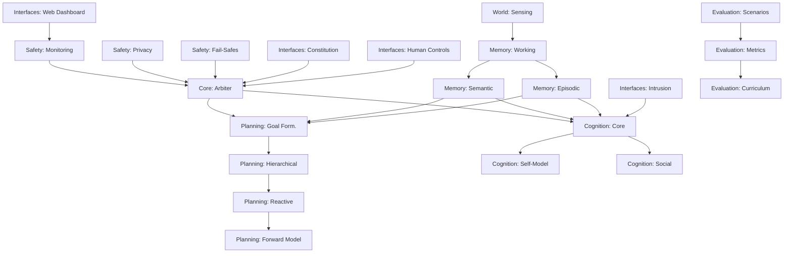

# Integration Strategy & Cross-Module Coordination

**Author:** @darianrosebrook

## Overview

This document defines the integration strategy for the conscious bot's modular architecture, addressing cross-module dependencies, data flow validation, and coordination protocols to ensure seamless operation of the cognitive system.

## Integration Architecture

### Module Dependency Graph



### Critical Integration Points

#### 1. Core-Safety Integration
**Purpose:** Ensure safe operation with comprehensive monitoring

**Protocols:**
- Safety monitors must be initialized before any cognitive processes
- All module operations route through Core Arbiter for safety validation
- Real-time performance monitoring with automatic degradation triggers
- Emergency stop capabilities with module state preservation

**Data Flow:**
```typescript
SafetyMonitor → CoreArbiter → ModuleRouter → ActionExecution
     ↑              ↓              ↓              ↓
PerformanceMetrics ← DecisionLog ← PlanResults ← ExecutionResults
```

#### 2. Memory-Planning Integration
**Purpose:** Leverage historical knowledge for intelligent planning

**Protocols:**
- Working memory provides current context for goal formulation
- Semantic memory supplies world knowledge for feasibility analysis
- Episodic memory informs preference learning and risk assessment
- Memory provenance tracking for decision justification

**Data Flow:**
```typescript
Observations → WorkingMemory → GoalFormulation
    ↓              ↓              ↓
SemanticMemory → HTNPlanner → PlanExecution
    ↓              ↓              ↓
EpisodicMemory → RiskAssessment → ActionResults
```

#### 3. Cognition-Interface Integration
**Purpose:** Enable constitutional reasoning and human oversight

**Protocols:**
- All LLM interactions filtered through constitutional constraints
- Intrusion interface validated against agent's self-model
- Human controls prioritized over autonomous decisions
- Web dashboard provides real-time cognitive state visibility

**Data Flow:**
```typescript
IntrusiveThought → ConstitutionFilter → CognitiveCore
      ↓                    ↓                ↓
DecisionRequest → EthicalReasoning → SelfModelUpdate
      ↓                    ↓                ↓
HumanOverride → WebDashboard → OperatorAlert
```

## Integration Testing Strategy

### 1. Contract Testing
```typescript
interface ModuleContract {
  name: string;
  version: string;
  inputs: DataSchema[];
  outputs: DataSchema[];
  latencyConstraints: PerformanceContract;
  errorHandling: ErrorContract;
}

// Example: Memory → Planning Contract
const MemoryPlanningContract: ModuleContract = {
  name: "memory_planning_interface",
  version: "1.0.0",
  inputs: [
    { name: "memory_query", schema: MemoryQuerySchema },
    { name: "planning_context", schema: PlanningContextSchema }
  ],
  outputs: [
    { name: "relevant_memories", schema: MemoryResultSchema },
    { name: "feasibility_assessment", schema: FeasibilitySchema }
  ],
  latencyConstraints: {
    maxResponseTime: 50, // ms
    percentile: 95
  },
  errorHandling: {
    timeoutBehavior: "graceful_degradation",
    retryPolicy: "exponential_backoff"
  }
};
```

### 2. Integration Test Scenarios

#### Scenario 1: Emergency Response Cascade
```typescript
describe('Emergency Response Integration', () => {
  test('safety threat triggers full system response', async () => {
    // Simulate sudden health drop
    const threat = simulateThreat({ type: 'health_critical', value: 0.1 });
    
    // Verify cascade: Monitoring → Arbiter → Planning → Action
    await expectResponseChain([
      { module: 'Safety', action: 'threat_detected', latency: '<5ms' },
      { module: 'Core', action: 'emergency_mode', latency: '<10ms' },
      { module: 'Planning', action: 'safety_reflex', latency: '<20ms' },
      { module: 'World', action: 'heal_action', latency: '<50ms' }
    ]);
    
    // Verify no module blocks the emergency response
    expect(await getSystemResponseTime()).toBeLessThan(50);
  });
});
```

#### Scenario 2: Memory-Guided Planning
```typescript
describe('Memory-Planning Integration', () => {
  test('planning utilizes relevant memories', async () => {
    const goal = { type: 'find_food', urgency: 0.8 };
    const memories = await memorySystem.recall('food_locations');
    
    const plan = await planningSystem.formulate(goal, memories);
    
    expect(plan.justification.usedMemories).toContain(memories[0].id);
    expect(plan.steps[0].location).toEqual(memories[0].bestFoodLocation);
  });
});
```

### 3. Performance Integration Testing

#### Latency Budget Validation
```typescript
class IntegrationPerformanceTest {
  async validateLatencyBudgets() {
    const scenarios = [
      { name: 'routine_planning', budget: 200 },
      { name: 'emergency_response', budget: 50 },
      { name: 'social_interaction', budget: 500 },
      { name: 'memory_consolidation', budget: 1000 }
    ];
    
    for (const scenario of scenarios) {
      const latency = await measureEndToEndLatency(scenario.name);
      expect(latency.p95).toBeLessThan(scenario.budget);
    }
  }
}
```

## Error Handling & Recovery

### Cross-Module Error Propagation

#### 1. Error Classification
```typescript
enum ErrorSeverity {
  INFO = 'info',           // Log only
  WARNING = 'warning',     // Degrade gracefully
  ERROR = 'error',         // Retry or fallback
  CRITICAL = 'critical'    // Emergency stop
}

interface CrossModuleError {
  severity: ErrorSeverity;
  source: string;
  target: string;
  context: ErrorContext;
  recoveryOptions: RecoveryOption[];
}
```

#### 2. Recovery Strategies
```typescript
class ErrorRecoveryManager {
  async handleCrossModuleError(error: CrossModuleError): Promise<RecoveryResult> {
    switch (error.severity) {
      case ErrorSeverity.WARNING:
        return this.gracefulDegradation(error);
      case ErrorSeverity.ERROR:
        return this.attemptRecovery(error);
      case ErrorSeverity.CRITICAL:
        return this.emergencyShutdown(error);
    }
  }
  
  private async gracefulDegradation(error: CrossModuleError): Promise<RecoveryResult> {
    // Reduce module capabilities but continue operation
    await this.reduceModuleCapabilities(error.source);
    await this.notifyDependentModules(error.source, 'degraded');
    return { status: 'degraded', capabilities: 'reduced' };
  }
}
```

### Module State Synchronization

#### 1. State Consistency Protocol
```typescript
interface ModuleState {
  id: string;
  version: number;
  status: 'active' | 'degraded' | 'stopped';
  lastUpdate: timestamp;
  checksum: string;
}

class StateManager {
  async synchronizeStates(): Promise<void> {
    const states = await this.collectModuleStates();
    const inconsistencies = this.detectInconsistencies(states);
    
    if (inconsistencies.length > 0) {
      await this.resolveInconsistencies(inconsistencies);
    }
  }
}
```

## Data Flow Validation

### Real-Time Data Flow Monitoring
```typescript
class DataFlowValidator {
  private validateDataIntegrity(data: any, schema: DataSchema): ValidationResult {
    return {
      valid: schema.validate(data),
      errors: schema.getErrors(data),
      metadata: this.extractMetadata(data)
    };
  }
  
  async monitorDataFlow(source: string, target: string): Promise<void> {
    const pipeline = this.getDataPipeline(source, target);
    
    pipeline.on('data', (data) => {
      const validation = this.validateDataIntegrity(data, pipeline.schema);
      if (!validation.valid) {
        this.handleDataIntegrityError(validation, source, target);
      }
    });
  }
}
```

## Configuration Management

### Environment-Specific Integration
```yaml
# config/integration/development.yaml
integration:
  monitoring:
    enabled: true
    interval: 100ms
    
  error_handling:
    retry_attempts: 3
    timeout_multiplier: 1.5
    
  performance:
    latency_budgets:
      emergency: 50ms
      routine: 200ms
      complex: 500ms

# config/integration/production.yaml
integration:
  monitoring:
    enabled: true
    interval: 1000ms
    
  error_handling:
    retry_attempts: 5
    timeout_multiplier: 2.0
    
  performance:
    latency_budgets:
      emergency: 25ms
      routine: 100ms
      complex: 250ms
```

## Deployment & Rollback Strategy

### Incremental Module Deployment
```typescript
class DeploymentManager {
  async deployModule(module: string, version: string): Promise<DeploymentResult> {
    // 1. Deploy in shadow mode
    await this.deployShadowMode(module, version);
    
    // 2. Validate integration contracts
    const contractValidation = await this.validateContracts(module);
    if (!contractValidation.passed) {
      return this.rollback(module, 'contract_validation_failed');
    }
    
    // 3. Gradual traffic shifting
    await this.shiftTraffic(module, { percentage: 10 });
    await this.monitorPerformance(module, { duration: '5min' });
    
    // 4. Full deployment or rollback
    const performanceCheck = await this.checkPerformance(module);
    if (performanceCheck.passed) {
      return this.completeDeployment(module, version);
    } else {
      return this.rollback(module, 'performance_degradation');
    }
  }
}
```

## Success Criteria

### Integration Health Metrics
1. **Cross-Module Latency**: P95 < target budgets for all integration points
2. **Error Rate**: < 0.1% cross-module communication failures
3. **State Consistency**: 99.9% module state synchronization accuracy
4. **Recovery Time**: < 100ms for graceful degradation scenarios
5. **Contract Compliance**: 100% adherence to module interface contracts

### Quality Gates
- [ ] All module contracts pass validation tests
- [ ] Integration test suite achieves 95% coverage
- [ ] Performance benchmarks meet target latencies
- [ ] Error recovery scenarios complete successfully
- [ ] State synchronization maintains consistency under load

This integration strategy ensures robust, scalable, and maintainable coordination between all conscious bot modules while preserving the real-time performance requirements critical for embodied AI operation.
