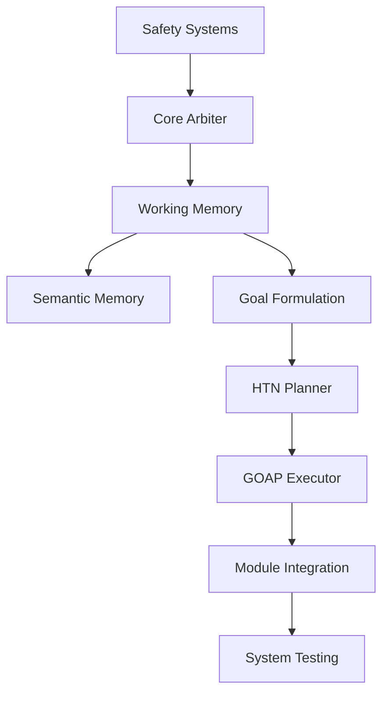

# Risk Management & Contingency Planning

**Author:** @darianrosebrook

## Overview

This document outlines comprehensive risk management strategies for the conscious bot project, identifying potential implementation challenges, technical risks, and mitigation strategies to ensure successful project delivery.

## Risk Assessment Framework

### Risk Categories

#### 1. Technical Implementation Risks
- **Complexity Risks**: Advanced AI architectures (HRM, HTN+GOAP)
- **Performance Risks**: Real-time constraints and latency requirements
- **Integration Risks**: Cross-module dependencies and data flow
- **Scalability Risks**: Memory usage and computational overhead

#### 2. Dependency Risks
- **External Library Risks**: Third-party AI/ML libraries
- **API Risks**: Local LLM service stability and resource requirements
- **Infrastructure Risks**: Minecraft server stability and performance
- **Platform Risks**: Node.js/Python ecosystem changes

#### 3. Research & Development Risks
- **Conceptual Risks**: Unproven cognitive architectures
- **Evaluation Risks**: Difficulty measuring consciousness-like behaviors
- **Timeline Risks**: Underestimated complexity and scope
- **Resource Risks**: Team capacity and expertise gaps

### Risk Prioritization Matrix

| Risk Level | Impact | Probability | Examples |
|------------|---------|-------------|----------|
| **Critical** | High | High | Local LLM resource usage, Real-time performance |
| **High** | High | Medium | HTN integration complexity, Memory scaling |
| **Medium** | Medium | High | External dependency updates, Testing coverage |
| **Low** | Low | Medium | Documentation gaps, Code style issues |

## Detailed Risk Analysis

### Critical Risks

#### CR-1: Local LLM Resource Requirements & Performance
**Risk:** Local LLM deployment requires excessive computational resources or fails to meet performance requirements

**Impact:** 
- Core cognitive functionality degraded or disabled
- Hardware requirements exceed available resources
- Development timeline extended due to optimization needs

**Mitigation Strategies:**
1. **Multi-Model Strategy**
   ```typescript
   interface LocalLLMConfig {
     name: string;
     memoryRequirement: string;
     latency: number;
     qualityScore: number;
   }
   
   const localModels: LocalLLMConfig[] = [
     { name: 'llama2_70b', memoryRequirement: '32GB', latency: 800, qualityScore: 0.95 },
     { name: 'llama2_13b', memoryRequirement: '16GB', latency: 400, qualityScore: 0.85 },
     { name: 'llama2_7b', memoryRequirement: '8GB', latency: 200, qualityScore: 0.75 }
   ];
   ```

2. **Resource Optimization**
   - Implement model quantization (4-bit/8-bit) to reduce memory usage
   - Use context caching to minimize recomputation
   - Batch inference requests for better GPU utilization
   - Implement prompt compression techniques

3. **Graceful Degradation**
   - Start with smaller models (7B) and scale up as resources allow
   - Reduce inference frequency for non-critical operations
   - Use hybrid reasoning (symbolic + LLM) to minimize LLM dependency

**Contingency Plan:**
- Immediate: Switch to smaller model variant
- Escalation: Reduce LLM inference frequency
- Fallback: Use symbolic reasoning with minimal LLM support
- Emergency: Operate in rule-based mode temporarily

#### CR-2: Real-Time Performance Constraints
**Risk:** System fails to meet 50ms p95 latency requirements for emergency scenarios

**Impact:**
- Agent becomes unresponsive in dangerous situations
- Fails safety requirements for autonomous operation
- Research objectives compromised

**Mitigation Strategies:**
1. **Performance Budgeting**
   ```typescript
   const PERFORMANCE_BUDGETS = {
     emergency: { p95: 50, p99: 100 },
     routine: { p95: 200, p99: 500 },
     reflection: { p95: 1000, p99: 2000 }
   };
   ```

2. **Preemption Hierarchy**
   - Safety reflexes (< 5ms): Hard-coded emergency responses
   - GOAP execution (< 20ms): Reactive planning
   - HTN planning (< 50ms): Structured decomposition
   - LLM reasoning (< 500ms): Complex cognitive tasks

3. **Graceful Degradation**
   ```typescript
   class PerformanceManager {
     async enforceLatencyBudget<T>(
       operation: () => Promise<T>,
       budgetMs: number,
       fallback: () => T
     ): Promise<T> {
       return Promise.race([
         operation(),
         this.timeoutWithFallback(budgetMs, fallback)
       ]);
     }
   }
   ```

**Contingency Plan:**
- Immediate: Optimize critical path bottlenecks
- Escalation: Increase preemption thresholds
- Fallback: Disable non-essential features
- Emergency: Switch to pure reactive mode

### High Risks

#### HR-1: HTN/HRM Integration Complexity
**Risk:** Hierarchical planning integration proves more complex than anticipated

**Impact:**
- Core planning functionality delayed
- Reduced agent intelligence
- Alternative architecture required

**Mitigation Strategies:**
1. **Incremental Implementation**
   ```typescript
   // Foundation: Basic HTN with manual methods
   class BasicHTNPlanner {
     plan(goal: Goal): Plan {
       return this.decomposeWithManualMethods(goal);
     }
   }
   
   // Enhancement: Add HRM-style refinement
   class HRMEnhancedPlanner extends BasicHTNPlanner {
     plan(goal: Goal): Plan {
       const initialPlan = super.plan(goal);
       return this.refineWithHRM(initialPlan);
     }
   }
   ```

2. **Fallback Architecture**
   - Pure GOAP implementation as backup
   - Simple rule-based planning
   - Basic goal stack management

3. **External Validation**
   - Prototype integration with pyhop library
   - Consult HTN planning experts
   - Implement SHOP2-style validation

**Contingency Plan:**
- Immediate: Simplify HTN method complexity
- Escalation: Use pure GOAP with goal hierarchies
- Fallback: Implement basic rule-based planner
- Emergency: Manual scripted behaviors

#### HR-2: Memory System Scaling
**Risk:** GraphRAG memory system doesn't scale to long-term agent operation

**Impact:**
- Memory retrieval becomes too slow
- Storage requirements exceed limits
- Agent forgets important information

**Mitigation Strategies:**
1. **Tiered Memory Architecture**
   ```typescript
   class TieredMemorySystem {
     hotMemory: Map<string, Memory>;      // Recent/frequent (1MB)
     warmMemory: LRUCache<string, Memory>; // Medium-term (10MB)
     coldStorage: Database;                // Long-term (100MB+)
     
     async retrieve(query: MemoryQuery): Promise<Memory[]> {
       // Check hot first, then warm, finally cold
       return await this.cascadeRetrieve(query);
     }
   }
   ```

2. **Intelligent Forgetting**
   - Salience-based memory consolidation
   - Periodic memory summarization
   - Automatic archival of old memories

3. **Performance Monitoring**
   - Memory retrieval latency tracking
   - Storage usage monitoring
   - Query optimization analysis

**Contingency Plan:**
- Immediate: Implement aggressive memory consolidation
- Escalation: Reduce memory retention timeouts
- Fallback: Switch to simple key-value storage
- Emergency: Disable episodic memory features

### Medium Risks

#### MR-1: External Dependency Management
**Risk:** Critical dependencies become unmaintained or incompatible

**Impact:**
- Security vulnerabilities
- Feature degradation
- Maintenance burden increase

**Mitigation Strategies:**
1. **Dependency Monitoring**
   ```json
   {
     "dependencies": {
       "mineflayer": "^4.17.0",
       "ollama": "^0.1.0"
     },
     "monitoring": {
       "vulnerability_scanning": true,
       "update_tracking": true,
       "license_compliance": true
     }
   }
   ```

2. **Abstraction Layers**
   ```typescript
   interface MinecraftAPI {
     move(direction: Direction): Promise<void>;
     mine(block: Block): Promise<void>;
     chat(message: string): Promise<void>;
   }
   
   class MineflayerAdapter implements MinecraftAPI {
     // Wrap mineflayer functionality
   }
   ```

3. **Vendor Diversification**
   - Multiple pathfinding libraries
   - Alternative LLM providers
   - Backup communication protocols

## Resource Risk Management

### Team Capacity Planning

#### Skill Gap Analysis
```typescript
interface SkillRequirement {
  skill: string;
  priority: 'critical' | 'high' | 'medium' | 'low';
  currentLevel: number;    // 1-5 scale
  requiredLevel: number;   // 1-5 scale
  gap: number;            // requiredLevel - currentLevel
}

const skillGaps: SkillRequirement[] = [
  { skill: 'HTN Planning', priority: 'critical', currentLevel: 2, requiredLevel: 4, gap: 2 },
  { skill: 'Real-time Systems', priority: 'critical', currentLevel: 3, requiredLevel: 4, gap: 1 },
  { skill: 'Cognitive Science', priority: 'high', currentLevel: 3, requiredLevel: 4, gap: 1 },
  { skill: 'Minecraft Modding', priority: 'medium', currentLevel: 2, requiredLevel: 3, gap: 1 }
];
```

#### Capacity Allocation
```typescript
interface ResourceAllocation {
  module: string;
  estimatedEffort: number;  // person-effort units
  skillRequirements: string[];
  riskAdjustment: number;   // 1.0 = no adjustment, 1.5 = 50% buffer
}

const allocations: ResourceAllocation[] = [
  {
    module: 'planning',
    estimatedEffort: 8,
    skillRequirements: ['HTN Planning', 'Real-time Systems'],
    riskAdjustment: 1.5  // High complexity
  },
  {
    module: 'memory',
    estimatedEffort: 6,
    skillRequirements: ['Graph Databases', 'Information Retrieval'],
    riskAdjustment: 1.3  // Medium complexity
  }
];
```

### Timeline Risk Management

#### Critical Path Dependencies


#### Resource Buffer Management
- **Technical Buffers**: 25% additional effort for complex modules
- **Integration Buffers**: 20% additional effort for cross-module work
- **Testing Buffers**: 15% additional effort for comprehensive validation
- **Research Buffers**: 30% additional effort for novel approaches

## Quality Risk Management

### Code Quality Assurance

#### Technical Debt Prevention
```typescript
// Example: Performance monitoring integration
class PerformanceMonitor {
  @monitor({ budget: 50, criticality: 'high' })
  async emergencyResponse(threat: Threat): Promise<Response> {
    // Implementation monitored for performance
  }
  
  @monitor({ budget: 200, criticality: 'medium' })
  async routinePlanning(goal: Goal): Promise<Plan> {
    // Implementation monitored for performance
  }
}
```

#### Testing Strategy Risk
```typescript
interface TestingCoverage {
  unitTests: number;        // Target: 90%
  integrationTests: number; // Target: 80%
  e2eTests: number;        // Target: 70%
  performanceTests: number; // Target: 95% of critical paths
}

const testingRisks = {
  low_coverage: {
    impact: 'high',
    mitigation: 'Automated coverage reporting',
    threshold: 0.85
  },
  flaky_tests: {
    impact: 'medium',
    mitigation: 'Test stability monitoring',
    threshold: 0.95
  }
};
```

## Contingency Implementation Plans

### Fallback Architecture

#### Simplified Agent Mode
```typescript
class SimplifiedAgent {
  // Minimal viable agent with reduced capabilities
  async simpleLoop(): Promise<void> {
    const threat = await this.scanForThreats();
    if (threat) {
      await this.flee(threat);
      return;
    }
    
    const hunger = await this.checkHunger();
    if (hunger > 0.8) {
      await this.findAndEatFood();
      return;
    }
    
    await this.wander();
  }
}
```

#### Emergency Response Protocols
1. **System Overload**: Disable non-essential modules
2. **Memory Overflow**: Aggressive garbage collection
3. **Performance Degradation**: Switch to reactive-only mode
4. **Integration Failures**: Isolate failing modules

## Risk Monitoring & Alerting

### Key Risk Indicators (KRIs)
```typescript
interface RiskMetrics {
  performance: {
    latency_p95: number;
    error_rate: number;
    memory_usage: number;
  };
  
  development: {
    velocity: number;
    bug_rate: number;
    technical_debt: number;
  };
  
  external: {
    api_availability: number;
    dependency_health: number;
    cost_burn_rate: number;
  };
}

const riskThresholds = {
  latency_p95: { warning: 80, critical: 120 },
  error_rate: { warning: 0.05, critical: 0.1 },
  api_availability: { warning: 0.95, critical: 0.9 }
};
```

### Automated Risk Response
```typescript
class RiskMonitor {
  async evaluateRisks(): Promise<RiskAssessment> {
    const metrics = await this.collectMetrics();
    const risks = this.assessRisks(metrics);
    
    for (const risk of risks.critical) {
      await this.triggerContingencyPlan(risk);
    }
    
    return risks;
  }
}
```

## Success Criteria

### Risk Management Effectiveness
1. **Risk Identification**: 95% of project risks identified in advance
2. **Mitigation Success**: 80% of identified risks successfully mitigated
3. **Recovery Time**: < 24 hours to implement contingency plans
4. **Budget Impact**: Risk-related overruns < 20% of total budget
5. **Timeline Impact**: Risk-related delays < 30% of critical path

### Quality Gates
- [ ] All critical risks have documented mitigation strategies
- [ ] Contingency plans tested and validated
- [ ] Risk monitoring systems operational
- [ ] Team trained on emergency procedures
- [ ] Regular risk assessment reviews scheduled

This comprehensive risk management strategy ensures the conscious bot project can navigate technical challenges, dependency issues, and resource constraints while maintaining focus on delivering a robust, research-quality cognitive architecture.
